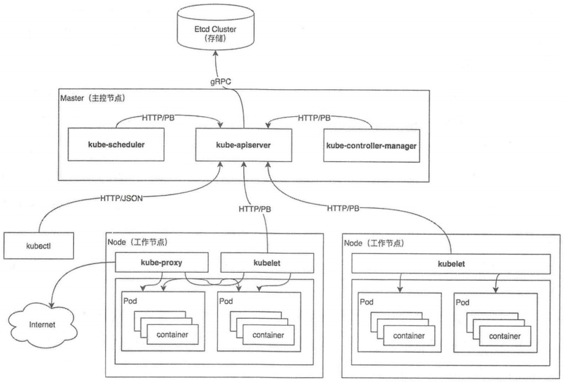

# kubernetes 架构

## Kubernetes 总架构

Kubernetes 总架构图如图所示。

Kubernetes遵循客户端/服务端(C/S)架构，系统架构分为 Master 和 Node 两部分， Master 作为服务端， Node 作为客户端。Kubernetes 系统具有多个 Master 服务端，可以实现高可用 。在默认情况下， 一个 Master 服务端即可
完成所有工作。

Master 服务端也被称为主控节点，集群所执行的所有控制命令都由 Master 服务端接收井处理，主要负责如下任务：

（1）集群的“大脑”，负责管理所有节点（Node）
（2）负责调度 Pod 在哪些节点（Node）上运行
（3）负责控制集群运行过程中的所有状态

Master 服务端主要包含如下组件：

- kube-apiserver 组件：集群的 HTTP REST API 接口，是集群控制的入口
- kube-controller-manager 组件：集群中所有资源对象的自动化控制中心
- kube-scheduler 组件： 集群中 Pod 资源对象的调度服务。

Node 客户端也被称为工作节点，主要负责如下任务：

（1）负责管理所有容器（Container）
（2）负责监控／上报所有 Pod 的运行状态

Node 节点主要包含如下组件：

- kubelet 组件：负责管理节点上容器的创建、删除、启停等任务，与 Master 节点进行通信
- kube-proxy 组件：负责 Kubernetes 服务的通信及负载均衡服务。
- container 组件：负责容器的基础管理服务，接收 kubelet 组件的指令。

## Kubernetes 各组件的功能

### kubectl

官方提供的cli工具，用户可以用命令的方式交互k8s api server进行操作 通信协议json http，kubectl发送相应的http请求，由api server接受处理并且反馈给kubectl 然后展示结果，至此一次请求周期结束

### client-go

k8s提供了编程式的与k8s api server通信 client-go是从k8s代码中单独抽离出来的包，并作为官方提供的go语言的客户端发挥作用，client-go简单 以用，k8s系统二其他组件与api通信也是基于client-go实现

### kube-apiserver

它负责将k8s“资源组/资源版本/资源 以restful的风格的形式对外暴露并提供服务。k8s集群所有组件都通过apiserver操作资源对象，apiserver也是集群中唯一与etcd集群进行交互的核心组件
etcd分布式键值存储集群，提供了可靠强一致性的服务发现。etcd村粗集群的状态和元数据，其中包括
k8s资源对象信息 集群节点等k8s所有数据村粗在前缀为/registry的目录下
api属于核心组件 至关重要，有以下特性

将k8s所有资源封装为restful风格的api接口进行管理
可进行集群状态管理和数据管理。是唯一跟etcd集群交互的组件
拥有丰富的安集群安全访问机制，以及认证授权准入控制器
提供了各个组件通信和交互功能

### kube-controller-manager

管理控制器，当节点发生意外当即 会及时发现并执行自动化修复流程确保集群始终处于预期的工作状态
为了保证k8s系统的实际状态达到所需状态默认提供了一些控制器例如deployment sts ds等，每个控制器通过apiserver组件提供的接口实时监控整个集群每个资源对象的当前状态，当法神问题会尝试将系统修复至期望状态
具备高可用（多实例同时运行）基于etcd上的分布式锁实现领导者选举机制，通过api提供的资源锁进行选举竞争，抢先获取锁的实例被称为leader节点即领导者节点并运行主逻辑，未抢到锁的即候选节点 阻塞，当leader推出 选举leader并接替

### kube-scheduler

调度器通过预选调度宣发和优选算法为pod选出最佳节点，并且还支持抢占机制以及亲和度
高可用与kube-controller-manager类似

### kubelet

管理节点，在每个node节点，用来接收、处理、上报api组件下发的任务，进程启动回向api注册自己的信息，主要负责所在节点的pod资源管理，例如pod的增删改以及驱逐和生命周期的管理
kubelet会定期的监控所在节点的资源使用状态并上报给apiserver，这些可以帮助kube-scheduler调度器为pod资源预选节点，也会对所在节点的镜像和容器做清理工作，保证节点的镜像不会占满磁盘空间
kubelet实现了3中开放接口

CRI容器运行时接口，定义了容器和镜像服务的几口，cri将kubelet组件与容器运行时进行解耦i，将原来完全面向pod级的内部接口拆分成面向sandbox和container的grpc接口，将镜像管理和容器管理分离给不同的服务
CNI容器网络接口，提供网络插件服务，容器创建通过cni配置网络
CSI容器存储接口，提供存储通用插件接口服务 定义了容器村粗卷的标准规范，容器创建时通过csi插件配置存储卷

### kube-proxy

通过ipvs和iptables等配置负载均衡器为一组pod提供统一的tcp/udp流量转发和负载均衡功能
只向k8s服务机器后端pod发出请求

## Kubernetes Project Layout设计

|目录|功能|
|--|--|
|cmd/|每个可执行文件的入口代码，每个可执行文件都会对应一个main函数|
|pkg/|存放核心代码，可被项目内部或者外部直接引用|
|vendor/|存放项目依赖的库代码，一般是第三方库|
|api/|存放openapi/swagger的spec文件包括json protocol的定义等|
|build/|存放与构建相关的脚本|
|test/|存放测试工具及测试数据|
|docs/|存放设计或用户使用文档|
|hack/|存放与构建测试相关的脚本|
|third_party/|存放第三方工具、代码或其他组件|
|plugin/|存放kubernetes插件代码目录，例如认证、授权等相关插件|
|staging/|存放部分核心库的暂存目录|
|translations/|存放il8n(国际化)语言包的相关文件，可以在不修改内部代码的情况下支持不同语言及地区|
