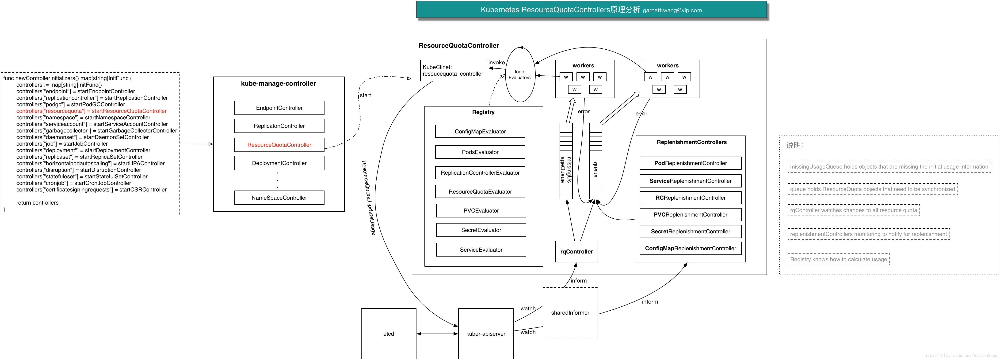
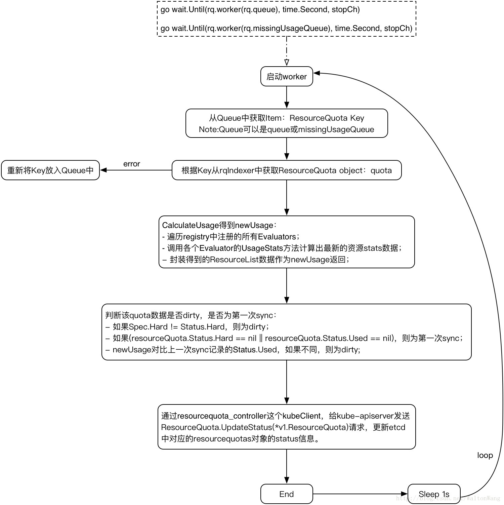

# ResourceQuota Controller源码剖析

## ResourceQuota Controller源码目录结构分析

ResourceQuota Controller主要源码位于目录k8s.io/kubernetes/pkg/quota和k8s.io/kubernetes/pkg/controller/resourcequota，具体分析如下：

k8s.io/kubernetes/pkg/quota

```
.
├── evaluator    // 负责各种资源使用的统计
│   └── core
│       ├── configmap.go   // ConfigMapEvaluator的实现，负责ConfigMap资源的统计
│       ├── doc.go
│       ├── persistent_volume_claims.go    // PVCEvaluator的实现，负责PVC资源的统计
│       ├── persistent_volume_claims_test.go
│       ├── pods.go    //PodEvaluator的实现，负责Pod资源的统计
│       ├── pods_test.go
│       ├── registry.go    // 创建Registry时注册所有的Evaluators
│       ├── replication_controllers.go    // RCEvaluator的实现，负责ReplicationController资源的统计
│       ├── resource_quotas.go    // ResourceQuotaEvaluator的实现，负责ResourceQuota资源的统计
│       ├── secrets.go    // SecretEvaluator的实现，负责Secret资源的统计
│       ├── services.go    // ServiceEvaluator的实现，负责Service资源的统计
│       └── services_test.go
├── generic    // genericEvaluator的定义和实现
│   ├── evaluator.go    // 实现了genericEvaluator的接口，包括最重要的CalculateUsageStats接口
│   └── registry.go    // 定义GenericRegistry
├── install
│   └── registry.go    // 定义了startResourceQuotaController时会调用创建ResourceQuota Registry的方法
├── interfaces.go    // 定义了Registry和Evaluator Interface
├── resources.go    // 定义Resources的集合操作以及CalculateUsage方法
└── resources_test.go
```

k8s.io/kubernetes/pkg/controller/resourcequota

```
.
├── doc.go
├── replenishment_controller.go    // 定义replenishmentControllerFactory，用来创建replenishmentController
├── replenishment_controller_test.go
├── resource_quota_controller.go    // 定义ResourceQuotaController及其Run方法，syncResourceQuota方法等，属于核心文件。
└── resource_quota_controller_test.go
```

## ResourceQuota Controller内部实现原理



## ResourceQuota Controller源码分析

ResourceQuotaController是Kubenetes Controller Manager启动进行初始化众多Controllers的时候，通过调用startResourceQuotaController来完成ResourceQuotaController的启动。

### 从kube-controller-manager的startResourceQuotaController开始

startResourceQuotaController启动一个goroutine，通过NewResourceQuotaController创建一个ResourceQuotaController并执行其Run方法开始提供ResourceQuotaController。

下面是ResourceQuotaController和ResourceQuotaControllerOptions结构体的定义。ResourceQuotaController中定义了几个关键Entity，分别是rqController、queue、missingUsageQueue、registry、replenishmentControllers，在上一节中的原理图中也能看到它们的身影。

```
func startResourceQuotaController(ctx ControllerContext) (bool, error) {
    resourceQuotaControllerClient := ctx.ClientBuilder.ClientOrDie("resourcequota-controller")
    resourceQuotaRegistry := quotainstall.NewRegistry(resourceQuotaControllerClient, ctx.InformerFactory)

    // 定义ReplenishmentController需要监控的资源对象
    groupKindsToReplenish := []schema.GroupKind{
        api.Kind("Pod"),
        api.Kind("Service"),
        api.Kind("ReplicationController"),
        api.Kind("PersistentVolumeClaim"),
        api.Kind("Secret"),
        api.Kind("ConfigMap"),
    }

    ...

    go resourcequotacontroller.NewResourceQuotaController(
        resourceQuotaControllerOptions,
    ).Run(int(ctx.Options.ConcurrentResourceQuotaSyncs), ctx.Stop)
    return true, nil
}
```

### ResourceQuotaController定义

```
// ResourceQuotaControllerOptions holds options for creating a quota controller
type ResourceQuotaControllerOptions struct {
    // Must have authority to list all quotas, and update quota status
    KubeClient clientset.Interface
    // Controls full recalculation of quota usage
    ResyncPeriod controller.ResyncPeriodFunc
    // Knows how to calculate usage
    Registry quota.Registry
    // Knows how to build controllers that notify replenishment events
    ControllerFactory ReplenishmentControllerFactory
    // Controls full resync of objects monitored for replenihsment.
    ReplenishmentResyncPeriod controller.ResyncPeriodFunc
    // List of GroupKind objects that should be monitored for replenishment at
    // a faster frequency than the quota controller recalculation interval
    GroupKindsToReplenish []schema.GroupKind
}

// ResourceQuotaController is responsible for tracking quota usage status in the system
type ResourceQuotaController struct {
    // Must have authority to list all resources in the system, and update quota status
    kubeClient clientset.Interface
    // An index of resource quota objects by namespace
    rqIndexer cache.Indexer
    // Watches changes to all resource quota
    rqController *cache.Controller
    // ResourceQuota objects that need to be synchronized
    queue workqueue.RateLimitingInterface
    // missingUsageQueue holds objects that are missing the initial usage informatino
    missingUsageQueue workqueue.RateLimitingInterface
    // To allow injection of syncUsage for testing.
    syncHandler func(key string) error
    // function that controls full recalculation of quota usage
    resyncPeriod controller.ResyncPeriodFunc
    // knows how to calculate usage
    registry quota.Registry
    // controllers monitoring to notify for replenishment
    replenishmentControllers []cache.ControllerInterface
}
```

### NewRegistry

startResourceQuotaController调用了NewRegistry

NewRegistry负责这些资源对象(pod,service,rc,secret,configMap,resourceQuota,PVC)的的Evaluator的创建和注册，供后面Worker中执行quota.CalculateUsage(…)对这些资源对象进行使用统计。

```
// NewRegistry returns a registry that knows how to deal with core kubernetes resources
// If an informer factory is provided, evaluators will use them.
func NewRegistry(kubeClient clientset.Interface, f informers.SharedInformerFactory) quota.Registry {
    pod := NewPodEvaluator(kubeClient, f)
    service := NewServiceEvaluator(kubeClient)
    replicationController := NewReplicationControllerEvaluator(kubeClient)
    resourceQuota := NewResourceQuotaEvaluator(kubeClient)
    secret := NewSecretEvaluator(kubeClient)
    configMap := NewConfigMapEvaluator(kubeClient)
    persistentVolumeClaim := NewPersistentVolumeClaimEvaluator(kubeClient, f)
    return &generic.GenericRegistry{
        InternalEvaluators: map[schema.GroupKind]quota.Evaluator{
            pod.GroupKind():                   pod,
            service.GroupKind():               service,
            replicationController.GroupKind(): replicationController,
            secret.GroupKind():                secret,
            configMap.GroupKind():             configMap,
            resourceQuota.GroupKind():         resourceQuota,
            persistentVolumeClaim.GroupKind(): persistentVolumeClaim,
        },
    }
}
```

### NewResourceQuotaController

NewRegistry执行完后，开始创建ResourceQuotaController

NewResourceQuotaController负责创建ResourceQuotaController，包括queue, missingUsageQueue, syncHandler,rqIndexer, rqController,replenishmentControllers的Entity填充。重点关注
rq.rqIndexer, rq.rqController = cache.NewIndexerInformer(...)
进行了rqController中注册ResourceEventHandlerFuncs：addQuota和enqueueResourceQuota。另外，
replenishmentController, err := options.ControllerFactory.NewController(controllerOptions)
负责replenishmentController的创建，NewRegistry中注册了6种replenishmentSource，所以这里replenishmentControllers会添加对应的6中replenishmentController。

```
func NewResourceQuotaController(options *ResourceQuotaControllerOptions) *ResourceQuotaController {
    // build the resource quota controller
    rq := &ResourceQuotaController{
        kubeClient:               options.KubeClient,
        queue:                    workqueue.NewNamedRateLimitingQueue(workqueue.DefaultControllerRateLimiter(), "resourcequota_primary"),
        missingUsageQueue:        workqueue.NewNamedRateLimitingQueue(workqueue.DefaultControllerRateLimiter(), "resourcequota_priority"),
        resyncPeriod:             options.ResyncPeriod,
        registry:                 options.Registry,
        replenishmentControllers: []cache.ControllerInterface{},
    }

    ...

    // set the synchronization handler
    rq.syncHandler = rq.syncResourceQuotaFromKey

    // build the controller that observes quota
    rq.rqIndexer, rq.rqController = cache.NewIndexerInformer(
        &cache.ListWatch{
            ListFunc: func(options v1.ListOptions) (runtime.Object, error) {
                return rq.kubeClient.Core().ResourceQuotas(v1.NamespaceAll).List(options)
            },
            WatchFunc: func(options v1.ListOptions) (watch.Interface, error) {
                return rq.kubeClient.Core().ResourceQuotas(v1.NamespaceAll).Watch(options)
            },
        },
        &v1.ResourceQuota{},
        rq.resyncPeriod(),
        cache.ResourceEventHandlerFuncs{
            AddFunc: rq.addQuota,
            UpdateFunc: func(old, cur interface{}) {
                oldResourceQuota := old.(*v1.ResourceQuota)
                curResourceQuota := cur.(*v1.ResourceQuota)
                if quota.V1Equals(oldResourceQuota.Spec.Hard, curResourceQuota.Spec.Hard) {
                    return
                }
                rq.addQuota(curResourceQuota)
            },
            DeleteFunc: rq.enqueueResourceQuota,
        },
        cache.Indexers{"namespace": cache.MetaNamespaceIndexFunc},
    )

    for _, groupKindToReplenish := range options.GroupKindsToReplenish {
        controllerOptions := &ReplenishmentControllerOptions{
            GroupKind:         groupKindToReplenish,
            ResyncPeriod:      options.ReplenishmentResyncPeriod,
            ReplenishmentFunc: rq.replenishQuota,
        }
        replenishmentController, err := options.ControllerFactory.NewController(controllerOptions)
        if err != nil {
            glog.Warningf("quota controller unable to replenish %s due to %v, changes only accounted during full resync", groupKindToReplenish, err)
        } else {
            rq.replenishmentControllers = append(rq.replenishmentControllers, replenishmentController)
        }
    }
    return rq
}
```

### ResourceQuotaController.Run

创建完ResourceQuotaController之后，就执行Run方法开始进行任务处理。

```
// Run begins quota controller using the specified number of workers
func (rq *ResourceQuotaController) Run(workers int, stopCh <-chan struct{}) {
    ...
    // 启动rqController和rq.replenishmentControllers中的6中replenishmentController，开始watch对应的ResourceQuota加入到queue和missingUsageQueue。
    go rq.rqController.Run(stopCh)
    // the controllers that replenish other resources to respond rapidly to state changes
    for _, replenishmentController := range rq.replenishmentControllers {
        go replenishmentController.Run(stopCh)
    }

    // 启动workers数量的worker协程，分别对queue和missingUsageQueue中的Item。
    for i := 0; i < workers; i++ {
        go wait.Until(rq.worker(rq.queue), time.Second, stopCh)
        go wait.Until(rq.worker(rq.missingUsageQueue), time.Second, stopCh)
    }

    // 定期的进行全量的quotas计算。
    go wait.Until(func() { rq.enqueueAll() }, rq.resyncPeriod(), stopCh)
    <-stopCh
    glog.Infof("Shutting down ResourceQuotaController")
    rq.queue.ShutDown()
}
```

### Worker

```
// worker runs a worker thread that just dequeues items, processes them, and marks them done.
func (rq *ResourceQuotaController) worker(queue workqueue.RateLimitingInterface) func() {
    workFunc := func() bool {
        // 从queue中获取Key
        key, quit := queue.Get()
        if quit {
            return true
        }
        defer queue.Done(key)

        // 执行NewResourceQuotaController时注册的syncHandler(流程跳转到syncResourceQuotaFromKey)
        err := rq.syncHandler(key.(string))
        ...
    }

    return func() {
        for {
            if quit := workFunc(); quit {
                glog.Infof("resource quota controller worker shutting down")
                return
            }
        }
    }
}
```

流程进入到syncResourceQuotaFromKey：

```
// syncResourceQuotaFromKey syncs a quota key
func (rq *ResourceQuotaController) syncResourceQuotaFromKey(key string) (err error) {
    ...
    obj, exists, err := rq.rqIndexer.GetByKey(key)
    ...
    quota := *obj.(*v1.ResourceQuota)
    return rq.syncResourceQuota(quota)
}
```

syncResourceQuotaFromKey根据从queue中获得的key，从rqIndexer中得到该Object，然后执行rq.syncResourceQuota(quota)。

```
// syncResourceQuota runs a complete sync of resource quota status across all known kinds
func (rq *ResourceQuotaController) syncResourceQuota(v1ResourceQuota v1.ResourceQuota) (err error) {
    ...
    newUsage, err := quota.CalculateUsage(resourceQuota.Namespace, resourceQuota.Spec.Scopes, hardLimits, rq.registry)
    ...

    // ensure set of used values match those that have hard constraints
    hardResources := quota.ResourceNames(hardLimits)
    used = quota.Mask(used, hardResources)
    usage := api.ResourceQuota{
        ObjectMeta: api.ObjectMeta{
            Name:            resourceQuota.Name,
            Namespace:       resourceQuota.Namespace,
            ResourceVersion: resourceQuota.ResourceVersion,
            Labels:          resourceQuota.Labels,
            Annotations:     resourceQuota.Annotations},
        Status: api.ResourceQuotaStatus{
            Hard: hardLimits,
            Used: used,
        },
    }

    dirty = dirty || !quota.Equals(usage.Status.Used, resourceQuota.Status.Used)

    // there was a change observed by this controller that requires we update quota
    if dirty {
        v1Usage := &v1.ResourceQuota{}
        if err := v1.Convert_api_ResourceQuota_To_v1_ResourceQuota(&usage, v1Usage, nil); err != nil {
            return err
        }
        _, err = rq.kubeClient.Core().ResourceQuotas(usage.Namespace).UpdateStatus(v1Usage)
        return err
    }
    return nil
}
```

syncResourceQuota中最关键的操作是：
newUsage, err := quota.CalculateUsage(resourceQuota.Namespace, resourceQuota.Spec.Scopes, hardLimits, rq.registry)
quota.CalculateUsage根据namespace, quota的Scope，hardLimits，registry对该Item（resourceQuota）进行CalculateUsage。

```
// CalculateUsage calculates and returns the requested ResourceList usage
func CalculateUsage(namespaceName string, scopes []api.ResourceQuotaScope, hardLimits api.ResourceList, registry Registry) (api.ResourceList, error) {
    // find the intersection between the hard resources on the quota
    // and the resources this controller can track to know what we can
    // look to measure updated usage stats for
    hardResources := ResourceNames(hardLimits)
    potentialResources := []api.ResourceName{}
    evaluators := registry.Evaluators()
    for _, evaluator := range evaluators {
        potentialResources = append(potentialResources, evaluator.MatchingResources(hardResources)...)
    }
    // NOTE: the intersection just removes duplicates since the evaluator match intersects wtih hard
    matchedResources := Intersection(hardResources, potentialResources)

    // sum the observed usage from each evaluator
    newUsage := api.ResourceList{}
    for _, evaluator := range evaluators {
        // only trigger the evaluator if it matches a resource in the quota, otherwise, skip calculating anything
        intersection := evaluator.MatchingResources(matchedResources)
        if len(intersection) == 0 {
            continue
        }

        usageStatsOptions := UsageStatsOptions{Namespace: namespaceName, Scopes: scopes, Resources: intersection}
        stats, err := evaluator.UsageStats(usageStatsOptions)
        if err != nil {
            return nil, err
        }
        newUsage = Add(newUsage, stats.Used)
    }

    // mask the observed usage to only the set of resources tracked by this quota
    // merge our observed usage with the quota usage status
    // if the new usage is different than the last usage, we will need to do an update
    newUsage = Mask(newUsage, matchedResources)
    return newUsage, nil
}
```

CalculateUsage中最重要的一步是循环registry中注册的所有Evaluators，执行对应Evaluator的UsageStats方法进资源使用统计。

接着来看Registry和Evaluator的关系，以及Evaluator的定义。

```
// Registry holds the list of evaluators associated to a particular group kind
type Registry interface {
    // Evaluators returns the set Evaluator objects registered to a groupKind
    Evaluators() map[schema.GroupKind]Evaluator
}


// Evaluator knows how to evaluate quota usage for a particular group kind
type Evaluator interface {
    // Constraints ensures that each required resource is present on item
    Constraints(required []api.ResourceName, item runtime.Object) error
    // GroupKind returns the groupKind that this object knows how to evaluate
    GroupKind() schema.GroupKind
    // Handles determines if quota could be impacted by the specified operation.
    // If true, admission control must perform quota processing for the operation, otherwise it is safe to ignore quota.
    Handles(operation admission.Operation) bool
    // Matches returns true if the specified quota matches the input item
    Matches(resourceQuota *api.ResourceQuota, item runtime.Object) (bool, error)
    // MatchingResources takes the input specified list of resources and returns the set of resources evaluator matches.
    MatchingResources(input []api.ResourceName) []api.ResourceName
    // Usage returns the resource usage for the specified object
    Usage(item runtime.Object) (api.ResourceList, error)
    // UsageStats calculates latest observed usage stats for all objects
    UsageStats(options UsageStatsOptions) (UsageStats, error)
}
```

可见Evaluator就是一系列操作的集合，是一个Interface，而Registry就是资源类型到Evaluator的一个Map。

Kubernetes中定义了7种资源的Evaluator，都在pkg/quota/evaluator/core/*目录下，比如pods.go就是PodEvaluator的实现，里面实现了关键的UsageStats方法。除了PodEvaluator之外，其他的Evaluator的UsageStats实现，都是genericEvaluator来完成的，其代码在pkg/quota/generic/evaluator.go。

下面是Worker的内部流程图：



### ReplenishmentController

rqController负责watch待sync的ResourceQuota，并将其加入到queue和missingUsageQueue中，而上面分析NewResourceQuotaController代码时提到：
replenishmentController, err := options.ControllerFactory.NewController(controllerOptions)
负责replenishmentController的创建，那replenishmentController又是啥呢？我们有必要来看看replenishmentController的创建。

```
func (r *replenishmentControllerFactory) NewController(options *ReplenishmentControllerOptions) (result cache.ControllerInterface, err error) {
    ...
    switch options.GroupKind {
    case api.Kind("Pod"):
        if r.sharedInformerFactory != nil {
            result, err = controllerFor(api.Resource("pods"), r.sharedInformerFactory, cache.ResourceEventHandlerFuncs{
                UpdateFunc: PodReplenishmentUpdateFunc(options),
                DeleteFunc: ObjectReplenishmentDeleteFunc(options),
            })
            break
        }
        result = informers.NewPodInformer(r.kubeClient, options.ResyncPeriod())
    case api.Kind("Service"):
        // TODO move to informer when defined
        _, result = cache.NewInformer(
            &cache.ListWatch{
                ListFunc: func(options v1.ListOptions) (runtime.Object, error) {
                    return r.kubeClient.Core().Services(v1.NamespaceAll).List(options)
                },
                WatchFunc: func(options v1.ListOptions) (watch.Interface, error) {
                    return r.kubeClient.Core().Services(v1.NamespaceAll).Watch(options)
                },
            },
            &v1.Service{},
            options.ResyncPeriod(),
            cache.ResourceEventHandlerFuncs{
                UpdateFunc: ServiceReplenishmentUpdateFunc(options),
                DeleteFunc: ObjectReplenishmentDeleteFunc(options),
            },
        )
    case api.Kind("ReplicationController"):
        // TODO move to informer when defined
        _, result = cache.NewInformer(
            &cache.ListWatch{
                ListFunc: func(options v1.ListOptions) (runtime.Object, error) {
                    return r.kubeClient.Core().ReplicationControllers(v1.NamespaceAll).List(options)
                },
                WatchFunc: func(options v1.ListOptions) (watch.Interface, error) {
                    return r.kubeClient.Core().ReplicationControllers(v1.NamespaceAll).Watch(options)
                },
            },
            &v1.ReplicationController{},
            options.ResyncPeriod(),
            cache.ResourceEventHandlerFuncs{
                DeleteFunc: ObjectReplenishmentDeleteFunc(options),
            },
        )
    case api.Kind("PersistentVolumeClaim"):
        if r.sharedInformerFactory != nil {
            result, err = controllerFor(api.Resource("persistentvolumeclaims"), r.sharedInformerFactory, cache.ResourceEventHandlerFuncs{
                DeleteFunc: ObjectReplenishmentDeleteFunc(options),
            })
            break
        }
        // TODO (derekwaynecarr) remove me when we can require a sharedInformerFactory in all code paths...
        _, result = cache.NewInformer(
            &cache.ListWatch{
                ListFunc: func(options v1.ListOptions) (runtime.Object, error) {
                    return r.kubeClient.Core().PersistentVolumeClaims(v1.NamespaceAll).List(options)
                },
                WatchFunc: func(options v1.ListOptions) (watch.Interface, error) {
                    return r.kubeClient.Core().PersistentVolumeClaims(v1.NamespaceAll).Watch(options)
                },
            },
            &v1.PersistentVolumeClaim{},
            options.ResyncPeriod(),
            cache.ResourceEventHandlerFuncs{
                DeleteFunc: ObjectReplenishmentDeleteFunc(options),
            },
        )
    case api.Kind("Secret"):
        // TODO move to informer when defined
        _, result = cache.NewInformer(
            &cache.ListWatch{
                ListFunc: func(options v1.ListOptions) (runtime.Object, error) {
                    return r.kubeClient.Core().Secrets(v1.NamespaceAll).List(options)
                },
                WatchFunc: func(options v1.ListOptions) (watch.Interface, error) {
                    return r.kubeClient.Core().Secrets(v1.NamespaceAll).Watch(options)
                },
            },
            &v1.Secret{},
            options.ResyncPeriod(),
            cache.ResourceEventHandlerFuncs{
                DeleteFunc: ObjectReplenishmentDeleteFunc(options),
            },
        )
    case api.Kind("ConfigMap"):
        // TODO move to informer when defined
        _, result = cache.NewInformer(
            &cache.ListWatch{
                ListFunc: func(options v1.ListOptions) (runtime.Object, error) {
                    return r.kubeClient.Core().ConfigMaps(v1.NamespaceAll).List(options)
                },
                WatchFunc: func(options v1.ListOptions) (watch.Interface, error) {
                    return r.kubeClient.Core().ConfigMaps(v1.NamespaceAll).Watch(options)
                },
            },
            &v1.ConfigMap{},
            options.ResyncPeriod(),
            cache.ResourceEventHandlerFuncs{
                DeleteFunc: ObjectReplenishmentDeleteFunc(options),
            },
        )
    default:
        return nil, NewUnhandledGroupKindError(options.GroupKind)
    }
    return result, err
}
```

根据不同的资源类型，返回对应的Controller。而每种资源的Controller的定义都是通过创建一个对应的Informer完成。Informer中注册对应的ResourceEventHandlerFuncs：UpdateFunc和DeleteFunc用来出watch的对象发生对应的change时需要调用的方法。

以Pod为例，看看Pod注册的UpdateFunc：PodReplenishmentUpdateFunc和DeleteFunc：ObjectReplenishmentDeleteFunc。

```
// PodReplenishmentUpdateFunc will replenish if the old pod was quota tracked but the new is not
func PodReplenishmentUpdateFunc(options *ReplenishmentControllerOptions) func(oldObj, newObj interface{}) {
    return func(oldObj, newObj interface{}) {
        oldPod := oldObj.(*v1.Pod)
        newPod := newObj.(*v1.Pod)
        if core.QuotaV1Pod(oldPod) && !core.QuotaV1Pod(newPod) {
            options.ReplenishmentFunc(options.GroupKind, newPod.Namespace, oldPod)
        }
    }
}

// ObjectReplenenishmentDeleteFunc will replenish on every delete
func ObjectReplenishmentDeleteFunc(options *ReplenishmentControllerOptions) func(obj interface{}) {
    return func(obj interface{}) {
        metaObject, err := meta.Accessor(obj)
        if err != nil {
            tombstone, ok := obj.(cache.DeletedFinalStateUnknown)
            if !ok {
                glog.Errorf("replenishment controller could not get object from tombstone %+v, could take up to %v before quota is replenished", obj, options.ResyncPeriod())
                utilruntime.HandleError(err)
                return
            }
            metaObject, err = meta.Accessor(tombstone.Obj)
            if err != nil {
                glog.Errorf("replenishment controller tombstone contained object that is not a meta %+v, could take up to %v before quota is replenished", tombstone.Obj, options.ResyncPeriod())
                utilruntime.HandleError(err)
                return
            }
        }
        options.ReplenishmentFunc(options.GroupKind, metaObject.GetNamespace(), nil)
    }
}
```

在NewResourceQuotaController中创建replenishmentController时，已经指定了对应的ReplenishmentFunc为rq.replenishQuota，PodReplenishmentUpdateFunc和ObjectReplenishmentDeleteFunc最终都是调用ReplenishmentFunc（rq.replenishQuota）来进行quota recalculated。

```
// replenishQuota is a replenishment function invoked by a controller to notify that a quota should be recalculated
func (rq *ResourceQuotaController) replenishQuota(groupKind schema.GroupKind, namespace string, object runtime.Object) {
    ...
    for i := range resourceQuotas {
        resourceQuota := resourceQuotas[i].(*v1.ResourceQuota)
        internalResourceQuota := &api.ResourceQuota{}
        if err := v1.Convert_v1_ResourceQuota_To_api_ResourceQuota(resourceQuota, internalResourceQuota, nil); err != nil {
            glog.Error(err)
            continue
        }
        resourceQuotaResources := quota.ResourceNames(internalResourceQuota.Status.Hard)
        if intersection := evaluator.MatchingResources(resourceQuotaResources); len(intersection) > 0 {
            // 将该resourceQuota加入到队列queue
            rq.enqueueResourceQuota(resourceQuota)
        }
    }
}
```

因此replenishmentController就是用来捕获对应资源的Update/Delete事件，将其对应的ResourceQuota加入到queue中，然后worker再对其进行重新计算Usage。

## 总结
Kubernetes Controller Manager在初始化Controllers时执行startResourceQuotaController启动创建ResourceQuotaController并执行其Run方法来启动ResourceQuotaController。
ResourceQuotaController中包括两个队列：
queue：用来存放待sync和recalculate的ResourceQuota
missingUsageQueue：用来存放那些丢失Usage信息的ResourceQuota
ResourceQuotaController中有两种Controller：
rqController：通过List/Watch对应的资源及变化，根据情况，将ResourceQuota加入到queue和missingUsageQueue。
replenishmentControllers：通过监控资源的Update/Delete操作，将ResourceQuota加入到queue。
ResourceQuotaController中存在一个Registry对象，用来存放各种资源的Evaluator，包括：
PodEvaluator
ConfigMapEvaluator
PersistentVolumeClaimEvaluator
ResourceQuotaEvaluator
ReplicationControllerEvaluator
ServiceEvaluator
SecretEvaluator
ResourceQuotaController中的replenishmentControllers包含以下replenishmentController：
PodReplenishController
ConfigMapReplenishController
PersistentVolumeClaimReplenishController
ReplicationControllerReplenishController
ServiceReplenishController
SecretReplenishController
ResourceQuotaController中默认存在5个worker对queue中的ResourceQuota Item进行处理。可通过kube-controller-manager的--concurrent-resource-quota-syncs配置。
ResourceQuotaController中默认存在5个worker对missingUsageQueue中的ResourceQuota Item进行处理。可通过kube-controller-manager的--concurrent-resource-quota-syncs配置。
ResourceQuotaController默认5min会做一次全量的quota usage同步。可通过kube-controller-manager的--resource-quota-sync-period
