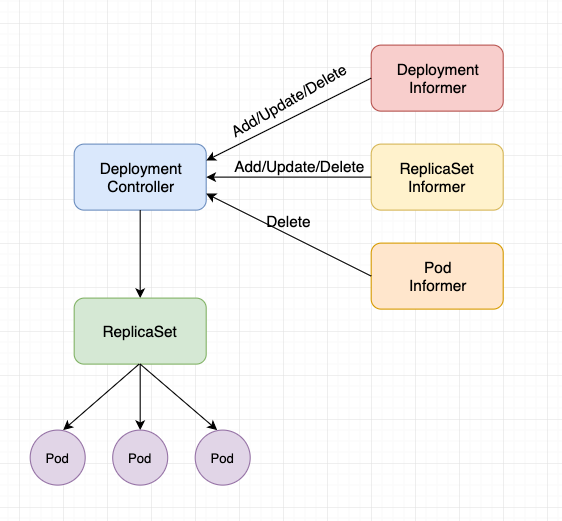

# deployment controller 源码分析

## deployment 的功能

deployment 是 kubernetes 中用来部署无状态应用的一个对象，也是最常用的一种对象。

### deployment、replicaSet 和 pod 之间的关系

deployment 的本质是控制 replicaSet，replicaSet 会控制 pod，然后由 controller 驱动各个对象达到期望状态。



DeploymentController 是 Deployment 资源的控制器，其通过 DeploymentInformer、ReplicaSetInformer、PodInformer 监听三种资源，当三种资源变化时会触发 DeploymentController 中的 syncLoop 操作。

### deployment 的基本功能

下面通过命令行操作展示一下 deployment 的基本功能。

以下是 deployment 的一个示例文件：

```
apiVersion: apps/v1
kind: Deployment
metadata:
  name: nginx-deployment
spec:
  progressDeadlineSeconds: 600    // 执行操作的超时时间
  replicas: 20
  revisionHistoryLimit: 10    // 保存的历史版本数量
  selector:
    matchLabels:
      app: nginx-deployment
  strategy:
    rollingUpdate:
      maxSurge: 25%         // 升级过程中最多可以比原先设置多出的 pod 数量
      maxUnavailable: 25%   // 升级过程中最多有多少个 pod 处于无法提供服务的状态
    type: RollingUpdate     // 更新策略
  template:
    metadata:
      labels:
        app: nginx-deployment
    spec:
      containers:
      - name: nginx-deployment
        image: nginx:1.9
        imagePullPolicy: IfNotPresent
        ports:
        - containerPort: 80
```

#### 创建

```
$ kubectl create -f nginx-dep.yaml --record

$ kubectl get deployment
NAME               READY   UP-TO-DATE   AVAILABLE   AGE
nginx-deployment   20/20   20           20          22h

$ kubectl get rs
NAME                          DESIRED   CURRENT   READY   AGE
nginx-deployment-68b649bd8b   20        20        20      22h
```

#### 滚动更新

```
$ kubectl set image deploy/nginx-deployment nginx-deployment=nginx:1.9.3

$ kubectl rollout status deployment/nginx-deployment
```

#### 回滚

```
// 查看历史版本
$ kubectl rollout history deployment/nginx-deployment
deployment.extensions/nginx-deployment
REVISION  CHANGE-CAUSE
4         <none>
5         <none>

// 指定版本回滚
$ kubectl rollout undo deployment/nginx-deployment --to-revision=2
```

#### 扩缩容

```
$ kubectl scale deployment nginx-deployment --replicas 10
deployment.extensions/nginx-deployment scaled
```

#### 暂停与恢复

```
$ kubectl rollout pause deployment/nginx-deployment
$ kubectl rollout resume deploy nginx-deployment
```

#### 删除

```
$ kubectl delete deployment nginx-deployment
```

## deployment controller 源码分析

在控制器模式下，每次操作对象都会触发一次事件，然后 controller 会进行一次 syncLoop 操作，controller 是通过 informer 监听事件以及进行 ListWatch 操作的，关于 informer 的基础知识可以参考以前写的文章。

### deployment controller 启动流程

kube-controller-manager 中所有 controller 的启动都是在 Run 方法中完成初始化并启动的。在 Run 中会调用 run 函数，run 函数的主要流程有：

1、调用 NewControllerInitializers 初始化所有 controller
2、调用 StartControllers 启动所有 controller

```
func Run(c *config.CompletedConfig, stopCh <-chan struct{}) error {
	// To help debugging, immediately log version
	klog.Infof("Version: %+v", version.Get())

	if cfgz, err := configz.New(ConfigzName); err == nil {
		cfgz.Set(c.ComponentConfig)
	} else {
		klog.Errorf("unable to register configz: %v", err)
	}

	// Setup any healthz checks we will want to use.
	var checks []healthz.HealthChecker
	var electionChecker *leaderelection.HealthzAdaptor
	if c.ComponentConfig.Generic.LeaderElection.LeaderElect {
		electionChecker = leaderelection.NewLeaderHealthzAdaptor(time.Second * 20)
		checks = append(checks, electionChecker)
	}

	// Start the controller manager HTTP server
	// unsecuredMux is the handler for these controller *after* authn/authz filters have been applied
	var unsecuredMux *mux.PathRecorderMux
	if c.SecureServing != nil {
		unsecuredMux = genericcontrollermanager.NewBaseHandler(&c.ComponentConfig.Generic.Debugging, checks...)
		handler := genericcontrollermanager.BuildHandlerChain(unsecuredMux, &c.Authorization, &c.Authentication)
		// TODO: handle stoppedCh returned by c.SecureServing.Serve
		if _, err := c.SecureServing.Serve(handler, 0, stopCh); err != nil {
			return err
		}
	}
	if c.InsecureServing != nil {
		unsecuredMux = genericcontrollermanager.NewBaseHandler(&c.ComponentConfig.Generic.Debugging, checks...)
		insecureSuperuserAuthn := server.AuthenticationInfo{Authenticator: &server.InsecureSuperuser{}}
		handler := genericcontrollermanager.BuildHandlerChain(unsecuredMux, nil, &insecureSuperuserAuthn)
		if err := c.InsecureServing.Serve(handler, 0, stopCh); err != nil {
			return err
		}
	}

	run := func(ctx context.Context) {
		rootClientBuilder := controller.SimpleControllerClientBuilder{
			ClientConfig: c.Kubeconfig,
		}
		var clientBuilder controller.ControllerClientBuilder
		if c.ComponentConfig.KubeCloudShared.UseServiceAccountCredentials {
			if len(c.ComponentConfig.SAController.ServiceAccountKeyFile) == 0 {
				// It's possible another controller process is creating the tokens for us.
				// If one isn't, we'll timeout and exit when our client builder is unable to create the tokens.
				klog.Warningf("--use-service-account-credentials was specified without providing a --service-account-private-key-file")
			}

			if shouldTurnOnDynamicClient(c.Client) {
				klog.V(1).Infof("using dynamic client builder")
				//Dynamic builder will use TokenRequest feature and refresh service account token periodically
				clientBuilder = controller.NewDynamicClientBuilder(
					restclient.AnonymousClientConfig(c.Kubeconfig),
					c.Client.CoreV1(),
					"kube-system")
			} else {
				klog.V(1).Infof("using legacy client builder")
				clientBuilder = controller.SAControllerClientBuilder{
					ClientConfig:         restclient.AnonymousClientConfig(c.Kubeconfig),
					CoreClient:           c.Client.CoreV1(),
					AuthenticationClient: c.Client.AuthenticationV1(),
					Namespace:            "kube-system",
				}
			}
		} else {
			clientBuilder = rootClientBuilder
		}
		controllerContext, err := CreateControllerContext(c, rootClientBuilder, clientBuilder, ctx.Done())
		if err != nil {
			klog.Fatalf("error building controller context: %v", err)
		}
		saTokenControllerInitFunc := serviceAccountTokenControllerStarter{rootClientBuilder: rootClientBuilder}.startServiceAccountTokenController

		if err := StartControllers(controllerContext, saTokenControllerInitFunc, NewControllerInitializers(controllerContext.LoopMode), unsecuredMux); err != nil {
			klog.Fatalf("error starting controllers: %v", err)
		}

		controllerContext.InformerFactory.Start(controllerContext.Stop)
		controllerContext.ObjectOrMetadataInformerFactory.Start(controllerContext.Stop)
		close(controllerContext.InformersStarted)

		select {}
	}

	if !c.ComponentConfig.Generic.LeaderElection.LeaderElect {
		run(context.TODO())
		panic("unreachable")
	}

	id, err := os.Hostname()
	if err != nil {
		return err
	}

	// add a uniquifier so that two processes on the same host don't accidentally both become active
	id = id + "_" + string(uuid.NewUUID())

	rl, err := resourcelock.New(c.ComponentConfig.Generic.LeaderElection.ResourceLock,
		c.ComponentConfig.Generic.LeaderElection.ResourceNamespace,
		c.ComponentConfig.Generic.LeaderElection.ResourceName,
		c.LeaderElectionClient.CoreV1(),
		c.LeaderElectionClient.CoordinationV1(),
		resourcelock.ResourceLockConfig{
			Identity:      id,
			EventRecorder: c.EventRecorder,
		})
	if err != nil {
		klog.Fatalf("error creating lock: %v", err)
	}

	leaderelection.RunOrDie(context.TODO(), leaderelection.LeaderElectionConfig{
		Lock:          rl,
		LeaseDuration: c.ComponentConfig.Generic.LeaderElection.LeaseDuration.Duration,
		RenewDeadline: c.ComponentConfig.Generic.LeaderElection.RenewDeadline.Duration,
		RetryPeriod:   c.ComponentConfig.Generic.LeaderElection.RetryPeriod.Duration,
		Callbacks: leaderelection.LeaderCallbacks{
			OnStartedLeading: run,
			OnStoppedLeading: func() {
				klog.Fatalf("leaderelection lost")
			},
		},
		WatchDog: electionChecker,
		Name:     "kube-controller-manager",
	})
	panic("unreachable")
}
```

NewControllerInitializers 中定义了所有的 controller 以及 start controller 对应的方法。deployment controller 对应的启动方法是 startDeploymentController。

```
func NewControllerInitializers(loopMode ControllerLoopMode) map[string]InitFunc {
	controllers := map[string]InitFunc{}
	controllers["endpoint"] = startEndpointController
	controllers["endpointslice"] = startEndpointSliceController
	controllers["replicationcontroller"] = startReplicationController
	controllers["podgc"] = startPodGCController
	controllers["resourcequota"] = startResourceQuotaController
	controllers["namespace"] = startNamespaceController
	controllers["serviceaccount"] = startServiceAccountController
	controllers["garbagecollector"] = startGarbageCollectorController
	controllers["daemonset"] = startDaemonSetController
	controllers["job"] = startJobController
	controllers["deployment"] = startDeploymentController
	controllers["replicaset"] = startReplicaSetController
	controllers["horizontalpodautoscaling"] = startHPAController
	controllers["disruption"] = startDisruptionController
	controllers["statefulset"] = startStatefulSetController
	controllers["cronjob"] = startCronJobController
	controllers["csrsigning"] = startCSRSigningController
	controllers["csrapproving"] = startCSRApprovingController
	controllers["csrcleaner"] = startCSRCleanerController
	controllers["ttl"] = startTTLController
	controllers["bootstrapsigner"] = startBootstrapSignerController
	controllers["tokencleaner"] = startTokenCleanerController
	controllers["nodeipam"] = startNodeIpamController
	controllers["nodelifecycle"] = startNodeLifecycleController
	if loopMode == IncludeCloudLoops {
		controllers["service"] = startServiceController
		controllers["route"] = startRouteController
		controllers["cloud-node-lifecycle"] = startCloudNodeLifecycleController
		// TODO: volume controller into the IncludeCloudLoops only set.
	}
	controllers["persistentvolume-binder"] = startPersistentVolumeBinderController
	controllers["attachdetach"] = startAttachDetachController
	controllers["persistentvolume-expander"] = startVolumeExpandController
	controllers["clusterrole-aggregation"] = startClusterRoleAggregrationController
	controllers["pvc-protection"] = startPVCProtectionController
	controllers["pv-protection"] = startPVProtectionController
	controllers["ttl-after-finished"] = startTTLAfterFinishedController
	controllers["root-ca-cert-publisher"] = startRootCACertPublisher

	return controllers
}
```

在startDeploymentController 中对 deploymentController 进行了初始化，并执行 dc.Run() 方法启动了 controller。

```
func startDeploymentController(ctx ControllerContext) (http.Handler, bool, error) {
	if !ctx.AvailableResources[schema.GroupVersionResource{Group: "apps", Version: "v1", Resource: "deployments"}] {
		return nil, false, nil
	}
	dc, err := deployment.NewDeploymentController(
		ctx.InformerFactory.Apps().V1().Deployments(),
		ctx.InformerFactory.Apps().V1().ReplicaSets(),
		ctx.InformerFactory.Core().V1().Pods(),
		ctx.ClientBuilder.ClientOrDie("deployment-controller"),
	)
	if err != nil {
		return nil, true, fmt.Errorf("error creating Deployment controller: %v", err)
	}
	go dc.Run(int(ctx.ComponentConfig.DeploymentController.ConcurrentDeploymentSyncs), ctx.Stop)
	return nil, true, nil
}
```

ctx.ComponentConfig.DeploymentController.ConcurrentDeploymentSyncs 指定了 deployment controller 中工作的 goroutine 数量，默认值为 5，即会启动五个 goroutine 从 workqueue 中取出 object 并进行 sync 操作，该参数的默认值定义在 k8s.io/kubernetes/pkg/controller/deployment/config/v1alpha1/defaults.go 中。

dc.Run 方法会执行 ListWatch 操作并根据对应的事件执行 syncLoop。

```
func (dc *DeploymentController) Run(workers int, stopCh <-chan struct{}) {
	defer utilruntime.HandleCrash()
	defer dc.queue.ShutDown()

	klog.Infof("Starting deployment controller")
	defer klog.Infof("Shutting down deployment controller")

	if !cache.WaitForNamedCacheSync("deployment", stopCh, dc.dListerSynced, dc.rsListerSynced, dc.podListerSynced) {
		return
	}

	for i := 0; i < workers; i++ {
		go wait.Until(dc.worker, time.Second, stopCh)
	}

	<-stopCh
}
```

dc.worker 会调用 syncHandler 进行 sync 操作。

```
func (dc *DeploymentController) worker() {
	for dc.processNextWorkItem() {
	}
}
```

```

func (dc *DeploymentController) processNextWorkItem() bool {
	key, quit := dc.queue.Get()
	if quit {
		return false
	}
	defer dc.queue.Done(key)

	err := dc.syncHandler(key.(string))
	dc.handleErr(err, key)

	return true
}
```

syncHandler 是 controller 的核心逻辑，下面会进行详细说明。至此，对于 deployment controller 的启动流程已经分析完，再来看一下 deployment controller 启动过程中的整个调用链，如下所示：

```
Run() --> run() --> NewControllerInitializers() --> StartControllers() --> startDeploymentController() --> deployment.NewDeploymentController() --> deployment.Run()
--> deployment.syncDeployment()
```

deployment controller 在初始化时指定了 dc.syncHandler = dc.syncDeployment，所以该函数名为 syncDeployment，本文开头介绍 deployment 中的基本操作都是在 syncDeployment 中完成的。

syncDeployment 的主要流程如下所示：

1、调用 getReplicaSetsForDeployment 获取集群中与 Deployment 相关的 ReplicaSet，若发现匹配但没有关联 deployment 的 rs 则通过设置 ownerReferences 字段与 deployment 关联，已关联但不匹配的则删除对应的 ownerReferences；
2、调用 getPodMapForDeployment 获取当前 Deployment 对象关联的 pod，并根据 rs.UID 对上述 pod 进行分类；
3、通过判断 deployment 的 DeletionTimestamp 字段确认是否为删除操作；
4、执行 checkPausedConditions检查 deployment 是否为pause状态并添加合适的condition；
5、调用 getRollbackTo 函数检查 Deployment 是否有Annotations："deprecated.deployment.rollback.to"字段，如果有，调用 dc.rollback 方法执行 rollback 操作；
6、调用 dc.isScalingEvent 方法检查是否处于 scaling 状态中；
7、最后检查是否为更新操作，并根据更新策略 Recreate 或 RollingUpdate 来执行对应的操作；

```
func (dc *DeploymentController) syncDeployment(key string) error {
	startTime := time.Now()
	klog.V(4).Infof("Started syncing deployment %q (%v)", key, startTime)
	defer func() {
		klog.V(4).Infof("Finished syncing deployment %q (%v)", key, time.Since(startTime))
	}()

	namespace, name, err := cache.SplitMetaNamespaceKey(key)
	if err != nil {
		return err
	}
	deployment, err := dc.dLister.Deployments(namespace).Get(name)
	if errors.IsNotFound(err) {
		klog.V(2).Infof("Deployment %v has been deleted", key)
		return nil
	}
	if err != nil {
		return err
	}

	// Deep-copy otherwise we are mutating our cache.
	// TODO: Deep-copy only when needed.
	d := deployment.DeepCopy()

	everything := metav1.LabelSelector{}
	if reflect.DeepEqual(d.Spec.Selector, &everything) {
		dc.eventRecorder.Eventf(d, v1.EventTypeWarning, "SelectingAll", "This deployment is selecting all pods. A non-empty selector is required.")
		if d.Status.ObservedGeneration < d.Generation {
			d.Status.ObservedGeneration = d.Generation
			dc.client.AppsV1().Deployments(d.Namespace).UpdateStatus(context.TODO(), d, metav1.UpdateOptions{})
		}
		return nil
	}

	// List ReplicaSets owned by this Deployment, while reconciling ControllerRef
	// through adoption/orphaning.
	rsList, err := dc.getReplicaSetsForDeployment(d)
	if err != nil {
		return err
	}
	// List all Pods owned by this Deployment, grouped by their ReplicaSet.
	// Current uses of the podMap are:
	//
	// * check if a Pod is labeled correctly with the pod-template-hash label.
	// * check that no old Pods are running in the middle of Recreate Deployments.
	podMap, err := dc.getPodMapForDeployment(d, rsList)
	if err != nil {
		return err
	}

	if d.DeletionTimestamp != nil {
		return dc.syncStatusOnly(d, rsList)
	}

	// Update deployment conditions with an Unknown condition when pausing/resuming
	// a deployment. In this way, we can be sure that we won't timeout when a user
	// resumes a Deployment with a set progressDeadlineSeconds.
	if err = dc.checkPausedConditions(d); err != nil {
		return err
	}

	if d.Spec.Paused {
		return dc.sync(d, rsList)
	}

	// rollback is not re-entrant in case the underlying replica sets are updated with a new
	// revision so we should ensure that we won't proceed to update replica sets until we
	// make sure that the deployment has cleaned up its rollback spec in subsequent enqueues.
	if getRollbackTo(d) != nil {
		return dc.rollback(d, rsList)
	}

	scalingEvent, err := dc.isScalingEvent(d, rsList)
	if err != nil {
		return err
	}
	if scalingEvent {
		return dc.sync(d, rsList)
	}

	switch d.Spec.Strategy.Type {
	case apps.RecreateDeploymentStrategyType:
		return dc.rolloutRecreate(d, rsList, podMap)
	case apps.RollingUpdateDeploymentStrategyType:
		return dc.rolloutRolling(d, rsList)
	}
	return fmt.Errorf("unexpected deployment strategy type: %s", d.Spec.Strategy.Type)
}
```

可以看出对于 deployment 的删除、暂停恢复、扩缩容以及更新操作都是在 syncDeployment 方法中进行处理的，最终是通过调用 syncStatusOnly、sync、rollback、rolloutRecreate、rolloutRolling 这几个方法来处理的，其中 syncStatusOnly 和 sync 都是更新 Deployment 的 Status，rollback 是用来回滚的，rolloutRecreate 和 rolloutRolling 是根据不同的更新策略来更新 Deployment 的，下面就来看看这些操作的具体实现。

从 syncDeployment 中也可知以上几个操作的优先级为：

```
delete > pause > rollback > scale > rollout
```

举个例子，当在 rollout 操作时可以执行 pause 操作，在 pause 状态时也可直接执行删除操作。

### 删除

syncDeployment 中首先处理的是删除操作，删除操作是由客户端发起的，首先会在对象的 metadata 中设置 DeletionTimestamp 字段。

```
func (dc *DeploymentController) syncDeployment(key string) error {
	startTime := time.Now()
	klog.V(4).Infof("Started syncing deployment %q (%v)", key, startTime)
	defer func() {
		klog.V(4).Infof("Finished syncing deployment %q (%v)", key, time.Since(startTime))
	}()

	namespace, name, err := cache.SplitMetaNamespaceKey(key)
	if err != nil {
		return err
	}
	deployment, err := dc.dLister.Deployments(namespace).Get(name)
	if errors.IsNotFound(err) {
		klog.V(2).Infof("Deployment %v has been deleted", key)
		return nil
	}
	if err != nil {
		return err
	}

	// Deep-copy otherwise we are mutating our cache.
	// TODO: Deep-copy only when needed.
	d := deployment.DeepCopy()

	everything := metav1.LabelSelector{}
	if reflect.DeepEqual(d.Spec.Selector, &everything) {
		dc.eventRecorder.Eventf(d, v1.EventTypeWarning, "SelectingAll", "This deployment is selecting all pods. A non-empty selector is required.")
		if d.Status.ObservedGeneration < d.Generation {
			d.Status.ObservedGeneration = d.Generation
			dc.client.AppsV1().Deployments(d.Namespace).UpdateStatus(context.TODO(), d, metav1.UpdateOptions{})
		}
		return nil
	}

	// List ReplicaSets owned by this Deployment, while reconciling ControllerRef
	// through adoption/orphaning.
	rsList, err := dc.getReplicaSetsForDeployment(d)
	if err != nil {
		return err
	}
	// List all Pods owned by this Deployment, grouped by their ReplicaSet.
	// Current uses of the podMap are:
	//
	// * check if a Pod is labeled correctly with the pod-template-hash label.
	// * check that no old Pods are running in the middle of Recreate Deployments.
	podMap, err := dc.getPodMapForDeployment(d, rsList)
	if err != nil {
		return err
	}

	if d.DeletionTimestamp != nil {
		return dc.syncStatusOnly(d, rsList)
	}

	// Update deployment conditions with an Unknown condition when pausing/resuming
	// a deployment. In this way, we can be sure that we won't timeout when a user
	// resumes a Deployment with a set progressDeadlineSeconds.
	if err = dc.checkPausedConditions(d); err != nil {
		return err
	}

	if d.Spec.Paused {
		return dc.sync(d, rsList)
	}

	// rollback is not re-entrant in case the underlying replica sets are updated with a new
	// revision so we should ensure that we won't proceed to update replica sets until we
	// make sure that the deployment has cleaned up its rollback spec in subsequent enqueues.
	if getRollbackTo(d) != nil {
		return dc.rollback(d, rsList)
	}

	scalingEvent, err := dc.isScalingEvent(d, rsList)
	if err != nil {
		return err
	}
	if scalingEvent {
		return dc.sync(d, rsList)
	}

	switch d.Spec.Strategy.Type {
	case apps.RecreateDeploymentStrategyType:
		return dc.rolloutRecreate(d, rsList, podMap)
	case apps.RollingUpdateDeploymentStrategyType:
		return dc.rolloutRolling(d, rsList)
	}
	return fmt.Errorf("unexpected deployment strategy type: %s", d.Spec.Strategy.Type)
}
```

当 controller 检查到该对象有了 DeletionTimestamp 字段时会调用 dc.syncStatusOnly 执行对应的删除逻辑，该方法首先获取 newRS 以及所有的 oldRSs，然后会调用 syncDeploymentStatus 方法。

```
func (dc *DeploymentController) syncStatusOnly(d *apps.Deployment, rsList []*apps.ReplicaSet) error {
	newRS, oldRSs, err := dc.getAllReplicaSetsAndSyncRevision(d, rsList, false)
	if err != nil {
		return err
	}

	allRSs := append(oldRSs, newRS)
	return dc.syncDeploymentStatus(allRSs, newRS, d)
}
```

syncDeploymentStatus 首先通过 newRS 和 allRSs 计算 deployment 当前的 status，然后和 deployment 中的 status 进行比较，若二者有差异则更新 deployment 使用最新的 status，syncDeploymentStatus 在后面的多种操作中都会被用到。

```
func (dc *DeploymentController) syncDeploymentStatus(allRSs []*apps.ReplicaSet, newRS *apps.ReplicaSet, d *apps.Deployment) error {
	newStatus := calculateStatus(allRSs, newRS, d)

	if reflect.DeepEqual(d.Status, newStatus) {
		return nil
	}

	newDeployment := d
	newDeployment.Status = newStatus
	_, err := dc.client.AppsV1().Deployments(newDeployment.Namespace).UpdateStatus(context.TODO(), newDeployment, metav1.UpdateOptions{})
	return err
}
```

calculateStatus 如下所示，主要是通过 allRSs 以及 deployment 的状态计算出最新的 status。

```
func calculateStatus(allRSs []*apps.ReplicaSet, newRS *apps.ReplicaSet, deployment *apps.Deployment) apps.DeploymentStatus {
	availableReplicas := deploymentutil.GetAvailableReplicaCountForReplicaSets(allRSs)
	totalReplicas := deploymentutil.GetReplicaCountForReplicaSets(allRSs)
	unavailableReplicas := totalReplicas - availableReplicas
	// If unavailableReplicas is negative, then that means the Deployment has more available replicas running than
	// desired, e.g. whenever it scales down. In such a case we should simply default unavailableReplicas to zero.
	if unavailableReplicas < 0 {
		unavailableReplicas = 0
	}

	status := apps.DeploymentStatus{
		// TODO: Ensure that if we start retrying status updates, we won't pick up a new Generation value.
		ObservedGeneration:  deployment.Generation,
		Replicas:            deploymentutil.GetActualReplicaCountForReplicaSets(allRSs),
		UpdatedReplicas:     deploymentutil.GetActualReplicaCountForReplicaSets([]*apps.ReplicaSet{newRS}),
		ReadyReplicas:       deploymentutil.GetReadyReplicaCountForReplicaSets(allRSs),
		AvailableReplicas:   availableReplicas,
		UnavailableReplicas: unavailableReplicas,
		CollisionCount:      deployment.Status.CollisionCount,
	}

	// Copy conditions one by one so we won't mutate the original object.
	conditions := deployment.Status.Conditions
	for i := range conditions {
		status.Conditions = append(status.Conditions, conditions[i])
	}

	if availableReplicas >= *(deployment.Spec.Replicas)-deploymentutil.MaxUnavailable(*deployment) {
		minAvailability := deploymentutil.NewDeploymentCondition(apps.DeploymentAvailable, v1.ConditionTrue, deploymentutil.MinimumReplicasAvailable, "Deployment has minimum availability.")
		deploymentutil.SetDeploymentCondition(&status, *minAvailability)
	} else {
		noMinAvailability := deploymentutil.NewDeploymentCondition(apps.DeploymentAvailable, v1.ConditionFalse, deploymentutil.MinimumReplicasUnavailable, "Deployment does not have minimum availability.")
		deploymentutil.SetDeploymentCondition(&status, *noMinAvailability)
	}

	return status
}
```

以上就是 controller 中处理删除逻辑的主要流程，通过上述代码可知，当删除 deployment 对象时，仅仅是判断该对象中是否存在 metadata.DeletionTimestamp 字段，然后进行一次状态同步，并没有看到删除 deployment、rs、pod 对象的操作，其实删除对象并不是在此处进行而是在 kube-controller-manager 的垃圾回收器(garbagecollector controller)中完成的，对于 garbagecollector controller 会在后面的文章中进行说明，此外在删除对象时还需要指定一个删除选项(orphan、background 或者 foreground)来说明该对象如何删除。

### 暂停和恢复

暂停以及恢复两个操作都是通过更新 deployment spec.paused 字段实现的，下面直接看它的具体实现。

```
func (dc *DeploymentController) syncDeployment(key string) error {
	startTime := time.Now()
	klog.V(4).Infof("Started syncing deployment %q (%v)", key, startTime)
	defer func() {
		klog.V(4).Infof("Finished syncing deployment %q (%v)", key, time.Since(startTime))
	}()

	namespace, name, err := cache.SplitMetaNamespaceKey(key)
	if err != nil {
		return err
	}
	deployment, err := dc.dLister.Deployments(namespace).Get(name)
	if errors.IsNotFound(err) {
		klog.V(2).Infof("Deployment %v has been deleted", key)
		return nil
	}
	if err != nil {
		return err
	}

	// Deep-copy otherwise we are mutating our cache.
	// TODO: Deep-copy only when needed.
	d := deployment.DeepCopy()

	everything := metav1.LabelSelector{}
	if reflect.DeepEqual(d.Spec.Selector, &everything) {
		dc.eventRecorder.Eventf(d, v1.EventTypeWarning, "SelectingAll", "This deployment is selecting all pods. A non-empty selector is required.")
		if d.Status.ObservedGeneration < d.Generation {
			d.Status.ObservedGeneration = d.Generation
			dc.client.AppsV1().Deployments(d.Namespace).UpdateStatus(context.TODO(), d, metav1.UpdateOptions{})
		}
		return nil
	}

	// List ReplicaSets owned by this Deployment, while reconciling ControllerRef
	// through adoption/orphaning.
	rsList, err := dc.getReplicaSetsForDeployment(d)
	if err != nil {
		return err
	}
	// List all Pods owned by this Deployment, grouped by their ReplicaSet.
	// Current uses of the podMap are:
	//
	// * check if a Pod is labeled correctly with the pod-template-hash label.
	// * check that no old Pods are running in the middle of Recreate Deployments.
	podMap, err := dc.getPodMapForDeployment(d, rsList)
	if err != nil {
		return err
	}

	if d.DeletionTimestamp != nil {
		return dc.syncStatusOnly(d, rsList)
	}

	// Update deployment conditions with an Unknown condition when pausing/resuming
	// a deployment. In this way, we can be sure that we won't timeout when a user
	// resumes a Deployment with a set progressDeadlineSeconds.
	if err = dc.checkPausedConditions(d); err != nil {
		return err
	}

	if d.Spec.Paused {
		return dc.sync(d, rsList)
	}

	// rollback is not re-entrant in case the underlying replica sets are updated with a new
	// revision so we should ensure that we won't proceed to update replica sets until we
	// make sure that the deployment has cleaned up its rollback spec in subsequent enqueues.
	if getRollbackTo(d) != nil {
		return dc.rollback(d, rsList)
	}

	scalingEvent, err := dc.isScalingEvent(d, rsList)
	if err != nil {
		return err
	}
	if scalingEvent {
		return dc.sync(d, rsList)
	}

	switch d.Spec.Strategy.Type {
	case apps.RecreateDeploymentStrategyType:
		return dc.rolloutRecreate(d, rsList, podMap)
	case apps.RollingUpdateDeploymentStrategyType:
		return dc.rolloutRolling(d, rsList)
	}
	return fmt.Errorf("unexpected deployment strategy type: %s", d.Spec.Strategy.Type)
}
```

当触发暂停操作时，会调用 sync 方法进行操作，sync 方法的主要逻辑如下所示：

1、获取 newRS 和 oldRSs；
2、根据 newRS 和 oldRSs 判断是否需要 scale 操作；
3、若处于暂停状态且没有执行回滚操作，则根据 deployment 的 .spec.revisionHistoryLimit 中的值清理多余的 rs；
4、最后执行 syncDeploymentStatus 更新 status；

```
func (dc *DeploymentController) sync(d *apps.Deployment, rsList []*apps.ReplicaSet) error {
	newRS, oldRSs, err := dc.getAllReplicaSetsAndSyncRevision(d, rsList, false)
	if err != nil {
		return err
	}
	if err := dc.scale(d, newRS, oldRSs); err != nil {
		// If we get an error while trying to scale, the deployment will be requeued
		// so we can abort this resync
		return err
	}

	// Clean up the deployment when it's paused and no rollback is in flight.
	if d.Spec.Paused && getRollbackTo(d) == nil {
		if err := dc.cleanupDeployment(oldRSs, d); err != nil {
			return err
		}
	}

	allRSs := append(oldRSs, newRS)
	return dc.syncDeploymentStatus(allRSs, newRS, d)
}
```

上文已经提到过 deployment controller 在一个 syncLoop 中各种操作是有优先级，而 pause > rollback > scale > rollout，通过文章开头的命令行参数也可以看出，暂停和恢复操作只有在 rollout 时才会生效，再结合源码分析，虽然暂停操作下不会执行到 scale 相关的操作，但是 pause 与 scale 都是调用 sync 方法完成的，且在 sync 方法中会首先检查 scale 操作是否完成，也就是说在 pause 操作后并不是立即暂停所有操作，例如，当执行滚动更新操作后立即执行暂停操作，此时滚动更新的第一个周期并不会立刻停止而是会等到滚动更新的第一个周期完成后才会处于暂停状态，在下文的滚动更新一节会有例子进行详细的分析，至于 scale 操作在下文也会进行详细分析。

syncDeploymentStatus 方法以及相关的代码在上文的删除操作中已经解释过了，此处不再进行分析。

### 回滚

kubernetes 中的每一个 Deployment 资源都包含有 revision 这个概念，并且其 .spec.revisionHistoryLimit 字段指定了需要保留的历史版本数，默认为10，每个版本都会对应一个 rs，若发现集群中有大量 0/0 rs 时请不要删除它，这些 rs 对应的都是 deployment 的历史版本，否则会导致无法回滚。当一个 deployment 的历史 rs 数超过指定数时，deployment controller 会自动清理。

当在客户端触发回滚操作时，controller 会调用 getRollbackTo 进行判断并调用 rollback 执行对应的回滚操作。

```
func (dc *DeploymentController) syncDeployment(key string) error {
	startTime := time.Now()
	klog.V(4).Infof("Started syncing deployment %q (%v)", key, startTime)
	defer func() {
		klog.V(4).Infof("Finished syncing deployment %q (%v)", key, time.Since(startTime))
	}()

	namespace, name, err := cache.SplitMetaNamespaceKey(key)
	if err != nil {
		return err
	}
	deployment, err := dc.dLister.Deployments(namespace).Get(name)
	if errors.IsNotFound(err) {
		klog.V(2).Infof("Deployment %v has been deleted", key)
		return nil
	}
	if err != nil {
		return err
	}

	// Deep-copy otherwise we are mutating our cache.
	// TODO: Deep-copy only when needed.
	d := deployment.DeepCopy()

	everything := metav1.LabelSelector{}
	if reflect.DeepEqual(d.Spec.Selector, &everything) {
		dc.eventRecorder.Eventf(d, v1.EventTypeWarning, "SelectingAll", "This deployment is selecting all pods. A non-empty selector is required.")
		if d.Status.ObservedGeneration < d.Generation {
			d.Status.ObservedGeneration = d.Generation
			dc.client.AppsV1().Deployments(d.Namespace).UpdateStatus(context.TODO(), d, metav1.UpdateOptions{})
		}
		return nil
	}

	// List ReplicaSets owned by this Deployment, while reconciling ControllerRef
	// through adoption/orphaning.
	rsList, err := dc.getReplicaSetsForDeployment(d)
	if err != nil {
		return err
	}
	// List all Pods owned by this Deployment, grouped by their ReplicaSet.
	// Current uses of the podMap are:
	//
	// * check if a Pod is labeled correctly with the pod-template-hash label.
	// * check that no old Pods are running in the middle of Recreate Deployments.
	podMap, err := dc.getPodMapForDeployment(d, rsList)
	if err != nil {
		return err
	}

	if d.DeletionTimestamp != nil {
		return dc.syncStatusOnly(d, rsList)
	}

	// Update deployment conditions with an Unknown condition when pausing/resuming
	// a deployment. In this way, we can be sure that we won't timeout when a user
	// resumes a Deployment with a set progressDeadlineSeconds.
	if err = dc.checkPausedConditions(d); err != nil {
		return err
	}

	if d.Spec.Paused {
		return dc.sync(d, rsList)
	}

	// rollback is not re-entrant in case the underlying replica sets are updated with a new
	// revision so we should ensure that we won't proceed to update replica sets until we
	// make sure that the deployment has cleaned up its rollback spec in subsequent enqueues.
	if getRollbackTo(d) != nil {
		return dc.rollback(d, rsList)
	}

	scalingEvent, err := dc.isScalingEvent(d, rsList)
	if err != nil {
		return err
	}
	if scalingEvent {
		return dc.sync(d, rsList)
	}

	switch d.Spec.Strategy.Type {
	case apps.RecreateDeploymentStrategyType:
		return dc.rolloutRecreate(d, rsList, podMap)
	case apps.RollingUpdateDeploymentStrategyType:
		return dc.rolloutRolling(d, rsList)
	}
	return fmt.Errorf("unexpected deployment strategy type: %s", d.Spec.Strategy.Type)
}
```

getRollbackTo 通过判断 deployment 是否存在 rollback 对应的注解然后获取其值作为目标版本。

```
func getRollbackTo(d *apps.Deployment) *extensions.RollbackConfig {
	// Extract the annotation used for round-tripping the deprecated RollbackTo field.
	revision := d.Annotations[apps.DeprecatedRollbackTo]
	if revision == "" {
		return nil
	}
	revision64, err := strconv.ParseInt(revision, 10, 64)
	if err != nil {
		// If it's invalid, ignore it.
		return nil
	}
	return &extensions.RollbackConfig{
		Revision: revision64,
	}
}
```

rollback 方法的主要逻辑如下：

1、获取 newRS 和 oldRSs；
2、调用 getRollbackTo 获取 rollback 的 revision；
3、判断 revision 以及对应的 rs 是否存在，若 revision 为 0，则表示回滚到上一个版本；
4、若存在对应的 rs，则调用 rollbackToTemplate 方法将 rs.Spec.Template 赋值给 d.Spec.Template，否则放弃回滚操作；

```
func (dc *DeploymentController) rollback(d *apps.Deployment, rsList []*apps.ReplicaSet) error {
	newRS, allOldRSs, err := dc.getAllReplicaSetsAndSyncRevision(d, rsList, true)
	if err != nil {
		return err
	}

	allRSs := append(allOldRSs, newRS)
	rollbackTo := getRollbackTo(d)
	// If rollback revision is 0, rollback to the last revision
	if rollbackTo.Revision == 0 {
		if rollbackTo.Revision = deploymentutil.LastRevision(allRSs); rollbackTo.Revision == 0 {
			// If we still can't find the last revision, gives up rollback
			dc.emitRollbackWarningEvent(d, deploymentutil.RollbackRevisionNotFound, "Unable to find last revision.")
			// Gives up rollback
			return dc.updateDeploymentAndClearRollbackTo(d)
		}
	}
	for _, rs := range allRSs {
		v, err := deploymentutil.Revision(rs)
		if err != nil {
			klog.V(4).Infof("Unable to extract revision from deployment's replica set %q: %v", rs.Name, err)
			continue
		}
		if v == rollbackTo.Revision {
			klog.V(4).Infof("Found replica set %q with desired revision %d", rs.Name, v)
			// rollback by copying podTemplate.Spec from the replica set
			// revision number will be incremented during the next getAllReplicaSetsAndSyncRevision call
			// no-op if the spec matches current deployment's podTemplate.Spec
			performedRollback, err := dc.rollbackToTemplate(d, rs)
			if performedRollback && err == nil {
				dc.emitRollbackNormalEvent(d, fmt.Sprintf("Rolled back deployment %q to revision %d", d.Name, rollbackTo.Revision))
			}
			return err
		}
	}
	dc.emitRollbackWarningEvent(d, deploymentutil.RollbackRevisionNotFound, "Unable to find the revision to rollback to.")
	// Gives up rollback
	return dc.updateDeploymentAndClearRollbackTo(d)
}
```

rollbackToTemplate 会判断 deployment.Spec.Template 和 rs.Spec.Template 是否相等，若相等则无需回滚，否则使用 rs.Spec.Template 替换 deployment.Spec.Template，然后更新 deployment 的 spec 并清除回滚标志。

```
func (dc *DeploymentController) rollbackToTemplate(d *apps.Deployment, rs *apps.ReplicaSet) (bool, error) {
	performedRollback := false
	if !deploymentutil.EqualIgnoreHash(&d.Spec.Template, &rs.Spec.Template) {
		klog.V(4).Infof("Rolling back deployment %q to template spec %+v", d.Name, rs.Spec.Template.Spec)
		deploymentutil.SetFromReplicaSetTemplate(d, rs.Spec.Template)
		// set RS (the old RS we'll rolling back to) annotations back to the deployment;
		// otherwise, the deployment's current annotations (should be the same as current new RS) will be copied to the RS after the rollback.
		//
		// For example,
		// A Deployment has old RS1 with annotation {change-cause:create}, and new RS2 {change-cause:edit}.
		// Note that both annotations are copied from Deployment, and the Deployment should be annotated {change-cause:edit} as well.
		// Now, rollback Deployment to RS1, we should update Deployment's pod-template and also copy annotation from RS1.
		// Deployment is now annotated {change-cause:create}, and we have new RS1 {change-cause:create}, old RS2 {change-cause:edit}.
		//
		// If we don't copy the annotations back from RS to deployment on rollback, the Deployment will stay as {change-cause:edit},
		// and new RS1 becomes {change-cause:edit} (copied from deployment after rollback), old RS2 {change-cause:edit}, which is not correct.
		deploymentutil.SetDeploymentAnnotationsTo(d, rs)
		performedRollback = true
	} else {
		klog.V(4).Infof("Rolling back to a revision that contains the same template as current deployment %q, skipping rollback...", d.Name)
		eventMsg := fmt.Sprintf("The rollback revision contains the same template as current deployment %q", d.Name)
		dc.emitRollbackWarningEvent(d, deploymentutil.RollbackTemplateUnchanged, eventMsg)
	}

	return performedRollback, dc.updateDeploymentAndClearRollbackTo(d)
}
```

回滚操作其实就是通过 revision 找到对应的 rs，然后使用 rs.Spec.Template 替换 deployment.Spec.Template 最后驱动 replicaSet 和 pod 达到期望状态即完成了回滚操作，在最新版中，这种使用注解方式指定回滚版本的方法即将被废弃。

### 扩缩容

当执行 scale 操作时，首先会通过 isScalingEvent 方法判断是否为扩缩容操作，然后通过 dc.sync 方法来执行实际的扩缩容动作。

```
func (dc *DeploymentController) syncDeployment(key string) error {
	startTime := time.Now()
	klog.V(4).Infof("Started syncing deployment %q (%v)", key, startTime)
	defer func() {
		klog.V(4).Infof("Finished syncing deployment %q (%v)", key, time.Since(startTime))
	}()

	namespace, name, err := cache.SplitMetaNamespaceKey(key)
	if err != nil {
		return err
	}
	deployment, err := dc.dLister.Deployments(namespace).Get(name)
	if errors.IsNotFound(err) {
		klog.V(2).Infof("Deployment %v has been deleted", key)
		return nil
	}
	if err != nil {
		return err
	}

	// Deep-copy otherwise we are mutating our cache.
	// TODO: Deep-copy only when needed.
	d := deployment.DeepCopy()

	everything := metav1.LabelSelector{}
	if reflect.DeepEqual(d.Spec.Selector, &everything) {
		dc.eventRecorder.Eventf(d, v1.EventTypeWarning, "SelectingAll", "This deployment is selecting all pods. A non-empty selector is required.")
		if d.Status.ObservedGeneration < d.Generation {
			d.Status.ObservedGeneration = d.Generation
			dc.client.AppsV1().Deployments(d.Namespace).UpdateStatus(context.TODO(), d, metav1.UpdateOptions{})
		}
		return nil
	}

	// List ReplicaSets owned by this Deployment, while reconciling ControllerRef
	// through adoption/orphaning.
	rsList, err := dc.getReplicaSetsForDeployment(d)
	if err != nil {
		return err
	}
	// List all Pods owned by this Deployment, grouped by their ReplicaSet.
	// Current uses of the podMap are:
	//
	// * check if a Pod is labeled correctly with the pod-template-hash label.
	// * check that no old Pods are running in the middle of Recreate Deployments.
	podMap, err := dc.getPodMapForDeployment(d, rsList)
	if err != nil {
		return err
	}

	if d.DeletionTimestamp != nil {
		return dc.syncStatusOnly(d, rsList)
	}

	// Update deployment conditions with an Unknown condition when pausing/resuming
	// a deployment. In this way, we can be sure that we won't timeout when a user
	// resumes a Deployment with a set progressDeadlineSeconds.
	if err = dc.checkPausedConditions(d); err != nil {
		return err
	}

	if d.Spec.Paused {
		return dc.sync(d, rsList)
	}

	// rollback is not re-entrant in case the underlying replica sets are updated with a new
	// revision so we should ensure that we won't proceed to update replica sets until we
	// make sure that the deployment has cleaned up its rollback spec in subsequent enqueues.
	if getRollbackTo(d) != nil {
		return dc.rollback(d, rsList)
	}

	scalingEvent, err := dc.isScalingEvent(d, rsList)
	if err != nil {
		return err
	}
	if scalingEvent {
		return dc.sync(d, rsList)
	}

	switch d.Spec.Strategy.Type {
	case apps.RecreateDeploymentStrategyType:
		return dc.rolloutRecreate(d, rsList, podMap)
	case apps.RollingUpdateDeploymentStrategyType:
		return dc.rolloutRolling(d, rsList)
	}
	return fmt.Errorf("unexpected deployment strategy type: %s", d.Spec.Strategy.Type)
}
```

isScalingEvent 的主要逻辑如下所示：

1、获取所有的 rs；
2、过滤出 activeRS，rs.Spec.Replicas > 0 的为 activeRS；
3、判断 rs 的 desired 值是否等于 deployment.Spec.Replicas，若不等于则需要为 rs 进行 scale 操作；

```
func (dc *DeploymentController) isScalingEvent(d *apps.Deployment, rsList []*apps.ReplicaSet) (bool, error) {
	newRS, oldRSs, err := dc.getAllReplicaSetsAndSyncRevision(d, rsList, false)
	if err != nil {
		return false, err
	}
	allRSs := append(oldRSs, newRS)
	for _, rs := range controller.FilterActiveReplicaSets(allRSs) {
		desired, ok := deploymentutil.GetDesiredReplicasAnnotation(rs)
		if !ok {
			continue
		}
		if desired != *(d.Spec.Replicas) {
			return true, nil
		}
	}
	return false, nil
}
```

在通过 isScalingEvent 判断为 scale 操作时会调用 sync 方法执行，主要逻辑如下：

1、获取 newRS 和 oldRSs；
2、调用 scale 方法进行扩缩容操作；
3、同步 deployment 的状态；

```
func (dc *DeploymentController) sync(d *apps.Deployment, rsList []*apps.ReplicaSet) error {
	newRS, oldRSs, err := dc.getAllReplicaSetsAndSyncRevision(d, rsList, false)
	if err != nil {
		return err
	}
	if err := dc.scale(d, newRS, oldRSs); err != nil {
		// If we get an error while trying to scale, the deployment will be requeued
		// so we can abort this resync
		return err
	}

	// Clean up the deployment when it's paused and no rollback is in flight.
	if d.Spec.Paused && getRollbackTo(d) == nil {
		if err := dc.cleanupDeployment(oldRSs, d); err != nil {
			return err
		}
	}

	allRSs := append(oldRSs, newRS)
	return dc.syncDeploymentStatus(allRSs, newRS, d)
}
```

sync 方法中会调用 scale 方法执行扩容操作，其主要逻辑为：

1、通过 FindActiveOrLatest 获取 activeRS 或者最新的 rs，此时若只有一个 rs 说明本次操作仅为 scale 操作，则调用 scaleReplicaSetAndRecordEvent 对 rs 进行 scale 操作，否则此时存在多个 activeRS；
2、判断 newRS 是否已达到期望副本数，若达到则将所有的 oldRS 缩容到 0；
3、若 newRS 还未达到期望副本数，且存在多个 activeRS，说明此时的操作有可能是升级与扩缩容操作同时进行，若 deployment 的更新操作为 RollingUpdate 那么 scale 操作也需要按比例进行：
通过 FilterActiveReplicaSets 获取所有活跃的 ReplicaSet 对象；
调用 GetReplicaCountForReplicaSets 计算当前 Deployment 对应 ReplicaSet 持有的全部 Pod 副本个数；
计算 Deployment 允许创建的最大 Pod 数量；
判断是扩容还是缩容并对 allRSs 按时间戳进行正向或者反向排序；
计算每个 rs 需要增加或者删除的副本数；
更新 rs 对象；
4、若为 recreat 则需要等待更新完成后再进行 scale 操作；

```
func (dc *DeploymentController) scale(deployment *apps.Deployment, newRS *apps.ReplicaSet, oldRSs []*apps.ReplicaSet) error {
	// If there is only one active replica set then we should scale that up to the full count of the
	// deployment. If there is no active replica set, then we should scale up the newest replica set.
	if activeOrLatest := deploymentutil.FindActiveOrLatest(newRS, oldRSs); activeOrLatest != nil {
		if *(activeOrLatest.Spec.Replicas) == *(deployment.Spec.Replicas) {
			return nil
		}
		_, _, err := dc.scaleReplicaSetAndRecordEvent(activeOrLatest, *(deployment.Spec.Replicas), deployment)
		return err
	}

	// If the new replica set is saturated, old replica sets should be fully scaled down.
	// This case handles replica set adoption during a saturated new replica set.
	if deploymentutil.IsSaturated(deployment, newRS) {
		for _, old := range controller.FilterActiveReplicaSets(oldRSs) {
			if _, _, err := dc.scaleReplicaSetAndRecordEvent(old, 0, deployment); err != nil {
				return err
			}
		}
		return nil
	}

	// There are old replica sets with pods and the new replica set is not saturated.
	// We need to proportionally scale all replica sets (new and old) in case of a
	// rolling deployment.
	if deploymentutil.IsRollingUpdate(deployment) {
		allRSs := controller.FilterActiveReplicaSets(append(oldRSs, newRS))
		allRSsReplicas := deploymentutil.GetReplicaCountForReplicaSets(allRSs)

		allowedSize := int32(0)
		if *(deployment.Spec.Replicas) > 0 {
			allowedSize = *(deployment.Spec.Replicas) + deploymentutil.MaxSurge(*deployment)
		}

		// Number of additional replicas that can be either added or removed from the total
		// replicas count. These replicas should be distributed proportionally to the active
		// replica sets.
		deploymentReplicasToAdd := allowedSize - allRSsReplicas

		// The additional replicas should be distributed proportionally amongst the active
		// replica sets from the larger to the smaller in size replica set. Scaling direction
		// drives what happens in case we are trying to scale replica sets of the same size.
		// In such a case when scaling up, we should scale up newer replica sets first, and
		// when scaling down, we should scale down older replica sets first.
		var scalingOperation string
		switch {
		case deploymentReplicasToAdd > 0:
			sort.Sort(controller.ReplicaSetsBySizeNewer(allRSs))
			scalingOperation = "up"

		case deploymentReplicasToAdd < 0:
			sort.Sort(controller.ReplicaSetsBySizeOlder(allRSs))
			scalingOperation = "down"
		}

		// Iterate over all active replica sets and estimate proportions for each of them.
		// The absolute value of deploymentReplicasAdded should never exceed the absolute
		// value of deploymentReplicasToAdd.
		deploymentReplicasAdded := int32(0)
		nameToSize := make(map[string]int32)
		for i := range allRSs {
			rs := allRSs[i]

			// Estimate proportions if we have replicas to add, otherwise simply populate
			// nameToSize with the current sizes for each replica set.
			if deploymentReplicasToAdd != 0 {
				proportion := deploymentutil.GetProportion(rs, *deployment, deploymentReplicasToAdd, deploymentReplicasAdded)

				nameToSize[rs.Name] = *(rs.Spec.Replicas) + proportion
				deploymentReplicasAdded += proportion
			} else {
				nameToSize[rs.Name] = *(rs.Spec.Replicas)
			}
		}

		// Update all replica sets
		for i := range allRSs {
			rs := allRSs[i]

			// Add/remove any leftovers to the largest replica set.
			if i == 0 && deploymentReplicasToAdd != 0 {
				leftover := deploymentReplicasToAdd - deploymentReplicasAdded
				nameToSize[rs.Name] = nameToSize[rs.Name] + leftover
				if nameToSize[rs.Name] < 0 {
					nameToSize[rs.Name] = 0
				}
			}

			// TODO: Use transactions when we have them.
			if _, _, err := dc.scaleReplicaSet(rs, nameToSize[rs.Name], deployment, scalingOperation); err != nil {
				// Return as soon as we fail, the deployment is requeued
				return err
			}
		}
	}
	return nil
}
```

上述方法中有一个重要的操作就是在第 9 步调用 GetProportion 方法估算出 rs 需要扩容或者缩容的副本数，该方法中计算副本数的逻辑如下所示：

```
func GetProportion(rs *apps.ReplicaSet, d apps.Deployment, deploymentReplicasToAdd, deploymentReplicasAdded int32) int32 {
	if rs == nil || *(rs.Spec.Replicas) == 0 || deploymentReplicasToAdd == 0 || deploymentReplicasToAdd == deploymentReplicasAdded {
		return int32(0)
	}

	rsFraction := getReplicaSetFraction(*rs, d)
	allowed := deploymentReplicasToAdd - deploymentReplicasAdded

	if deploymentReplicasToAdd > 0 {
		// Use the minimum between the replica set fraction and the maximum allowed replicas
		// when scaling up. This way we ensure we will not scale up more than the allowed
		// replicas we can add.
		return integer.Int32Min(rsFraction, allowed)
	}
	// Use the maximum between the replica set fraction and the maximum allowed replicas
	// when scaling down. This way we ensure we will not scale down more than the allowed
	// replicas we can remove.
	return integer.Int32Max(rsFraction, allowed)
}
```

```
func getReplicaSetFraction(rs apps.ReplicaSet, d apps.Deployment) int32 {
	// If we are scaling down to zero then the fraction of this replica set is its whole size (negative)
	if *(d.Spec.Replicas) == int32(0) {
		return -*(rs.Spec.Replicas)
	}

	deploymentReplicas := *(d.Spec.Replicas) + MaxSurge(d)
	annotatedReplicas, ok := getMaxReplicasAnnotation(&rs)
	if !ok {
		// If we cannot find the annotation then fallback to the current deployment size. Note that this
		// will not be an accurate proportion estimation in case other replica sets have different values
		// which means that the deployment was scaled at some point but we at least will stay in limits
		// due to the min-max comparisons in getProportion.
		annotatedReplicas = d.Status.Replicas
	}

	// We should never proportionally scale up from zero which means rs.spec.replicas and annotatedReplicas
	// will never be zero here.
	newRSsize := (float64(*(rs.Spec.Replicas) * deploymentReplicas)) / float64(annotatedReplicas)
	return integer.RoundToInt32(newRSsize) - *(rs.Spec.Replicas)
}
```

### 滚动更新

deployment 的更新方式有两种，其中滚动更新是最常用的，下面就看看其具体的实现。

```
func (dc *DeploymentController) syncDeployment(key string) error {
	startTime := time.Now()
	klog.V(4).Infof("Started syncing deployment %q (%v)", key, startTime)
	defer func() {
		klog.V(4).Infof("Finished syncing deployment %q (%v)", key, time.Since(startTime))
	}()

	namespace, name, err := cache.SplitMetaNamespaceKey(key)
	if err != nil {
		return err
	}
	deployment, err := dc.dLister.Deployments(namespace).Get(name)
	if errors.IsNotFound(err) {
		klog.V(2).Infof("Deployment %v has been deleted", key)
		return nil
	}
	if err != nil {
		return err
	}

	// Deep-copy otherwise we are mutating our cache.
	// TODO: Deep-copy only when needed.
	d := deployment.DeepCopy()

	everything := metav1.LabelSelector{}
	if reflect.DeepEqual(d.Spec.Selector, &everything) {
		dc.eventRecorder.Eventf(d, v1.EventTypeWarning, "SelectingAll", "This deployment is selecting all pods. A non-empty selector is required.")
		if d.Status.ObservedGeneration < d.Generation {
			d.Status.ObservedGeneration = d.Generation
			dc.client.AppsV1().Deployments(d.Namespace).UpdateStatus(context.TODO(), d, metav1.UpdateOptions{})
		}
		return nil
	}

	// List ReplicaSets owned by this Deployment, while reconciling ControllerRef
	// through adoption/orphaning.
	rsList, err := dc.getReplicaSetsForDeployment(d)
	if err != nil {
		return err
	}
	// List all Pods owned by this Deployment, grouped by their ReplicaSet.
	// Current uses of the podMap are:
	//
	// * check if a Pod is labeled correctly with the pod-template-hash label.
	// * check that no old Pods are running in the middle of Recreate Deployments.
	podMap, err := dc.getPodMapForDeployment(d, rsList)
	if err != nil {
		return err
	}

	if d.DeletionTimestamp != nil {
		return dc.syncStatusOnly(d, rsList)
	}

	// Update deployment conditions with an Unknown condition when pausing/resuming
	// a deployment. In this way, we can be sure that we won't timeout when a user
	// resumes a Deployment with a set progressDeadlineSeconds.
	if err = dc.checkPausedConditions(d); err != nil {
		return err
	}

	if d.Spec.Paused {
		return dc.sync(d, rsList)
	}

	// rollback is not re-entrant in case the underlying replica sets are updated with a new
	// revision so we should ensure that we won't proceed to update replica sets until we
	// make sure that the deployment has cleaned up its rollback spec in subsequent enqueues.
	if getRollbackTo(d) != nil {
		return dc.rollback(d, rsList)
	}

	scalingEvent, err := dc.isScalingEvent(d, rsList)
	if err != nil {
		return err
	}
	if scalingEvent {
		return dc.sync(d, rsList)
	}

	switch d.Spec.Strategy.Type {
	case apps.RecreateDeploymentStrategyType:
		return dc.rolloutRecreate(d, rsList, podMap)
	case apps.RollingUpdateDeploymentStrategyType:
		return dc.rolloutRolling(d, rsList)
	}
	return fmt.Errorf("unexpected deployment strategy type: %s", d.Spec.Strategy.Type)
}
```

通过判断 d.Spec.Strategy.Type ，当更新操作为 rolloutRolling 时，会调用 rolloutRolling 方法进行操作，具体的逻辑如下所示：

1、调用 getAllReplicaSetsAndSyncRevision 获取所有的 rs，若没有 newRS 则创建；
2、调用 reconcileNewReplicaSet 判断是否需要对 newRS 进行 scaleUp 操作；
3、如果需要 scaleUp，更新 Deployment 的 status，添加相关的 condition，直接返回；
4、调用 reconcileOldReplicaSets 判断是否需要为 oldRS 进行 scaleDown 操作；
5、如果两者都不是则滚动升级很可能已经完成，此时需要检查 deployment status 是否已经达到期望状态，并且根据 deployment.Spec.RevisionHistoryLimit 的值清理 oldRSs；

```
func (dc *DeploymentController) rolloutRolling(d *apps.Deployment, rsList []*apps.ReplicaSet) error {
	newRS, oldRSs, err := dc.getAllReplicaSetsAndSyncRevision(d, rsList, true)
	if err != nil {
		return err
	}
	allRSs := append(oldRSs, newRS)

	// Scale up, if we can.
	scaledUp, err := dc.reconcileNewReplicaSet(allRSs, newRS, d)
	if err != nil {
		return err
	}
	if scaledUp {
		// Update DeploymentStatus
		return dc.syncRolloutStatus(allRSs, newRS, d)
	}

	// Scale down, if we can.
	scaledDown, err := dc.reconcileOldReplicaSets(allRSs, controller.FilterActiveReplicaSets(oldRSs), newRS, d)
	if err != nil {
		return err
	}
	if scaledDown {
		// Update DeploymentStatus
		return dc.syncRolloutStatus(allRSs, newRS, d)
	}

	if deploymentutil.DeploymentComplete(d, &d.Status) {
		if err := dc.cleanupDeployment(oldRSs, d); err != nil {
			return err
		}
	}

	// Sync deployment status
	return dc.syncRolloutStatus(allRSs, newRS, d)
}
```

reconcileNewReplicaSet 主要逻辑如下：

1、判断 newRS.Spec.Replicas 和 deployment.Spec.Replicas 是否相等，如果相等则直接返回，说明已经达到期望状态；
2、若 newRS.Spec.Replicas > deployment.Spec.Replicas ，则说明 newRS 副本数已经超过期望值，调用 dc.scaleReplicaSetAndRecordEvent 进行 scale down；
3、此时 newRS.Spec.Replicas < deployment.Spec.Replicas ，调用 NewRSNewReplicas 为 newRS 计算所需要的副本数，计算原则遵守 maxSurge 和 maxUnavailable 的约束；
4、调用 scaleReplicaSetAndRecordEvent 更新 newRS 对象，设置 rs.Spec.Replicas、rs.Annotations[DesiredReplicasAnnotation] 以及 rs.Annotations[MaxReplicasAnnotation] ；

```
func (dc *DeploymentController) reconcileNewReplicaSet(allRSs []*apps.ReplicaSet, newRS *apps.ReplicaSet, deployment *apps.Deployment) (bool, error) {
	if *(newRS.Spec.Replicas) == *(deployment.Spec.Replicas) {
		// Scaling not required.
		return false, nil
	}
	if *(newRS.Spec.Replicas) > *(deployment.Spec.Replicas) {
		// Scale down.
		scaled, _, err := dc.scaleReplicaSetAndRecordEvent(newRS, *(deployment.Spec.Replicas), deployment)
		return scaled, err
	}
	newReplicasCount, err := deploymentutil.NewRSNewReplicas(deployment, allRSs, newRS)
	if err != nil {
		return false, err
	}
	scaled, _, err := dc.scaleReplicaSetAndRecordEvent(newRS, newReplicasCount, deployment)
	return scaled, err
}
```

NewRSNewReplicas 是为 newRS 计算所需要的副本数，该方法主要逻辑为：

1、判断更新策略；
2、计算 maxSurge 值；
3、通过 allRSs 计算 currentPodCount 的值；
4、最后计算 scaleUpCount 值；

```
func NewRSNewReplicas(deployment *apps.Deployment, allRSs []*apps.ReplicaSet, newRS *apps.ReplicaSet) (int32, error) {
	switch deployment.Spec.Strategy.Type {
	case apps.RollingUpdateDeploymentStrategyType:
		// Check if we can scale up.
		maxSurge, err := intstrutil.GetValueFromIntOrPercent(deployment.Spec.Strategy.RollingUpdate.MaxSurge, int(*(deployment.Spec.Replicas)), true)
		if err != nil {
			return 0, err
		}
		// Find the total number of pods
		currentPodCount := GetReplicaCountForReplicaSets(allRSs)
		maxTotalPods := *(deployment.Spec.Replicas) + int32(maxSurge)
		if currentPodCount >= maxTotalPods {
			// Cannot scale up.
			return *(newRS.Spec.Replicas), nil
		}
		// Scale up.
		scaleUpCount := maxTotalPods - currentPodCount
		// Do not exceed the number of desired replicas.
		scaleUpCount = int32(integer.IntMin(int(scaleUpCount), int(*(deployment.Spec.Replicas)-*(newRS.Spec.Replicas))))
		return *(newRS.Spec.Replicas) + scaleUpCount, nil
	case apps.RecreateDeploymentStrategyType:
		return *(deployment.Spec.Replicas), nil
	default:
		return 0, fmt.Errorf("deployment type %v isn't supported", deployment.Spec.Strategy.Type)
	}
}
```

reconcileOldReplicaSets 的主要逻辑如下：

1、通过 oldRSs 和 allRSs 获取 oldPodsCount 和 allPodsCount；
2、计算 deployment 的 maxUnavailable、minAvailable、newRSUnavailablePodCount、maxScaledDown 值，当 deployment 的 maxSurge 和 maxUnavailable 值为百分数时，计算 maxSurge 向上取整而 maxUnavailable 则向下取整；
3、清理异常的 rs；
4、计算 oldRS 的 scaleDownCount；

```
func (dc *DeploymentController) reconcileOldReplicaSets(allRSs []*apps.ReplicaSet, oldRSs []*apps.ReplicaSet, newRS *apps.ReplicaSet, deployment *apps.Deployment) (bool, error) {
	oldPodsCount := deploymentutil.GetReplicaCountForReplicaSets(oldRSs)
	if oldPodsCount == 0 {
		// Can't scale down further
		return false, nil
	}

	allPodsCount := deploymentutil.GetReplicaCountForReplicaSets(allRSs)
	klog.V(4).Infof("New replica set %s/%s has %d available pods.", newRS.Namespace, newRS.Name, newRS.Status.AvailableReplicas)
	maxUnavailable := deploymentutil.MaxUnavailable(*deployment)

	// Check if we can scale down. We can scale down in the following 2 cases:
	// * Some old replica sets have unhealthy replicas, we could safely scale down those unhealthy replicas since that won't further
	//  increase unavailability.
	// * New replica set has scaled up and it's replicas becomes ready, then we can scale down old replica sets in a further step.
	//
	// maxScaledDown := allPodsCount - minAvailable - newReplicaSetPodsUnavailable
	// take into account not only maxUnavailable and any surge pods that have been created, but also unavailable pods from
	// the newRS, so that the unavailable pods from the newRS would not make us scale down old replica sets in a further
	// step(that will increase unavailability).
	//
	// Concrete example:
	//
	// * 10 replicas
	// * 2 maxUnavailable (absolute number, not percent)
	// * 3 maxSurge (absolute number, not percent)
	//
	// case 1:
	// * Deployment is updated, newRS is created with 3 replicas, oldRS is scaled down to 8, and newRS is scaled up to 5.
	// * The new replica set pods crashloop and never become available.
	// * allPodsCount is 13. minAvailable is 8. newRSPodsUnavailable is 5.
	// * A node fails and causes one of the oldRS pods to become unavailable. However, 13 - 8 - 5 = 0, so the oldRS won't be scaled down.
	// * The user notices the crashloop and does kubectl rollout undo to rollback.
	// * newRSPodsUnavailable is 1, since we rolled back to the good replica set, so maxScaledDown = 13 - 8 - 1 = 4. 4 of the crashlooping pods will be scaled down.
	// * The total number of pods will then be 9 and the newRS can be scaled up to 10.
	//
	// case 2:
	// Same example, but pushing a new pod template instead of rolling back (aka "roll over"):
	// * The new replica set created must start with 0 replicas because allPodsCount is already at 13.
	// * However, newRSPodsUnavailable would also be 0, so the 2 old replica sets could be scaled down by 5 (13 - 8 - 0), which would then
	// allow the new replica set to be scaled up by 5.
	minAvailable := *(deployment.Spec.Replicas) - maxUnavailable
	newRSUnavailablePodCount := *(newRS.Spec.Replicas) - newRS.Status.AvailableReplicas
	maxScaledDown := allPodsCount - minAvailable - newRSUnavailablePodCount
	if maxScaledDown <= 0 {
		return false, nil
	}

	// Clean up unhealthy replicas first, otherwise unhealthy replicas will block deployment
	// and cause timeout. See https://github.com/kubernetes/kubernetes/issues/16737
	oldRSs, cleanupCount, err := dc.cleanupUnhealthyReplicas(oldRSs, deployment, maxScaledDown)
	if err != nil {
		return false, nil
	}
	klog.V(4).Infof("Cleaned up unhealthy replicas from old RSes by %d", cleanupCount)

	// Scale down old replica sets, need check maxUnavailable to ensure we can scale down
	allRSs = append(oldRSs, newRS)
	scaledDownCount, err := dc.scaleDownOldReplicaSetsForRollingUpdate(allRSs, oldRSs, deployment)
	if err != nil {
		return false, nil
	}
	klog.V(4).Infof("Scaled down old RSes of deployment %s by %d", deployment.Name, scaledDownCount)

	totalScaledDown := cleanupCount + scaledDownCount
	return totalScaledDown > 0, nil
}
```

通过上面的代码可以看出，滚动更新过程中主要是通过调用reconcileNewReplicaSet对 newRS 不断扩容，调用 reconcileOldReplicaSets 对 oldRS 不断缩容，最终达到期望状态，并且在整个升级过程中，都严格遵守 maxSurge 和 maxUnavailable 的约束。

不论是在 scale up 或者 scale down 中都是调用 scaleReplicaSetAndRecordEvent 执行，而 scaleReplicaSetAndRecordEvent 又会调用 scaleReplicaSet 来执行，两个操作都是更新 rs 的 annotations 以及 rs.Spec.Replicas。

```
scale down

    or          --> dc.scaleReplicaSetAndRecordEvent() --> dc.scaleReplicaSet()

scale up
```

#### 滚动更新示例

上面的代码看起来非常的枯燥，只看源码其实并不能完全理解整个滚动升级的流程，此处举个例子说明一下：

创建一个 nginx-deployment 有10 个副本，等 10 个 pod 都启动完成后如下所示：

```
$ kubectl create -f nginx-dep.yaml

$ kubectl get rs
NAME                          DESIRED   CURRENT   READY   AGE
nginx-deployment-68b649bd8b   10        10        10      72m
```

然后更新 nginx-deployment 的镜像，默认使用滚动更新的方式：

```
$ kubectl set image deploy/nginx-deployment nginx-deployment=nginx:1.9.3
```

此时通过源码可知会计算该 deployment 的 maxSurge、maxUnavailable 和 maxAvailable 的值，分别为 3、2 和 13，计算方法如下所示：

```
// 向上取整为 3
maxSurge = replicas * deployment.spec.strategy.rollingUpdate.maxSurge(25%)= 2.5

// 向下取整为 2
maxUnavailable = replicas * deployment.spec.strategy.rollingUpdate.maxUnavailable(25%)= 2.5

maxAvailable = replicas(10) + MaxSurge（3） = 13
```

如上面代码所说，更新时首先创建 newRS，然后为其设定 replicas，计算 newRS replicas 值的方法在NewRSNewReplicas 中，此时计算出 replicas 结果为 3，然后更新 deployment 的 annotation，创建 events，本次 syncLoop 完成。等到下一个 syncLoop 时，所有 rs 的 replicas 已经达到最大值 10 + 3 = 13，此时需要 scale down oldRSs 了，scale down 的数量是通过以下公式得到的：

```
// 13 = 10 + 3
allPodsCount := deploymentutil.GetReplicaCountForReplicaSets(allRSs)

// 8 = 10 - 2
minAvailable := *(deployment.Spec.Replicas) - maxUnavailable

// ???
newRSUnavailablePodCount := *(newRS.Spec.Replicas) - newRS.Status.AvailableReplicas

// 13 - 8 - ???
maxScaledDown := allPodsCount - minAvailable - newRSUnavailablePodCount
```

allPodsCount 是 allRSs 的 replicas 之和此时为 13，minAvailable 为 8 ，newRSUnavailablePodCount 此时不确定，但是值在 [0,3] 中，此时假设 newRS 的三个 pod 还处于 containerCreating 状态，则newRSUnavailablePodCount 为 3，根据以上公式计算所知 maxScaledDown 为 2，则 oldRS 需要 scale down 2 个 pod，其 replicas 需要改为 8，此时该 syncLoop 完成。下一个 syncLoop 时在 scaleUp 处计算得知 scaleUpCount = maxTotalPods - currentPodCount，13-3-8=2， 此时 newRS 需要更新 replicase 增加 2。以此轮询直到 newRS replicas 扩容到 10，oldRSs replicas 缩容至 0。

对于上面的示例，可以使用 kubectl get rs -w 进行观察，以下为输出：

```
$ kubectl get  rs -w
NAME                          DESIRED   CURRENT   READY   AGE
nginx-deployment-68b649bd8b   10        0         0       0s
nginx-deployment-68b649bd8b   10        10        0       0s
nginx-deployment-68b649bd8b   10        10        10      13s

nginx-deployment-689bff574f   3         0         0       0s

nginx-deployment-68b649bd8b   8         10        10      14s

nginx-deployment-689bff574f   3         0         0       0s
nginx-deployment-689bff574f   3         3         3       1s

nginx-deployment-689bff574f   5         3         0       0s

nginx-deployment-68b649bd8b   8         8         8       14s

nginx-deployment-689bff574f   5         3         0       0s
nginx-deployment-689bff574f   5         5         0       0s

nginx-deployment-689bff574f   5         5         5       6s
......
```

### 重新创建

deployment 的另一种更新策略recreate 就比较简单粗暴了，当更新策略为 Recreate 时，deployment 先将所有旧的 rs 缩容到 0，并等待所有 pod 都删除后，再创建新的 rs。

```
func (dc *DeploymentController) syncDeployment(key string) error {
	startTime := time.Now()
	klog.V(4).Infof("Started syncing deployment %q (%v)", key, startTime)
	defer func() {
		klog.V(4).Infof("Finished syncing deployment %q (%v)", key, time.Since(startTime))
	}()

	namespace, name, err := cache.SplitMetaNamespaceKey(key)
	if err != nil {
		return err
	}
	deployment, err := dc.dLister.Deployments(namespace).Get(name)
	if errors.IsNotFound(err) {
		klog.V(2).Infof("Deployment %v has been deleted", key)
		return nil
	}
	if err != nil {
		return err
	}

	// Deep-copy otherwise we are mutating our cache.
	// TODO: Deep-copy only when needed.
	d := deployment.DeepCopy()

	everything := metav1.LabelSelector{}
	if reflect.DeepEqual(d.Spec.Selector, &everything) {
		dc.eventRecorder.Eventf(d, v1.EventTypeWarning, "SelectingAll", "This deployment is selecting all pods. A non-empty selector is required.")
		if d.Status.ObservedGeneration < d.Generation {
			d.Status.ObservedGeneration = d.Generation
			dc.client.AppsV1().Deployments(d.Namespace).UpdateStatus(context.TODO(), d, metav1.UpdateOptions{})
		}
		return nil
	}

	// List ReplicaSets owned by this Deployment, while reconciling ControllerRef
	// through adoption/orphaning.
	rsList, err := dc.getReplicaSetsForDeployment(d)
	if err != nil {
		return err
	}
	// List all Pods owned by this Deployment, grouped by their ReplicaSet.
	// Current uses of the podMap are:
	//
	// * check if a Pod is labeled correctly with the pod-template-hash label.
	// * check that no old Pods are running in the middle of Recreate Deployments.
	podMap, err := dc.getPodMapForDeployment(d, rsList)
	if err != nil {
		return err
	}

	if d.DeletionTimestamp != nil {
		return dc.syncStatusOnly(d, rsList)
	}

	// Update deployment conditions with an Unknown condition when pausing/resuming
	// a deployment. In this way, we can be sure that we won't timeout when a user
	// resumes a Deployment with a set progressDeadlineSeconds.
	if err = dc.checkPausedConditions(d); err != nil {
		return err
	}

	if d.Spec.Paused {
		return dc.sync(d, rsList)
	}

	// rollback is not re-entrant in case the underlying replica sets are updated with a new
	// revision so we should ensure that we won't proceed to update replica sets until we
	// make sure that the deployment has cleaned up its rollback spec in subsequent enqueues.
	if getRollbackTo(d) != nil {
		return dc.rollback(d, rsList)
	}

	scalingEvent, err := dc.isScalingEvent(d, rsList)
	if err != nil {
		return err
	}
	if scalingEvent {
		return dc.sync(d, rsList)
	}

	switch d.Spec.Strategy.Type {
	case apps.RecreateDeploymentStrategyType:
		return dc.rolloutRecreate(d, rsList, podMap)
	case apps.RollingUpdateDeploymentStrategyType:
		return dc.rolloutRolling(d, rsList)
	}
	return fmt.Errorf("unexpected deployment strategy type: %s", d.Spec.Strategy.Type)
}
```

rolloutRecreate 方法主要逻辑为：

1、获取 newRS 和 oldRSs；
2、缩容 oldRS replicas 至 0；
3、创建 newRS；
4、扩容 newRS；
5、同步 deployment 状态；
func (dc *DeploymentController) r

```
func (dc *DeploymentController) rolloutRecreate(d *apps.Deployment, rsList []*apps.ReplicaSet, podMap map[types.UID][]*v1.Pod) error {
	// Don't create a new RS if not already existed, so that we avoid scaling up before scaling down.
	newRS, oldRSs, err := dc.getAllReplicaSetsAndSyncRevision(d, rsList, false)
	if err != nil {
		return err
	}
	allRSs := append(oldRSs, newRS)
	activeOldRSs := controller.FilterActiveReplicaSets(oldRSs)

	// scale down old replica sets.
	scaledDown, err := dc.scaleDownOldReplicaSetsForRecreate(activeOldRSs, d)
	if err != nil {
		return err
	}
	if scaledDown {
		// Update DeploymentStatus.
		return dc.syncRolloutStatus(allRSs, newRS, d)
	}

	// Do not process a deployment when it has old pods running.
	if oldPodsRunning(newRS, oldRSs, podMap) {
		return dc.syncRolloutStatus(allRSs, newRS, d)
	}

	// If we need to create a new RS, create it now.
	if newRS == nil {
		newRS, oldRSs, err = dc.getAllReplicaSetsAndSyncRevision(d, rsList, true)
		if err != nil {
			return err
		}
		allRSs = append(oldRSs, newRS)
	}

	// scale up new replica set.
	if _, err := dc.scaleUpNewReplicaSetForRecreate(newRS, d); err != nil {
		return err
	}

	if util.DeploymentComplete(d, &d.Status) {
		if err := dc.cleanupDeployment(oldRSs, d); err != nil {
			return err
		}
	}

	// Sync deployment status.
	return dc.syncRolloutStatus(allRSs, newRS, d)
}
```

判断 deployment 是否存在 newRS 是在 deploymentutil.FindNewReplicaSet 方法中进行判断的，对比 rs.Spec.Template 和 deployment.Spec.Template 中字段的 hash 值是否相等以此进行确定，在上面的几个操作中也多次用到了该方法，此处说明一下。

```
dc.getAllReplicaSetsAndSyncRevision() --> dc.getNewReplicaSet() --> deploymentutil.FindNewReplicaSet() --> EqualIgnoreHash()
```

EqualIgnoreHash 方法如下所示：

```
func EqualIgnoreHash(template1, template2 *v1.PodTemplateSpec) bool {
	t1Copy := template1.DeepCopy()
	t2Copy := template2.DeepCopy()
	// Remove hash labels from template.Labels before comparing
	delete(t1Copy.Labels, apps.DefaultDeploymentUniqueLabelKey)
	delete(t2Copy.Labels, apps.DefaultDeploymentUniqueLabelKey)
	return apiequality.Semantic.DeepEqual(t1Copy, t2Copy)
}
```

以上就是对 deployment recreate 更新策略源码的分析，需要注意的是，该策略会导致服务一段时间不可用，当 oldRS 缩容为 0，newRS 才开始创建，此时无可用的 pod，所以在生产环境中请慎用该更新策略。

## 总结

本文主要介绍了 deployment 的基本功能以及从源码角度分析其实现，deployment 主要有更新、回滚、扩缩容、暂停与恢复几个主要的功能。从源码中可以看到 deployment 在升级过程中一直会修改 rs 的 replicas 以及 annotation 最终达到最终期望的状态，但是整个过程中并没有体现出 pod 的创建与删除，从开头三者的关系图中可知是 rs 控制 pod 的变化，在下篇文章中会继续介绍 rs 是如何控制 pod 的变化。
