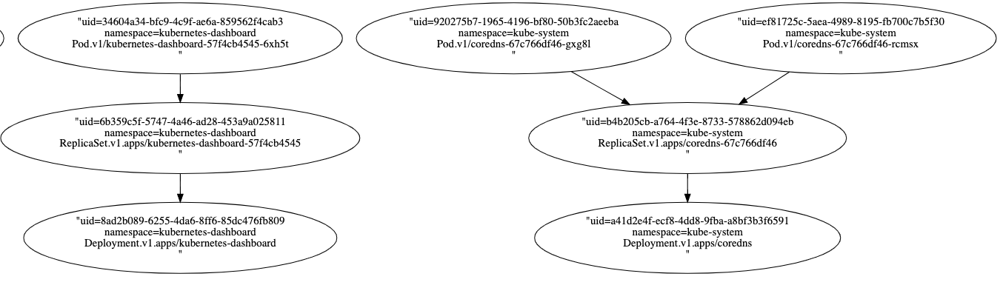

# garbage collector controller 源码分析

在前面几篇关于 controller 源码分析的文章中多次提到了当删除一个对象时，其对应的 controller 并不会执行删除对象的操作，在 kubernetes 中对象的回收操作是由 GarbageCollectorController 负责的，其作用就是当删除一个对象时，会根据指定的删除策略回收该对象及其依赖对象，本文会深入分析垃圾收集背后的实现。

## kubernetes 中的删除策略

kubernetes 中有三种删除策略：Orphan、Foreground 和 Background，三种删除策略的意义分别为：

- Orphan 策略：非级联删除，删除对象时，不会自动删除它的依赖或者是子对象，这些依赖被称作是原对象的孤儿对象，例如当执行以下命令时会使用 Orphan 策略进行删除，此时 ds 的依赖对象 controllerrevision 不会被删除；

```
$ kubectl delete ds/nginx-ds --cascade=false
```

- Background 策略：在该模式下，kubernetes 会立即删除该对象，然后垃圾收集器会在后台删除这些该对象的依赖对象；

- Foreground 策略：在该模式下，对象首先进入“删除中”状态，即会设置对象的 deletionTimestamp 字段并且对象的 metadata.finalizers 字段包含了值 “foregroundDeletion”，此时该对象依然存在，然后垃圾收集器会删除该对象的所有依赖对象，垃圾收集器在删除了所有“Blocking” 状态的依赖对象（指其子对象中 ownerReference.blockOwnerDeletion=true的对象）之后，然后才会删除对象本身；

在 v1.9 以前的版本中，大部分 controller 默认的删除策略为 Orphan，从 v1.9 开始，对于 apps/v1 下的资源默认使用 Background 模式。以上三种删除策略都可以在删除对象时通过设置 deleteOptions.propagationPolicy 字段进行指定，如下所示：

```
$ curl -k -v -XDELETE  -H "Accept: application/json" -H "Content-Type: application/json" -d '{"propagationPolicy":"Foreground"}' 'https://192.168.99.108:8443/apis/apps/v1/namespaces/default/daemonsets/nginx-ds'
```

### finalizer 机制

finalizer 是在删除对象时设置的一个 hook，其目的是为了让对象在删除前确认其子对象已经被完全删除，k8s 中默认有两种 finalizer：OrphanFinalizer 和 ForegroundFinalizer，finalizer 存在于对象的 ObjectMeta 中，当一个对象的依赖对象被删除后其对应的 finalizers 字段也会被移除，只有 finalizers 字段为空时，apiserver 才会删除该对象。

```
{
    ......
    "metadata": {
       ......
        "finalizers": [
            "foregroundDeletion"
        ]
    }
    ......
}
```

此外，finalizer 不仅仅支持以上两种字段，在使用自定义 controller 时也可以在 CR 中设置自定义的 finalizer 标识。

## GarbageCollectorController 源码分析

GarbageCollectorController 负责回收 kubernetes 中的资源，要回收 kubernetes 中所有资源首先得监控所有资源，GarbageCollectorController 会监听集群中所有可删除资源产生的所有事件，这些事件会被放入到一个队列中，然后 controller 会启动多个 goroutine 处理队列中的事件，若为删除事件会根据对象的删除策略删除关联的对象，对于非删除事件会更新对象之间的依赖关系。

### startGarbageCollectorController

首先还是看 GarbageCollectorController 的启动方法 startGarbageCollectorController，其主要逻辑为：

1、初始化 discoveryClient，discoveryClient 主要用来获取集群中的所有资源；
2、调用 garbagecollector.GetDeletableResources 获取集群内所有可删除的资源对象，支持 "delete", "list", "watch" 三种操作的 resource 称为 deletableResource；
3、调用 garbagecollector.NewGarbageCollector 初始化 garbageCollector 对象；
4、调用 garbageCollector.Run 启动 garbageCollector；
5、调用 garbageCollector.Sync 监听集群中的 DeletableResources ，当出现新的 DeletableResources 时同步到 monitors 中，确保监控集群中的所有资源；
6、调用 garbagecollector.NewDebugHandler 注册 debug 接口，用来提供集群内所有对象的关联关系；

```
func startGarbageCollectorController(ctx ControllerContext) (http.Handler, bool, error) {
	if !ctx.ComponentConfig.GarbageCollectorController.EnableGarbageCollector {
		return nil, false, nil
	}

	gcClientset := ctx.ClientBuilder.ClientOrDie("generic-garbage-collector")
	discoveryClient := cacheddiscovery.NewMemCacheClient(gcClientset.Discovery())

	config := ctx.ClientBuilder.ConfigOrDie("generic-garbage-collector")
	metadataClient, err := metadata.NewForConfig(config)
	if err != nil {
		return nil, true, err
	}

	// Get an initial set of deletable resources to prime the garbage collector.
	deletableResources := garbagecollector.GetDeletableResources(discoveryClient)
	ignoredResources := make(map[schema.GroupResource]struct{})
	for _, r := range ctx.ComponentConfig.GarbageCollectorController.GCIgnoredResources {
		ignoredResources[schema.GroupResource{Group: r.Group, Resource: r.Resource}] = struct{}{}
	}
	garbageCollector, err := garbagecollector.NewGarbageCollector(
		metadataClient,
		ctx.RESTMapper,
		deletableResources,
		ignoredResources,
		ctx.ObjectOrMetadataInformerFactory,
		ctx.InformersStarted,
	)
	if err != nil {
		return nil, true, fmt.Errorf("failed to start the generic garbage collector: %v", err)
	}

	// Start the garbage collector.
	workers := int(ctx.ComponentConfig.GarbageCollectorController.ConcurrentGCSyncs)
	go garbageCollector.Run(workers, ctx.Stop)

	// Periodically refresh the RESTMapper with new discovery information and sync
	// the garbage collector.
	go garbageCollector.Sync(gcClientset.Discovery(), 30*time.Second, ctx.Stop)

	return garbagecollector.NewDebugHandler(garbageCollector), true, nil
}
```

在 startGarbageCollectorController 中主要调用了四种方法garbagecollector.NewGarbageCollector、garbageCollector.Run、garbageCollector.Sync 和 garbagecollector.NewDebugHandler 来完成核心功能，下面主要针对这四种方法进行说明。

### garbagecollector.NewGarbageCollector

NewGarbageCollector 的主要功能是初始化 GarbageCollector 和 GraphBuilder 对象，并调用 gb.syncMonitors方法初始化 deletableResources 中所有 resource controller 的 informer。GarbageCollector 的主要作用是启动 GraphBuilder 以及启动所有的消费者，GraphBuilder 的主要作用是启动所有的生产者。

```
func NewGarbageCollector(
	metadataClient metadata.Interface,
	mapper resettableRESTMapper,
	deletableResources map[schema.GroupVersionResource]struct{},
	ignoredResources map[schema.GroupResource]struct{},
	sharedInformers controller.InformerFactory,
	informersStarted <-chan struct{},
) (*GarbageCollector, error) {
	attemptToDelete := workqueue.NewNamedRateLimitingQueue(workqueue.DefaultControllerRateLimiter(), "garbage_collector_attempt_to_delete")
	attemptToOrphan := workqueue.NewNamedRateLimitingQueue(workqueue.DefaultControllerRateLimiter(), "garbage_collector_attempt_to_orphan")
	absentOwnerCache := NewUIDCache(500)
	gc := &GarbageCollector{
		metadataClient:   metadataClient,
		restMapper:       mapper,
		attemptToDelete:  attemptToDelete,
		attemptToOrphan:  attemptToOrphan,
		absentOwnerCache: absentOwnerCache,
	}
	gb := &GraphBuilder{
		metadataClient:   metadataClient,
		informersStarted: informersStarted,
		restMapper:       mapper,
		graphChanges:     workqueue.NewNamedRateLimitingQueue(workqueue.DefaultControllerRateLimiter(), "garbage_collector_graph_changes"),
		uidToNode: &concurrentUIDToNode{
			uidToNode: make(map[types.UID]*node),
		},
		attemptToDelete:  attemptToDelete,
		attemptToOrphan:  attemptToOrphan,
		absentOwnerCache: absentOwnerCache,
		sharedInformers:  sharedInformers,
		ignoredResources: ignoredResources,
	}
	if err := gb.syncMonitors(deletableResources); err != nil {
		utilruntime.HandleError(fmt.Errorf("failed to sync all monitors: %v", err))
	}
	gc.dependencyGraphBuilder = gb

	return gc, nil
}
```

#### gb.syncMonitors

syncMonitors 的主要作用是初始化各个资源对象的 informer，并调用 gb.controllerFor 为每种资源注册 eventHandler，此处每种资源被称为 monitors，因为为每种资源注册 eventHandler 时，对于 AddFunc、UpdateFunc 和 DeleteFunc 都会将对应的 event push 到 graphChanges 队列中，每种资源对象的 informer 都作为生产者。

```
func (gb *GraphBuilder) syncMonitors(resources map[schema.GroupVersionResource]struct{}) error {
	gb.monitorLock.Lock()
	defer gb.monitorLock.Unlock()

	toRemove := gb.monitors
	if toRemove == nil {
		toRemove = monitors{}
	}
	current := monitors{}
	errs := []error{}
	kept := 0
	added := 0
	for resource := range resources {
		if _, ok := gb.ignoredResources[resource.GroupResource()]; ok {
			continue
		}
		if m, ok := toRemove[resource]; ok {
			current[resource] = m
			delete(toRemove, resource)
			kept++
			continue
		}
		kind, err := gb.restMapper.KindFor(resource)
		if err != nil {
			errs = append(errs, fmt.Errorf("couldn't look up resource %q: %v", resource, err))
			continue
		}
		c, s, err := gb.controllerFor(resource, kind)
		if err != nil {
			errs = append(errs, fmt.Errorf("couldn't start monitor for resource %q: %v", resource, err))
			continue
		}
		current[resource] = &monitor{store: s, controller: c}
		added++
	}
	gb.monitors = current

	for _, monitor := range toRemove {
		if monitor.stopCh != nil {
			close(monitor.stopCh)
		}
	}

	klog.V(4).Infof("synced monitors; added %d, kept %d, removed %d", added, kept, len(toRemove))
	// NewAggregate returns nil if errs is 0-length
	return utilerrors.NewAggregate(errs)
}
```

##### gb.controllerFor

在 gb.controllerFor中主要是为每个 deletableResources 的 informer 注册 eventHandler，此处就可以看到真正的生产者了。

```
func (gb *GraphBuilder) controllerFor(resource schema.GroupVersionResource, kind schema.GroupVersionKind) (cache.Controller, cache.Store, error) {
	handlers := cache.ResourceEventHandlerFuncs{
		// add the event to the dependencyGraphBuilder's graphChanges.
		AddFunc: func(obj interface{}) {
			event := &event{
				eventType: addEvent,
				obj:       obj,
				gvk:       kind,
			}
			gb.graphChanges.Add(event)
		},
		UpdateFunc: func(oldObj, newObj interface{}) {
			// TODO: check if there are differences in the ownerRefs,
			// finalizers, and DeletionTimestamp; if not, ignore the update.
			event := &event{
				eventType: updateEvent,
				obj:       newObj,
				oldObj:    oldObj,
				gvk:       kind,
			}
			gb.graphChanges.Add(event)
		},
		DeleteFunc: func(obj interface{}) {
			// delta fifo may wrap the object in a cache.DeletedFinalStateUnknown, unwrap it
			if deletedFinalStateUnknown, ok := obj.(cache.DeletedFinalStateUnknown); ok {
				obj = deletedFinalStateUnknown.Obj
			}
			event := &event{
				eventType: deleteEvent,
				obj:       obj,
				gvk:       kind,
			}
			gb.graphChanges.Add(event)
		},
	}
	shared, err := gb.sharedInformers.ForResource(resource)
	if err != nil {
		klog.V(4).Infof("unable to use a shared informer for resource %q, kind %q: %v", resource.String(), kind.String(), err)
		return nil, nil, err
	}
	klog.V(4).Infof("using a shared informer for resource %q, kind %q", resource.String(), kind.String())
	// need to clone because it's from a shared cache
	shared.Informer().AddEventHandlerWithResyncPeriod(handlers, ResourceResyncTime)
	return shared.Informer().GetController(), shared.Informer().GetStore(), nil
}
```

至此 NewGarbageCollector 的功能已经分析完了，在 NewGarbageCollector 中初始化了两个对象 GarbageCollector 和 GraphBuilder，然后在 gb.syncMonitors 中初始化了所有 deletableResources 的 informer，为每个 informer 添加 eventHandler 并将监听到的所有 event push 到 graphChanges 队列中，此处每个 informer 都被称为 monitor，所有 informer 都被称为生产者。graphChanges 是 GraphBuilder 中的一个对象，GraphBuilder 的主要功能是作为一个生产者，其会处理 graphChanges 中的所有事件并进行分类，将事件放入到 attemptToDelete 和 attemptToOrphan 两个队列中，具体处理逻辑下文讲述。

NewGarbageCollector 中的调用逻辑如下所示：

```
|--> ctx.ClientBuilder.
|    ClientOrDie
|
|
|--> cacheddiscovery.
|    NewMemCacheClient
|                                                                  |--> gb.sharedInformers.
|                                                                  |       ForResource
|                                                                  |
startGarbage     ----|--> garbagecollector.  --> gb.syncMonitors --> gb.controllerFor --|
CollectorController  |    NewGarbageCollector                                           |
|                                                                  |
|                                                                  |--> shared.Informer().
|                                                                    AddEventHandlerWithResyncPeriod
|--> garbageCollector.Run
|
|
|--> garbageCollector.Sync
|
|
|--> garbagecollector.NewDebugHandler
```

### garbageCollector.Run

上文已经详述了 NewGarbageCollector 的主要功能，然后继续分析 startGarbageCollectorController 中的第二个核心方法 garbageCollector.Run，garbageCollector.Run 的主要作用是启动所有的生产者和消费者，其首先会调用 gc.dependencyGraphBuilder.Run 启动所有的生产者，即 monitors，然后再启动一个 goroutine 处理 graphChanges 队列中的事件并分别放到 attemptToDelete 和 attemptToOrphan 两个队列中，dependencyGraphBuilder 即上文提到的 GraphBuilder，run 方法会调用 gc.runAttemptToDeleteWorker 和 gc.runAttemptToOrphanWorker 启动多个 goroutine 处理 attemptToDelete 和 attemptToOrphan 两个队列中的事件。

```
func (gc *GarbageCollector) Run(workers int, stopCh <-chan struct{}) {
	defer utilruntime.HandleCrash()
	defer gc.attemptToDelete.ShutDown()
	defer gc.attemptToOrphan.ShutDown()
	defer gc.dependencyGraphBuilder.graphChanges.ShutDown()

	klog.Infof("Starting garbage collector controller")
	defer klog.Infof("Shutting down garbage collector controller")

	go gc.dependencyGraphBuilder.Run(stopCh)

	if !cache.WaitForNamedCacheSync("garbage collector", stopCh, gc.dependencyGraphBuilder.IsSynced) {
		return
	}

	klog.Infof("Garbage collector: all resource monitors have synced. Proceeding to collect garbage")

	// gc workers
	for i := 0; i < workers; i++ {
		go wait.Until(gc.runAttemptToDeleteWorker, 1*time.Second, stopCh)
		go wait.Until(gc.runAttemptToOrphanWorker, 1*time.Second, stopCh)
	}

	<-stopCh
}
```

Run 方法中调用了 gc.dependencyGraphBuilder.Run 来完成 GraphBuilder 的启动。

#### gc.dependencyGraphBuilder.Run

GraphBuilder 在 garbageCollector 整个环节中起到承上启下的作用，首先看一下 GraphBuilder 对象的结构：

```
type GraphBuilder struct {
	restMapper meta.RESTMapper

	// each monitor list/watches a resource, the results are funneled to the
	// dependencyGraphBuilder
	monitors    monitors
	monitorLock sync.RWMutex
	// informersStarted is closed after after all of the controllers have been initialized and are running.
	// After that it is safe to start them here, before that it is not.
	informersStarted <-chan struct{}

	// stopCh drives shutdown. When a receive from it unblocks, monitors will shut down.
	// This channel is also protected by monitorLock.
	stopCh <-chan struct{}

	// running tracks whether Run() has been called.
	// it is protected by monitorLock.
	running bool

	metadataClient metadata.Interface
	// monitors are the producer of the graphChanges queue, graphBuilder alters
	// the in-memory graph according to the changes.
	graphChanges workqueue.RateLimitingInterface
	// uidToNode doesn't require a lock to protect, because only the
	// single-threaded GraphBuilder.processGraphChanges() reads/writes it.
	uidToNode *concurrentUIDToNode
	// GraphBuilder is the producer of attemptToDelete and attemptToOrphan, GC is the consumer.
	attemptToDelete workqueue.RateLimitingInterface
	attemptToOrphan workqueue.RateLimitingInterface
	// GraphBuilder and GC share the absentOwnerCache. Objects that are known to
	// be non-existent are added to the cached.
	absentOwnerCache *UIDCache
	sharedInformers  controller.InformerFactory
	ignoredResources map[schema.GroupResource]struct{}
}
```

##### uidToNode

此处有必要先说明一下 uidToNode 的功能，uidToNode 数据结构中维护着所有对象的依赖关系，此处的依赖关系是指比如当创建一个 deployment 时会创建对应的 rs 以及 pod，pod 的 owner 就是 rs，rs 的 owner 是 deployment，rs 的 dependents 是其关联的所有 pod，deployment 的 dependents 是其关联的所有 rs。

uidToNode 中的 node 不是指 k8s 中的 node 节点，而是将 graphChanges 中的 event 转换为 node 对象，k8s 中所有 object 之间的级联关系是通过 node 的概念来维护的，garbageCollector 在后续的处理中会直接使用 node 对象，node 对象定义如下：

```
type concurrentUIDToNode struct {
	uidToNodeLock sync.RWMutex
	uidToNode     map[types.UID]*node
}
```

```
type node struct {
	identity objectReference
	// dependents will be read by the orphan() routine, we need to protect it with a lock.
	dependentsLock sync.RWMutex
	// dependents are the nodes that have node.identity as a
	// metadata.ownerReference.
	dependents map[*node]struct{}
	// this is set by processGraphChanges() if the object has non-nil DeletionTimestamp
	// and has the FinalizerDeleteDependents.
	deletingDependents     bool
	deletingDependentsLock sync.RWMutex
	// this records if the object's deletionTimestamp is non-nil.
	beingDeleted     bool
	beingDeletedLock sync.RWMutex
	// this records if the object was constructed virtually and never observed via informer event
	virtual     bool
	virtualLock sync.RWMutex
	// when processing an Update event, we need to compare the updated
	// ownerReferences with the owners recorded in the graph.
	owners []metav1.OwnerReference
}
```

GraphBuilder 主要有三个功能：

1、监控集群中所有的可删除资源；
2、基于 informers 中的资源在 uidToNode 数据结构中维护着所有对象的依赖关系；
3、处理 graphChanges 中的事件并放到 attemptToDelete 和 attemptToOrphan 两个队列中；
上文已经说了 gc.dependencyGraphBuilder.Run 的功能，启动所有的 informers 然后再启动一个 goroutine 处理 graphChanges 队列中的事件并分别放到 attemptToDelete 和 attemptToOrphan 两个队列中，代码如下所示：

```
func (gb *GraphBuilder) Run(stopCh <-chan struct{}) {
	klog.Infof("GraphBuilder running")
	defer klog.Infof("GraphBuilder stopping")

	// Set up the stop channel.
	gb.monitorLock.Lock()
	gb.stopCh = stopCh
	gb.running = true
	gb.monitorLock.Unlock()

	// Start monitors and begin change processing until the stop channel is
	// closed.
	gb.startMonitors()
	wait.Until(gb.runProcessGraphChanges, 1*time.Second, stopCh)

	// Stop any running monitors.
	gb.monitorLock.Lock()
	defer gb.monitorLock.Unlock()
	monitors := gb.monitors
	stopped := 0
	for _, monitor := range monitors {
		if monitor.stopCh != nil {
			stopped++
			close(monitor.stopCh)
		}
	}

	// reset monitors so that the graph builder can be safely re-run/synced.
	gb.monitors = nil
	klog.Infof("stopped %d of %d monitors", stopped, len(monitors))
}
```

gc.dependencyGraphBuilder.Run的核心是调用了 gb.startMonitors 和 gb.runProcessGraphChanges 两个方法来完成主要功能，继续看这两个方法的主要逻辑。

##### gb.startMonitors

startMonitors 的功能很简单就是启动所有的 informers，代码如下所示：

```
func (gb *GraphBuilder) startMonitors() {
	gb.monitorLock.Lock()
	defer gb.monitorLock.Unlock()

	if !gb.running {
		return
	}

	// we're waiting until after the informer start that happens once all the controllers are initialized.  This ensures
	// that they don't get unexpected events on their work queues.
	<-gb.informersStarted

	monitors := gb.monitors
	started := 0
	for _, monitor := range monitors {
		if monitor.stopCh == nil {
			monitor.stopCh = make(chan struct{})
			gb.sharedInformers.Start(gb.stopCh)
			go monitor.Run()
			started++
		}
	}
	klog.V(4).Infof("started %d new monitors, %d currently running", started, len(monitors))
}
```

##### gb.runProcessGraphChanges

runProcessGraphChanges 方法的主要功能是处理 graphChanges 中的事件将其分别放到 GraphBuilder 的 attemptToDelete 和 attemptToOrphan 两个队列中，代码主要逻辑为：

1、从 graphChanges 队列中取出一个 item 即 event；
2、获取 event 的 accessor，accessor 是一个 object 的 meta.Interface，里面包含访问 object meta 中所有字段的方法；
3、通过 accessor 获取 UID 判断 uidToNode 中是否存在该 object；
4、若 uidToNode 中不存在该 node 且该事件是 addEvent 或 updateEvent，则为该 object 创建对应的 node，并调用 gb.insertNode 将该 node 加到 uidToNode 中，然后将该 node 添加到其 owner 的 dependents 中，执行完 gb.insertNode 中的操作后再调用 gb.processTransitions 方法判断该对象是否处于删除状态，若处于删除状态会判断该对象是以 orphan 模式删除还是以 foreground 模式删除，若以 orphan 模式删除，则将该 node 加入到 attemptToOrphan 队列中，若以 foreground 模式删除则将该对象以及其所有 dependents 都加入到 attemptToDelete 队列中；
5、若 uidToNode 中存在该 node 且该事件是 addEvent 或 updateEvent 时，此时可能是一个 update 操作，调用 referencesDiffs 方法检查该对象的 OwnerReferences 字段是否有变化，若有变化(1)调用 gb.addUnblockedOwnersToDeleteQueue 将被删除以及更新的 owner 对应的 node 加入到 attemptToDelete 中，因为此时该 node 中已被删除或更新的 owner 可能处于删除状态且阻塞在该 node 处，此时有三种方式避免该 node 的 owner 处于删除阻塞状态，一是等待该 node 被删除，二是将该 node 自身对应 owner 的 OwnerReferences 字段删除，三是将该 node OwnerReferences 字段中对应 owner 的 BlockOwnerDeletion 设置为 false；(2)更新该 node 的 owners 列表；(3)若有新增的 owner，将该 node 加入到新 owner 的 dependents 中；(4) 若有被删除的 owner，将该 node 从已删除 owner 的 dependents 中删除；以上操作完成后，检查该 node 是否处于删除状态并进行标记，最后调用 gb.processTransitions 方法检查该 node 是否要被删除；

举个例子，若以 foreground 模式删除 deployment 时，deployment 的 dependents 列表中有对应的 rs，那么 deployment 的删除会阻塞住等待其依赖 rs 的删除，此时 rs 有三种方法不阻塞 deployment 的删除操作，一是 rs 对象被删除，二是删除 rs 对象 OwnerReferences 字段中对应的 deployment，三是将 rs 对象OwnerReferences 字段中对应的 deployment 配置 BlockOwnerDeletion 设置为 false，文末会有示例演示该操作。

6、若该事件为 deleteEvent，首先从 uidToNode 中删除该对象，然后从该 node 所有 owners 的 dependents 中删除该对象，将该 node 所有的 dependents 加入到 attemptToDelete 队列中，最后检查该 node 的所有 owners，若有处于删除状态的 owner，此时该 owner 可能处于删除阻塞状态正在等待该 node 的删除，将该 owner 加入到 attemptToDelete 中；

总结一下，当从 graphChanges 中取出 event 时，不管是什么 event，主要完成三件时，首先都会将 event 转化为 uidToNode 中的 node 对象，其次一是更新 uidToNode 中维护的依赖关系，二是更新该 node 的 owners 以及 owners 的 dependents，三是检查该 node 的 owners 是否要被删除以及该 node 的 dependents 是否要被删除，若需要删除则根据 node 的删除策略将其添加到 attemptToOrphan 或者 attemptToDelete 队列中；

```
func (gb *GraphBuilder) runProcessGraphChanges() {
	for gb.processGraphChanges() {
	}
}
```

```
func (gb *GraphBuilder) processGraphChanges() bool {
	item, quit := gb.graphChanges.Get()
	if quit {
		return false
	}
	defer gb.graphChanges.Done(item)
	event, ok := item.(*event)
	if !ok {
		utilruntime.HandleError(fmt.Errorf("expect a *event, got %v", item))
		return true
	}
	obj := event.obj
	accessor, err := meta.Accessor(obj)
	if err != nil {
		utilruntime.HandleError(fmt.Errorf("cannot access obj: %v", err))
		return true
	}
	klog.V(5).Infof("GraphBuilder process object: %s/%s, namespace %s, name %s, uid %s, event type %v", event.gvk.GroupVersion().String(), event.gvk.Kind, accessor.GetNamespace(), accessor.GetName(), string(accessor.GetUID()), event.eventType)
	// Check if the node already exists
	existingNode, found := gb.uidToNode.Read(accessor.GetUID())
	if found {
		// this marks the node as having been observed via an informer event
		// 1. this depends on graphChanges only containing add/update events from the actual informer
		// 2. this allows things tracking virtual nodes' existence to stop polling and rely on informer events
		existingNode.markObserved()
	}
	switch {
	case (event.eventType == addEvent || event.eventType == updateEvent) && !found:
		newNode := &node{
			identity: objectReference{
				OwnerReference: metav1.OwnerReference{
					APIVersion: event.gvk.GroupVersion().String(),
					Kind:       event.gvk.Kind,
					UID:        accessor.GetUID(),
					Name:       accessor.GetName(),
				},
				Namespace: accessor.GetNamespace(),
			},
			dependents:         make(map[*node]struct{}),
			owners:             accessor.GetOwnerReferences(),
			deletingDependents: beingDeleted(accessor) && hasDeleteDependentsFinalizer(accessor),
			beingDeleted:       beingDeleted(accessor),
		}
		gb.insertNode(newNode)
		// the underlying delta_fifo may combine a creation and a deletion into
		// one event, so we need to further process the event.
		gb.processTransitions(event.oldObj, accessor, newNode)
	case (event.eventType == addEvent || event.eventType == updateEvent) && found:
		// handle changes in ownerReferences
		added, removed, changed := referencesDiffs(existingNode.owners, accessor.GetOwnerReferences())
		if len(added) != 0 || len(removed) != 0 || len(changed) != 0 {
			// check if the changed dependency graph unblock owners that are
			// waiting for the deletion of their dependents.
			gb.addUnblockedOwnersToDeleteQueue(removed, changed)
			// update the node itself
			existingNode.owners = accessor.GetOwnerReferences()
			// Add the node to its new owners' dependent lists.
			gb.addDependentToOwners(existingNode, added)
			// remove the node from the dependent list of node that are no longer in
			// the node's owners list.
			gb.removeDependentFromOwners(existingNode, removed)
		}

		if beingDeleted(accessor) {
			existingNode.markBeingDeleted()
		}
		gb.processTransitions(event.oldObj, accessor, existingNode)
	case event.eventType == deleteEvent:
		if !found {
			klog.V(5).Infof("%v doesn't exist in the graph, this shouldn't happen", accessor.GetUID())
			return true
		}
		// removeNode updates the graph
		gb.removeNode(existingNode)
		existingNode.dependentsLock.RLock()
		defer existingNode.dependentsLock.RUnlock()
		if len(existingNode.dependents) > 0 {
			gb.absentOwnerCache.Add(accessor.GetUID())
		}
		for dep := range existingNode.dependents {
			gb.attemptToDelete.Add(dep)
		}
		for _, owner := range existingNode.owners {
			ownerNode, found := gb.uidToNode.Read(owner.UID)
			if !found || !ownerNode.isDeletingDependents() {
				continue
			}
			// this is to let attempToDeleteItem check if all the owner's
			// dependents are deleted, if so, the owner will be deleted.
			gb.attemptToDelete.Add(ownerNode)
		}
	}
	return true
}
```

##### processTransitions

上述在处理 add 或 update event 时最后都调用了 processTransitions 方法检查 node 是否处于删除状态，若处于删除状态会通过其删除策略将 node 放到 attemptToOrphan 或 attemptToDelete 队列中。

```
func (gb *GraphBuilder) processTransitions(oldObj interface{}, newAccessor metav1.Object, n *node) {
	if startsWaitingForDependentsOrphaned(oldObj, newAccessor) {
		klog.V(5).Infof("add %s to the attemptToOrphan", n.identity)
		gb.attemptToOrphan.Add(n)
		return
	}
	if startsWaitingForDependentsDeleted(oldObj, newAccessor) {
		klog.V(2).Infof("add %s to the attemptToDelete, because it's waiting for its dependents to be deleted", n.identity)
		// if the n is added as a "virtual" node, its deletingDependents field is not properly set, so always set it here.
		n.markDeletingDependents()
		for dep := range n.dependents {
			gb.attemptToDelete.Add(dep)
		}
		gb.attemptToDelete.Add(n)
	}
}
```

#### gc.runAttemptToDeleteWorker

runAttemptToDeleteWorker 是执行删除 attemptToDelete 中 node 的方法，其主要逻辑为：

1、调用 gc.attemptToDeleteItem 删除 node；
2、若删除失败则重新加入到 attemptToDelete 队列中进行重试

```
func (gc *GarbageCollector) runAttemptToDeleteWorker() {
	for gc.attemptToDeleteWorker() {
	}
}
```

```
func (gc *GarbageCollector) attemptToDeleteWorker() bool {
	item, quit := gc.attemptToDelete.Get()
	gc.workerLock.RLock()
	defer gc.workerLock.RUnlock()
	if quit {
		return false
	}
	defer gc.attemptToDelete.Done(item)
	n, ok := item.(*node)
	if !ok {
		utilruntime.HandleError(fmt.Errorf("expect *node, got %#v", item))
		return true
	}
	err := gc.attemptToDeleteItem(n)
	if err != nil {
		if _, ok := err.(*restMappingError); ok {
			// There are at least two ways this can happen:
			// 1. The reference is to an object of a custom type that has not yet been
			//    recognized by gc.restMapper (this is a transient error).
			// 2. The reference is to an invalid group/version. We don't currently
			//    have a way to distinguish this from a valid type we will recognize
			//    after the next discovery sync.
			// For now, record the error and retry.
			klog.V(5).Infof("error syncing item %s: %v", n, err)
		} else {
			utilruntime.HandleError(fmt.Errorf("error syncing item %s: %v", n, err))
		}
		// retry if garbage collection of an object failed.
		gc.attemptToDelete.AddRateLimited(item)
	} else if !n.isObserved() {
		// requeue if item hasn't been observed via an informer event yet.
		// otherwise a virtual node for an item added AND removed during watch reestablishment can get stuck in the graph and never removed.
		// see https://issue.k8s.io/56121
		klog.V(5).Infof("item %s hasn't been observed via informer yet", n.identity)
		gc.attemptToDelete.AddRateLimited(item)
	}
	return true
}
```

gc.runAttemptToDeleteWorker 中调用了 gc.attemptToDeleteItem 执行实际的删除操作。

##### gc.attemptToDeleteItem

gc.attemptToDeleteItem 的主要逻辑为：

1、判断 node 是否处于删除状态；
2、从 apiserver 获取该 node 最新的状态，该 node 可能为 virtual node，若为 virtual node 则从 apiserver 中获取不到该 node 的对象，此时会将该 node 重新加入到 graphChanges 队列中，再次处理该 node 时会将其从 uidToNode 中删除；
3、判断该 node 最新状态的 uid 是否等于本地缓存中的 uid，若不匹配说明该 node 已更新过此时将其设置为 virtual node 并重新加入到 graphChanges 队列中，再次处理该 node 时会将其从 uidToNode 中删除；
4、通过 node 的 deletingDependents 字段判断该 node 当前是否处于删除 dependents 的状态，若该 node 处于删除 dependents 的状态则调用 processDeletingDependentsItem 方法检查 node 的 blockingDependents 是否被完全删除，若 blockingDependents 已完全被删除则删除该 node 对应的 finalizer，若 blockingDependents 还未删除完，将未删除的 blockingDependents 加入到 attemptToDelete 中；

上文中在 GraphBuilder 处理 graphChanges 中的事件时，若发现 node 处于删除状态，会将 node 的 dependents 加入到 attemptToDelete 中并标记 node 的 deletingDependents 为 true；

5、调用 gc.classifyReferences 将 node 的 ownerReferences 分类为 solid, dangling, waitingForDependentsDeletion 三类：dangling(owner 不存在)、waitingForDependentsDeletion(owner 存在，owner 处于删除状态且正在等待其 dependents 被删除)、solid(至少有一个 owner 存在且不处于删除状态)；
6、对以上分类进行不同的处理，若 solid不为 0 即当前 node 至少存在一个 owner，该对象还不能被回收，此时需要将 dangling 和 waitingForDependentsDeletion 列表中的 owner 从 node 的 ownerReferences 删除，即已经被删除或等待删除的引用从对象中删掉；
7、第二种情况是该 node 的 owner 处于 waitingForDependentsDeletion 状态并且 node 的 dependents 未被完全删除，该 node 需要等待删除完所有的 dependents 后才能被删除；
8、第三种情况就是该 node 已经没有任何 dependents 了，此时按照 node 中声明的删除策略调用 apiserver 的接口删除即可；

```
func (gc *GarbageCollector) attemptToDeleteItem(item *node) error {
	klog.V(2).Infof("processing item %s", item.identity)
	// "being deleted" is an one-way trip to the final deletion. We'll just wait for the final deletion, and then process the object's dependents.
	if item.isBeingDeleted() && !item.isDeletingDependents() {
		klog.V(5).Infof("processing item %s returned at once, because its DeletionTimestamp is non-nil", item.identity)
		return nil
	}
	// TODO: It's only necessary to talk to the API server if this is a
	// "virtual" node. The local graph could lag behind the real status, but in
	// practice, the difference is small.
	latest, err := gc.getObject(item.identity)
	switch {
	case errors.IsNotFound(err):
		// the GraphBuilder can add "virtual" node for an owner that doesn't
		// exist yet, so we need to enqueue a virtual Delete event to remove
		// the virtual node from GraphBuilder.uidToNode.
		klog.V(5).Infof("item %v not found, generating a virtual delete event", item.identity)
		gc.dependencyGraphBuilder.enqueueVirtualDeleteEvent(item.identity)
		// since we're manually inserting a delete event to remove this node,
		// we don't need to keep tracking it as a virtual node and requeueing in attemptToDelete
		item.markObserved()
		return nil
	case err != nil:
		return err
	}

	if latest.GetUID() != item.identity.UID {
		klog.V(5).Infof("UID doesn't match, item %v not found, generating a virtual delete event", item.identity)
		gc.dependencyGraphBuilder.enqueueVirtualDeleteEvent(item.identity)
		// since we're manually inserting a delete event to remove this node,
		// we don't need to keep tracking it as a virtual node and requeueing in attemptToDelete
		item.markObserved()
		return nil
	}

	// TODO: attemptToOrphanWorker() routine is similar. Consider merging
	// attemptToOrphanWorker() into attemptToDeleteItem() as well.
	if item.isDeletingDependents() {
		return gc.processDeletingDependentsItem(item)
	}

	// compute if we should delete the item
	ownerReferences := latest.GetOwnerReferences()
	if len(ownerReferences) == 0 {
		klog.V(2).Infof("object %s's doesn't have an owner, continue on next item", item.identity)
		return nil
	}

	solid, dangling, waitingForDependentsDeletion, err := gc.classifyReferences(item, ownerReferences)
	if err != nil {
		return err
	}
	klog.V(5).Infof("classify references of %s.\nsolid: %#v\ndangling: %#v\nwaitingForDependentsDeletion: %#v\n", item.identity, solid, dangling, waitingForDependentsDeletion)

	switch {
	case len(solid) != 0:
		klog.V(2).Infof("object %#v has at least one existing owner: %#v, will not garbage collect", item.identity, solid)
		if len(dangling) == 0 && len(waitingForDependentsDeletion) == 0 {
			return nil
		}
		klog.V(2).Infof("remove dangling references %#v and waiting references %#v for object %s", dangling, waitingForDependentsDeletion, item.identity)
		// waitingForDependentsDeletion needs to be deleted from the
		// ownerReferences, otherwise the referenced objects will be stuck with
		// the FinalizerDeletingDependents and never get deleted.
		ownerUIDs := append(ownerRefsToUIDs(dangling), ownerRefsToUIDs(waitingForDependentsDeletion)...)
		patch := deleteOwnerRefStrategicMergePatch(item.identity.UID, ownerUIDs...)
		_, err = gc.patch(item, patch, func(n *node) ([]byte, error) {
			return gc.deleteOwnerRefJSONMergePatch(n, ownerUIDs...)
		})
		return err
	case len(waitingForDependentsDeletion) != 0 && item.dependentsLength() != 0:
		deps := item.getDependents()
		for _, dep := range deps {
			if dep.isDeletingDependents() {
				// this circle detection has false positives, we need to
				// apply a more rigorous detection if this turns out to be a
				// problem.
				// there are multiple workers run attemptToDeleteItem in
				// parallel, the circle detection can fail in a race condition.
				klog.V(2).Infof("processing object %s, some of its owners and its dependent [%s] have FinalizerDeletingDependents, to prevent potential cycle, its ownerReferences are going to be modified to be non-blocking, then the object is going to be deleted with Foreground", item.identity, dep.identity)
				patch, err := item.unblockOwnerReferencesStrategicMergePatch()
				if err != nil {
					return err
				}
				if _, err := gc.patch(item, patch, gc.unblockOwnerReferencesJSONMergePatch); err != nil {
					return err
				}
				break
			}
		}
		klog.V(2).Infof("at least one owner of object %s has FinalizerDeletingDependents, and the object itself has dependents, so it is going to be deleted in Foreground", item.identity)
		// the deletion event will be observed by the graphBuilder, so the item
		// will be processed again in processDeletingDependentsItem. If it
		// doesn't have dependents, the function will remove the
		// FinalizerDeletingDependents from the item, resulting in the final
		// deletion of the item.
		policy := metav1.DeletePropagationForeground
		return gc.deleteObject(item.identity, &policy)
	default:
		// item doesn't have any solid owner, so it needs to be garbage
		// collected. Also, none of item's owners is waiting for the deletion of
		// the dependents, so set propagationPolicy based on existing finalizers.
		var policy metav1.DeletionPropagation
		switch {
		case hasOrphanFinalizer(latest):
			// if an existing orphan finalizer is already on the object, honor it.
			policy = metav1.DeletePropagationOrphan
		case hasDeleteDependentsFinalizer(latest):
			// if an existing foreground finalizer is already on the object, honor it.
			policy = metav1.DeletePropagationForeground
		default:
			// otherwise, default to background.
			policy = metav1.DeletePropagationBackground
		}
		klog.V(2).Infof("delete object %s with propagation policy %s", item.identity, policy)
		return gc.deleteObject(item.identity, &policy)
	}
}
```

#### gc.runAttemptToOrphanWorker

runAttemptToOrphanWorker 是处理以 orphan 模式删除的 node，主要逻辑为：

1、调用 gc.orphanDependents 删除 owner 所有 dependents OwnerReferences 中的 owner 字段；
2、调用 gc.removeFinalizer 删除 owner 的 orphan Finalizer；
3、以上两步中若有失败的会进行重试；

```
func (gc *GarbageCollector) runAttemptToOrphanWorker() {
	for gc.attemptToOrphanWorker() {
	}
}
```

```
func (gc *GarbageCollector) attemptToOrphanWorker() bool {
	item, quit := gc.attemptToOrphan.Get()
	gc.workerLock.RLock()
	defer gc.workerLock.RUnlock()
	if quit {
		return false
	}
	defer gc.attemptToOrphan.Done(item)
	owner, ok := item.(*node)
	if !ok {
		utilruntime.HandleError(fmt.Errorf("expect *node, got %#v", item))
		return true
	}
	// we don't need to lock each element, because they never get updated
	owner.dependentsLock.RLock()
	dependents := make([]*node, 0, len(owner.dependents))
	for dependent := range owner.dependents {
		dependents = append(dependents, dependent)
	}
	owner.dependentsLock.RUnlock()

	err := gc.orphanDependents(owner.identity, dependents)
	if err != nil {
		utilruntime.HandleError(fmt.Errorf("orphanDependents for %s failed with %v", owner.identity, err))
		gc.attemptToOrphan.AddRateLimited(item)
		return true
	}
	// update the owner, remove "orphaningFinalizer" from its finalizers list
	err = gc.removeFinalizer(owner, metav1.FinalizerOrphanDependents)
	if err != nil {
		utilruntime.HandleError(fmt.Errorf("removeOrphanFinalizer for %s failed with %v", owner.identity, err))
		gc.attemptToOrphan.AddRateLimited(item)
	}
	return true
}
```

### garbageCollector.Sync

garbageCollector.Sync 是 startGarbageCollectorController 中的第三个核心方法，主要功能是周期性的查询集群中所有的资源，过滤出 deletableResources，然后对比已经监控的 deletableResources 和当前获取到的 deletableResources 是否一致，若不一致则更新 GraphBuilder 的 monitors 并重新启动 monitors 监控所有的 deletableResources，该方法的主要逻辑为：

1、通过调用 GetDeletableResources 获取集群内所有的 deletableResources 作为 newResources，deletableResources 指支持 "delete", "list", "watch" 三种操作的 resource，包括 CR；
2、检查 oldResources, newResources 是否一致，不一致则需要同步；
3、调用 gc.resyncMonitors 同步 newResources，在 gc.resyncMonitors 中会重新调用 GraphBuilder 的 syncMonitors 和 startMonitors 两个方法完成 monitors 的刷新；
4、等待 newResources informer 中的 cache 同步完成；
5、将 newResources 作为 oldResources，继续进行下一轮的同步；

```
func (gc *GarbageCollector) Sync(discoveryClient discovery.ServerResourcesInterface, period time.Duration, stopCh <-chan struct{}) {
	oldResources := make(map[schema.GroupVersionResource]struct{})
	wait.Until(func() {
		// Get the current resource list from discovery.
		newResources := GetDeletableResources(discoveryClient)

		// This can occur if there is an internal error in GetDeletableResources.
		if len(newResources) == 0 {
			klog.V(2).Infof("no resources reported by discovery, skipping garbage collector sync")
			return
		}

		// Decide whether discovery has reported a change.
		if reflect.DeepEqual(oldResources, newResources) {
			klog.V(5).Infof("no resource updates from discovery, skipping garbage collector sync")
			return
		}

		// Ensure workers are paused to avoid processing events before informers
		// have resynced.
		gc.workerLock.Lock()
		defer gc.workerLock.Unlock()

		// Once we get here, we should not unpause workers until we've successfully synced
		attempt := 0
		wait.PollImmediateUntil(100*time.Millisecond, func() (bool, error) {
			attempt++

			// On a reattempt, check if available resources have changed
			if attempt > 1 {
				newResources = GetDeletableResources(discoveryClient)
				if len(newResources) == 0 {
					klog.V(2).Infof("no resources reported by discovery (attempt %d)", attempt)
					return false, nil
				}
			}

			klog.V(2).Infof("syncing garbage collector with updated resources from discovery (attempt %d): %s", attempt, printDiff(oldResources, newResources))

			// Resetting the REST mapper will also invalidate the underlying discovery
			// client. This is a leaky abstraction and assumes behavior about the REST
			// mapper, but we'll deal with it for now.
			gc.restMapper.Reset()
			klog.V(4).Infof("reset restmapper")

			// Perform the monitor resync and wait for controllers to report cache sync.
			//
			// NOTE: It's possible that newResources will diverge from the resources
			// discovered by restMapper during the call to Reset, since they are
			// distinct discovery clients invalidated at different times. For example,
			// newResources may contain resources not returned in the restMapper's
			// discovery call if the resources appeared in-between the calls. In that
			// case, the restMapper will fail to map some of newResources until the next
			// attempt.
			if err := gc.resyncMonitors(newResources); err != nil {
				utilruntime.HandleError(fmt.Errorf("failed to sync resource monitors (attempt %d): %v", attempt, err))
				return false, nil
			}
			klog.V(4).Infof("resynced monitors")

			// wait for caches to fill for a while (our sync period) before attempting to rediscover resources and retry syncing.
			// this protects us from deadlocks where available resources changed and one of our informer caches will never fill.
			// informers keep attempting to sync in the background, so retrying doesn't interrupt them.
			// the call to resyncMonitors on the reattempt will no-op for resources that still exist.
			// note that workers stay paused until we successfully resync.
			if !cache.WaitForNamedCacheSync("garbage collector", waitForStopOrTimeout(stopCh, period), gc.dependencyGraphBuilder.IsSynced) {
				utilruntime.HandleError(fmt.Errorf("timed out waiting for dependency graph builder sync during GC sync (attempt %d)", attempt))
				return false, nil
			}

			// success, break out of the loop
			return true, nil
		}, stopCh)

		// Finally, keep track of our new state. Do this after all preceding steps
		// have succeeded to ensure we'll retry on subsequent syncs if an error
		// occurred.
		oldResources = newResources
		klog.V(2).Infof("synced garbage collector")
	}, period, stopCh)
}
```

garbageCollector.Sync 中主要调用了两个方法，一是调用 GetDeletableResources 获取集群中所有的可删除资源，二是调用 gc.resyncMonitors 更新 GraphBuilder 中 monitors。

#### GetDeletableResources

在 GetDeletableResources 中首先通过调用 discoveryClient.ServerPreferredResources 方法获取集群内所有的 resource 信息，然后通过调用 discovery.FilteredBy 过滤出支持 "delete", "list", "watch" 三种方法的 resource 作为 deletableResources。

```
func GetDeletableResources(discoveryClient discovery.ServerResourcesInterface) map[schema.GroupVersionResource]struct{} {
	preferredResources, err := discoveryClient.ServerPreferredResources()
	if err != nil {
		if discovery.IsGroupDiscoveryFailedError(err) {
			klog.Warningf("failed to discover some groups: %v", err.(*discovery.ErrGroupDiscoveryFailed).Groups)
		} else {
			klog.Warningf("failed to discover preferred resources: %v", err)
		}
	}
	if preferredResources == nil {
		return map[schema.GroupVersionResource]struct{}{}
	}

	// This is extracted from discovery.GroupVersionResources to allow tolerating
	// failures on a per-resource basis.
	deletableResources := discovery.FilteredBy(discovery.SupportsAllVerbs{Verbs: []string{"delete", "list", "watch"}}, preferredResources)
	deletableGroupVersionResources := map[schema.GroupVersionResource]struct{}{}
	for _, rl := range deletableResources {
		gv, err := schema.ParseGroupVersion(rl.GroupVersion)
		if err != nil {
			klog.Warningf("ignoring invalid discovered resource %q: %v", rl.GroupVersion, err)
			continue
		}
		for i := range rl.APIResources {
			deletableGroupVersionResources[schema.GroupVersionResource{Group: gv.Group, Version: gv.Version, Resource: rl.APIResources[i].Name}] = struct{}{}
		}
	}

	return deletableGroupVersionResources
}
```

##### ServerPreferredResources

ServerPreferredResources 的主要功能是获取集群内所有的 resource 以及其 group、version、verbs 信息，该方法的主要逻辑为：

1、调用 ServerGroups 方法获取集群内所有的 GroupList，ServerGroups 方法首先从 apiserver 通过 /api URL 获取当前版本下所有可用的 APIVersions，再通过 /apis URL 获取 所有可用的 APIVersions 以及其下的所有 APIGroupList；
2、调用 fetchGroupVersionResources 通过 serverGroupList 再获取到对应的 resource；
3、将获取到的 version、group、resource 构建成标准格式添加到 metav1.APIResourceList 中；

```
func ServerPreferredResources(d DiscoveryInterface) ([]*metav1.APIResourceList, error) {
	serverGroupList, err := d.ServerGroups()
	if err != nil {
		return nil, err
	}

	groupVersionResources, failedGroups := fetchGroupVersionResources(d, serverGroupList)

	result := []*metav1.APIResourceList{}
	grVersions := map[schema.GroupResource]string{}                         // selected version of a GroupResource
	grAPIResources := map[schema.GroupResource]*metav1.APIResource{}        // selected APIResource for a GroupResource
	gvAPIResourceLists := map[schema.GroupVersion]*metav1.APIResourceList{} // blueprint for a APIResourceList for later grouping

	for _, apiGroup := range serverGroupList.Groups {
		for _, version := range apiGroup.Versions {
			groupVersion := schema.GroupVersion{Group: apiGroup.Name, Version: version.Version}

			apiResourceList, ok := groupVersionResources[groupVersion]
			if !ok {
				continue
			}

			// create empty list which is filled later in another loop
			emptyAPIResourceList := metav1.APIResourceList{
				GroupVersion: version.GroupVersion,
			}
			gvAPIResourceLists[groupVersion] = &emptyAPIResourceList
			result = append(result, &emptyAPIResourceList)

			for i := range apiResourceList.APIResources {
				apiResource := &apiResourceList.APIResources[i]
				if strings.Contains(apiResource.Name, "/") {
					continue
				}
				gv := schema.GroupResource{Group: apiGroup.Name, Resource: apiResource.Name}
				if _, ok := grAPIResources[gv]; ok && version.Version != apiGroup.PreferredVersion.Version {
					// only override with preferred version
					continue
				}
				grVersions[gv] = version.Version
				grAPIResources[gv] = apiResource
			}
		}
	}

	// group selected APIResources according to GroupVersion into APIResourceLists
	for groupResource, apiResource := range grAPIResources {
		version := grVersions[groupResource]
		groupVersion := schema.GroupVersion{Group: groupResource.Group, Version: version}
		apiResourceList := gvAPIResourceLists[groupVersion]
		apiResourceList.APIResources = append(apiResourceList.APIResources, *apiResource)
	}

	if len(failedGroups) == 0 {
		return result, nil
	}

	return result, &ErrGroupDiscoveryFailed{Groups: failedGroups}
}
```

GetDeletableResources 方法中的调用流程为：

```
|--> d.ServerGroups
|
|--> discoveryClient.       --|
|  ServerPreferredResources   |
|                             |--> fetchGroupVersionResources
GetDeletableResources --|
|
|--> discovery.FilteredBy
```

#### gc.resyncMonitors

gc.resyncMonitors 的主要功能是更新 GraphBuilder 的 monitors 并重新启动 monitors 监控所有的 deletableResources，GraphBuilder 的 syncMonitors 和 startMonitors 方法在前面的流程中已经分析过，此处不再详细说明。

```
func (gc *GarbageCollector) resyncMonitors(deletableResources map[schema.GroupVersionResource]struct{}) error {
	if err := gc.dependencyGraphBuilder.syncMonitors(deletableResources); err != nil {
		return err
	}
	gc.dependencyGraphBuilder.startMonitors()
	return nil
}
```

### garbagecollector.NewDebugHandler

garbagecollector.NewDebugHandler 主要功能是对外提供一个接口供用户查询当前集群中所有资源的依赖关系，依赖关系可以以图表的形式展示。

```
func startGarbageCollectorController(ctx ControllerContext) (http.Handler, bool, error) {
	if !ctx.ComponentConfig.GarbageCollectorController.EnableGarbageCollector {
		return nil, false, nil
	}

	gcClientset := ctx.ClientBuilder.ClientOrDie("generic-garbage-collector")
	discoveryClient := cacheddiscovery.NewMemCacheClient(gcClientset.Discovery())

	config := ctx.ClientBuilder.ConfigOrDie("generic-garbage-collector")
	metadataClient, err := metadata.NewForConfig(config)
	if err != nil {
		return nil, true, err
	}

	// Get an initial set of deletable resources to prime the garbage collector.
	deletableResources := garbagecollector.GetDeletableResources(discoveryClient)
	ignoredResources := make(map[schema.GroupResource]struct{})
	for _, r := range ctx.ComponentConfig.GarbageCollectorController.GCIgnoredResources {
		ignoredResources[schema.GroupResource{Group: r.Group, Resource: r.Resource}] = struct{}{}
	}
	garbageCollector, err := garbagecollector.NewGarbageCollector(
		metadataClient,
		ctx.RESTMapper,
		deletableResources,
		ignoredResources,
		ctx.ObjectOrMetadataInformerFactory,
		ctx.InformersStarted,
	)
	if err != nil {
		return nil, true, fmt.Errorf("failed to start the generic garbage collector: %v", err)
	}

	// Start the garbage collector.
	workers := int(ctx.ComponentConfig.GarbageCollectorController.ConcurrentGCSyncs)
	go garbageCollector.Run(workers, ctx.Stop)

	// Periodically refresh the RESTMapper with new discovery information and sync
	// the garbage collector.
	go garbageCollector.Sync(gcClientset.Discovery(), 30*time.Second, ctx.Stop)

	return garbagecollector.NewDebugHandler(garbageCollector), true, nil
}
```

具体使用方法如下所示：

```
$ curl http://192.168.99.108:10252/debug/controllers/garbagecollector/graph  > tmp.dot

$ curl http://192.168.99.108:10252/debug/controllers/garbagecollector/graph\?uid=f9555d53-2b5f-4702-9717-54a313ed4fe8 > tmp.dot

// 生成 svg 文件
$ dot -Tsvg -o graph.svg tmp.dot

// 然后在浏览器中打开 svg 文件
```

依赖关系图如下所示：



## 示例

在此处会有一个小示例验证一下源码中的删除阻塞逻辑，当以 Foreground 策略删除一个对象时，该对象会处于阻塞状态等待其依依赖被删除，此时有三种方式避免该对象处于删除阻塞状态，一是将依赖对象直接删除，二是将依赖对象自身的 OwnerReferences 中 owner 字段删除，三是将该依赖对象 OwnerReferences 字段中对应 owner 的 BlockOwnerDeletion 设置为 false，下面会验证下这三种方式，首先创建一个 deployment，deployment 创建出的 rs 默认不会有 foregroundDeletion finalizers，此时使用 kubectl edit 手动加上 foregroundDeletion finalizers，当 deployment 正常运行时，如下所示：

```
$ kubectl get deployment  nginx-deployment
NAME               READY   UP-TO-DATE   AVAILABLE   AGE
nginx-deployment   2/2     2            2           43s

$ kubectl get rs nginx-deployment-69b6b4c5cd
NAME                          DESIRED   CURRENT   READY   AGE
nginx-deployment-69b6b4c5cd   2         2         2       57s

$ kubectl get pod
NAME                                READY   STATUS    RESTARTS   AGE
nginx-deployment-69b6b4c5cd-26dsn   1/1     Running   0          66s
nginx-deployment-69b6b4c5cd-6rqqc   1/1     Running   0          64s

$ kubectl edit rs nginx-deployment-69b6b4c5cd

// deployment 关联的 rs 对象
apiVersion: apps/v1
kind: ReplicaSet
metadata:
  name: nginx-deployment-69b6b4c5cd
  namespace: default
  ownerReferences:
  - apiVersion: apps/v1
    blockOwnerDeletion: true
    controller: true
    kind: Deployment
    name: nginx-deployment
    uid: 40a1044e-03d1-48bc-8806-cb79d781c946
  finalizers:
  - foregroundDeletion       // 为 rs 手动添加的 Foreground 策略
  ......
spec:
  replicas: 2
  ......
status:
  ......
```

当 deployment、rs、pod 都处于正常运行状态且 deployment 关联的 rs 使用 Foreground 删除策略时，然后验证源码中提到的三种方法，验证时需要模拟一个依赖对象无法删除的场景，当然这个也很好模拟，三种场景如下所示：

1、当 pod 所在的 node 处于 Ready 状态时，以 Foreground 策略删除 deploment，因为 rs 关联的 pod 会直接被删除，rs 也会被正常删除，此时 deployment 也会直接被删除；
2、当 pod 所在的 node 处于 NotReady 状态时，以 Foreground 策略删除 deploment，此时因 rs 关联的 pod 无法被删除，rs 会一直处于删除阻塞状态，deployment 由于 rs 无法被删除也会处于删除阻塞状态，此时更新 rs 去掉其 ownerReferences 中对应的 deployment 部分，deployment 会因无依赖对象被成功删除；
3、和 2 同样的场景，node 处于 NotReady 状态时，以 Foreground 策略删除 deploment，deployment 和 rs 将处于删除阻塞状态，此时将 rs ownerReferences 中关联 deployment 的 blockOwnerDeletion 字段设置为 false，可以看到 deployment 会因无 block 依赖对象被成功删除；

```
$ systemctl stop kubelet

// node 处于 NotReady 状态
$ kubectl get node
NAME       STATUS     ROLES    AGE     VERSION
minikube   NotReady   master   6d11h   v1.16.2

// 以 Foreground 策略删除 deployment
$ curl -k -v -XDELETE  -H "Accept: application/json" -H "Content-Type: application/json" -d '{"propagationPolicy":"Foreground"}' 'https://192.168.99.108:8443/apis/apps/v1/namespaces/default/deployments/nginx-deployment'
```

## 总结

GarbageCollectorController 是一种典型的生产者消费者模型，所有 deletableResources 的 informer 都是生产者，每种资源的 informer 监听到变化后都会将对应的事件 push 到 graphChanges 中，graphChanges 是 GraphBuilder 对象中的一个数据结构，GraphBuilder 会启动另外的 goroutine 对 graphChanges 中的事件进行分类并放在其 attemptToDelete 和 attemptToOrphan 两个队列中，garbageCollector 会启动多个 goroutine 对 attemptToDelete 和 attemptToOrphan 两个队列中的事件进行处理，处理的结果就是回收一些需要被删除的对象。最后，再用一个流程图总结一下 GarbageCollectorController 的主要流程:

```
monitors (producer)
      |
      |
      ∨
graphChanges queue
      |
      |
      ∨
processGraphChanges
      |
      |
      ∨
-------------------------------
|                             |
|                             |
∨                             ∨
attemptToDelete queue         attemptToOrphan queue
|                             |
|                             |
∨                             ∨
AttemptToDeleteWorker       AttemptToOrphanWorker
(consumer)                    (consumer)
```
