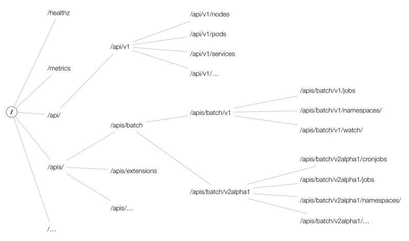
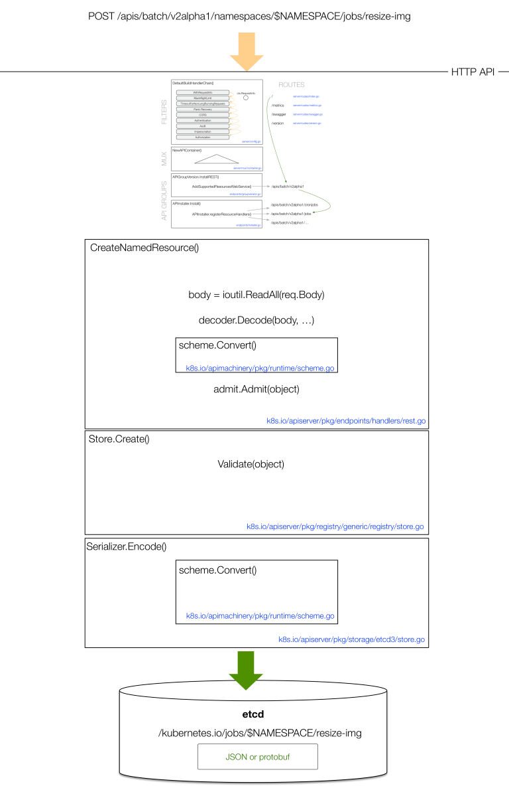

# kube-apiserver的设计与实现

kube-apiserver 是 kubernetes 中与 etcd 直接交互的一个组件，其控制着 kubernetes 中核心资源的变化。它主要提供了以下几个功能：

- 提供 Kubernetes API，包括认证授权、数据校验以及集群状态变更等，供客户端及其他组件调用；
- 代理集群中的一些附加组件组件，如 Kubernetes UI、metrics-server、npd 等；
- 创建 kubernetes 服务，即提供 apiserver 的 Service，kubernetes Service；
- 资源在不同版本之间的转换；

## kube-apiserver 处理流程

kube-apiserver 主要通过对外提供 API 的方式与其他组件进行交互，可以调用 kube-apiserver 的接口 $ curl -k https://<masterIP>:6443或者通过其提供的 swagger-ui 获取到，其主要有以下三种 API：

core group：主要在 /api/v1 下；
named groups：其 path 为 /apis/$NAME/$VERSION；
暴露系统状态的一些 API：如/metrics 、/healthz 等；
API 的 URL 大致以 /apis/group/version/namespaces/my-ns/myresource 组成，其中 API 的结构大致如下图所示：



下面介绍 kube-apiserver 如何处理一个 API 请求，一个请求完整的流程如下图所示：


此处以一次 POST 请求示例说明，当请求到达 kube-apiserver 时，kube-apiserver 首先会执行在 http filter chain 中注册的过滤器链，该过滤器对其执行一系列过滤操作，主要有认证、鉴权等检查操作。当 filter chain 处理完成后，请求会通过 route 进入到对应的 handler 中，handler 中的操作主要是与 etcd 的交互，在 handler 中的主要的操作如下所示：



### Decoder

kubernetes 中的多数 resource 都会有一个 internal version，因为在整个开发过程中一个 resource 可能会对应多个 version，比如 deployment 会有 extensions/v1beta1，apps/v1。 为了避免出现问题，kube-apiserver 必须要知道如何在每一对版本之间进行转换（例如，v1⇔v1alpha1，v1⇔v1beta1，v1beta1⇔v1alpha1），因此其使用了一个特殊的internal version，internal version 作为一个通用的 version 会包含所有 version 的字段，它具有所有 version 的功能。 Decoder 会首先把 creater object 转换到 internal version，然后将其转换为 storage version，storage version 是在 etcd 中存储时的另一个 version。

在解码时，首先从 HTTP path 中获取期待的 version，然后使用 scheme 以正确的 version 创建一个与之匹配的空对象，并使用 JSON 或 protobuf 解码器进行转换，在转换的第一步中，如果用户省略了某些字段，Decoder 会把其设置为默认值。

### Admission

在解码完成后，需要通过验证集群的全局约束来检查是否可以创建或更新对象，并根据集群配置设置默认值。在 k8s.io/kubernetes/plugin/pkg/admission 目录下可以看到 kube-apiserver 可以使用的所有全局约束插件，kube-apiserver 在启动时通过设置 --enable-admission-plugins 参数来开启需要使用的插件，通过 ValidatingAdmissionWebhook 或 MutatingAdmissionWebhook 添加的插件也都会在此处进行工作。

### Validation

主要检查 object 中字段的合法性。

在 handler 中执行完以上操作后最后会执行与 etcd 相关的操作，POST 操作会将数据写入到 etcd 中，以上在 handler 中的主要处理流程如下所示：

```
v1beta1 ⇒ internal ⇒    |    ⇒       |    ⇒  v1  ⇒ json/yaml ⇒ etcd
                     admission    validation
```

## kube-apiserver 中的组件

kube-apiserver 共由 3 个组件构成（Aggregator、KubeAPIServer、APIExtensionServer），这些组件依次通过 Delegation 处理请求：

- Aggregator：暴露的功能类似于一个七层负载均衡，将来自用户的请求拦截转发给其他服务器，并且负责整个 APIServer 的 Discovery 功能；
- KubeAPIServer ：负责对请求的一些通用处理，认证、鉴权等，以及处理各个内建资源的 REST 服务；
- APIExtensionServer：主要处理 CustomResourceDefinition（CRD）和 CustomResource（CR）的 REST 请求，也是 Delegation 的最后一环，如果对应 CR 不能被处理的话则会返回 404。

Aggregator 和 APIExtensionsServer 对应两种主要扩展 APIServer 资源的方式，即分别是 AA 和 CRD。

### Aggregator

Aggregator 通过 APIServices 对象关联到某个 Service 来进行请求的转发，其关联的 Service 类型进一步决定了请求转发形式。Aggregator 包括一个 GenericAPIServer 和维护自身状态的 Controller。其中 GenericAPIServer 主要处理 apiregistration.k8s.io 组下的 APIService 资源请求。

Aggregator 除了处理资源请求外还包含几个 controller：

1、apiserviceRegistrationController：负责 APIServices 中资源的注册与删除；
2、availableConditionController：维护 APIServices 的可用状态，包括其引用 Service 是否可用等；
3、autoRegistrationController：用于保持 API 中存在的一组特定的 APIServices；
4、crdRegistrationController：负责将 CRD GroupVersions 自动注册到 APIServices 中；
5、openAPIAggregationController：将 APIServices 资源的变化同步至提供的 OpenAPI 文档；
kubernetes 中的一些附加组件，比如 metrics-server 就是通过 Aggregator 的方式进行扩展的，实际环境中可以通过使用 apiserver-builder 工具轻松以 Aggregator 的扩展方式创建自定义资源。

#### 启用 API Aggregation

在 kube-apiserver 中需要增加以下配置来开启 API Aggregation：

```
--proxy-client-cert-file=/etc/kubernetes/certs/proxy.crt
--proxy-client-key-file=/etc/kubernetes/certs/proxy.key
--requestheader-client-ca-file=/etc/kubernetes/certs/proxy-ca.crt
--requestheader-allowed-names=aggregator
--requestheader-extra-headers-prefix=X-Remote-Extra-
--requestheader-group-headers=X-Remote-Group
--requestheader-username-headers=X-Remote-User
```

### KubeAPIServer

KubeAPIServer 主要是提供对 API Resource 的操作请求，为 kubernetes 中众多 API 注册路由信息，暴露 RESTful API 并且对外提供 kubernetes service，使集群中以及集群外的服务都可以通过 RESTful API 操作 kubernetes 中的资源。

### APIExtensionServer

APIExtensionServer 作为 Delegation 链的最后一层，是处理所有用户通过 Custom Resource Definition 定义的资源服务器。

其中包含的 controller 以及功能如下所示：

1、openapiController：将 crd 资源的变化同步至提供的 OpenAPI 文档，可通过访问 /openapi/v2 进行查看；
2、crdController：负责将 crd 信息注册到 apiVersions 和 apiResources 中，两者的信息可通过 $ kubectl api-versions 和 $ kubectl api-resources 查看；
3、namingController：检查 crd obj 中是否有命名冲突，可在 crd .status.conditions 中查看；
4、establishingController：检查 crd 是否处于正常状态，可在 crd .status.conditions 中查看；
5、nonStructuralSchemaController：检查 crd obj 结构是否正常，可在 crd .status.conditions 中查看；
6、apiApprovalController：检查 crd 是否遵循 kubernetes API 声明策略，可在 crd .status.conditions 中查看；
7、finalizingController：类似于 finalizes 的功能，与 CRs 的删除有关；

## kube-apiserver 启动流程分析

首先分析 kube-apiserver 的启动方式，kube-apiserver 也是通过其 Run 方法启动主逻辑的，在Run 方法调用之前会进行解析命令行参数、设置默认值等。

### Run

Run 方法的主要逻辑为：

1、调用 CreateServerChain 构建服务调用链并判断是否启动非安全的 http server，http server 链中包含 apiserver 要启动的三个 server，以及为每个 server 注册对应资源的路由；
2、调用 server.PrepareRun 进行服务运行前的准备，该方法主要完成了健康检查、存活检查和OpenAPI路由的注册工作；
3、调用 prepared.Run 启动 https server；
server 的初始化使用委托模式，通过 DelegationTarget 接口，把基本的 API Server、CustomResource、Aggregator 这三种服务采用链式结构串联起来，对外提供服务。

```
func Run(completeOptions completedServerRunOptions, stopCh <-chan struct{}) error {
	// To help debugging, immediately log version
	klog.Infof("Version: %+v", version.Get())

	server, err := CreateServerChain(completeOptions, stopCh)
	if err != nil {
		return err
	}

	prepared, err := server.PrepareRun()
	if err != nil {
		return err
	}

	return prepared.Run(stopCh)
}
```

### CreateServerChain

CreateServerChain 是完成 server 初始化的方法，里面包含 APIExtensionsServer、KubeAPIServer、AggregatorServer 初始化的所有流程，最终返回 aggregatorapiserver.APIAggregator 实例，初始化流程主要有：http filter chain 的配置、API Group 的注册、http path 与 handler 的关联以及 handler 后端存储 etcd 的配置。其主要逻辑为：

1、调用 CreateKubeAPIServerConfig 创建 KubeAPIServer 所需要的配置，主要是创建 master.Config，其中会调用 buildGenericConfig 生成 genericConfig，genericConfig 中包含 apiserver 的核心配置；
2、判断是否启用了扩展的 API server 并调用 createAPIExtensionsConfig 为其创建配置，apiExtensions server 是一个代理服务，用于代理 kubeapiserver 中的其他 server，比如 metric-server；
3、调用 createAPIExtensionsServer 创建 apiExtensionsServer 实例；
4、调用 CreateKubeAPIServer初始化 kubeAPIServer；
5、调用 createAggregatorConfig 为 aggregatorServer 创建配置并调用 createAggregatorServer 初始化 aggregatorServer；
6、配置并判断是否启动非安全的 http server；

```
func CreateServerChain(completedOptions completedServerRunOptions, stopCh <-chan struct{}) (*aggregatorapiserver.APIAggregator, error) {
	nodeTunneler, proxyTransport, err := CreateNodeDialer(completedOptions)
	if err != nil {
		return nil, err
	}

	// 为 kubeAPIServer 创建配置
	kubeAPIServerConfig, insecureServingInfo, serviceResolver, pluginInitializer, err := CreateKubeAPIServerConfig(completedOptions, nodeTunneler, proxyTransport)
	if err != nil {
		return nil, err
	}

	// 判断是否配置了 APIExtensionsServer，创建 apiExtensionsConfig
	apiExtensionsConfig, err := createAPIExtensionsConfig(*kubeAPIServerConfig.GenericConfig, kubeAPIServerConfig.ExtraConfig.VersionedInformers, pluginInitializer, completedOptions.ServerRunOptions, completedOptions.MasterCount,
		serviceResolver, webhook.NewDefaultAuthenticationInfoResolverWrapper(proxyTransport, kubeAPIServerConfig.GenericConfig.EgressSelector, kubeAPIServerConfig.GenericConfig.LoopbackClientConfig))
	if err != nil {
		return nil, err
	}

	// 初始化 APIExtensionsServer
	apiExtensionsServer, err := createAPIExtensionsServer(apiExtensionsConfig, genericapiserver.NewEmptyDelegate())
	if err != nil {
		return nil, err
	}

	// 初始化 KubeAPIServer
	kubeAPIServer, err := CreateKubeAPIServer(kubeAPIServerConfig, apiExtensionsServer.GenericAPIServer)
	if err != nil {
		return nil, err
	}

	// 创建 AggregatorConfig
	aggregatorConfig, err := createAggregatorConfig(*kubeAPIServerConfig.GenericConfig, completedOptions.ServerRunOptions, kubeAPIServerConfig.ExtraConfig.VersionedInformers, serviceResolver, proxyTransport, pluginInitializer)
	if err != nil {
		return nil, err
	}
	// 初始化 AggregatorServer
	aggregatorServer, err := createAggregatorServer(aggregatorConfig, kubeAPIServer.GenericAPIServer, apiExtensionsServer.Informers)
	if err != nil {
		// we don't need special handling for innerStopCh because the aggregator server doesn't create any go routines
		return nil, err
	}

	// 判断是否启动非安全端口的 http server
	if insecureServingInfo != nil {
		insecureHandlerChain := kubeserver.BuildInsecureHandlerChain(aggregatorServer.GenericAPIServer.UnprotectedHandler(), kubeAPIServerConfig.GenericConfig)
		if err := insecureServingInfo.Serve(insecureHandlerChain, kubeAPIServerConfig.GenericConfig.RequestTimeout, stopCh); err != nil {
			return nil, err
		}
	}

	return aggregatorServer, nil
}
```

### CreateKubeAPIServerConfig

在 CreateKubeAPIServerConfig 中主要是调用 buildGenericConfig 创建 genericConfig 以及构建 master.Config 对象。

```
func CreateKubeAPIServerConfig(
	s completedServerRunOptions,
	nodeTunneler tunneler.Tunneler,
	proxyTransport *http.Transport,
) (
	*master.Config,
	*genericapiserver.DeprecatedInsecureServingInfo,
	aggregatorapiserver.ServiceResolver,
	[]admission.PluginInitializer,
	error,
) {

	// 构建 genericConfig
	genericConfig, versionedInformers, insecureServingInfo, serviceResolver, pluginInitializers, admissionPostStartHook, storageFactory, err := buildGenericConfig(s.ServerRunOptions, proxyTransport)
	if err != nil {
		return nil, nil, nil, nil, err
	}

	if _, port, err := net.SplitHostPort(s.Etcd.StorageConfig.Transport.ServerList[0]); err == nil && port != "0" && len(port) != 0 {
		if err := utilwait.PollImmediate(etcdRetryInterval, etcdRetryLimit*etcdRetryInterval, preflight.EtcdConnection{ServerList: s.Etcd.StorageConfig.Transport.ServerList}.CheckEtcdServers); err != nil {
			return nil, nil, nil, nil, fmt.Errorf("error waiting for etcd connection: %v", err)
		}
	}

	// 初始化所支持的 capabilities
	capabilities.Initialize(capabilities.Capabilities{
		AllowPrivileged: s.AllowPrivileged,
		// TODO(vmarmol): Implement support for HostNetworkSources.
		PrivilegedSources: capabilities.PrivilegedSources{
			HostNetworkSources: []string{},
			HostPIDSources:     []string{},
			HostIPCSources:     []string{},
		},
		PerConnectionBandwidthLimitBytesPerSec: s.MaxConnectionBytesPerSec,
	})

	s.Metrics.Apply()

	// 获取 service ip range 以及 api server service IP
	serviceIPRange, apiServerServiceIP, err := master.ServiceIPRange(s.PrimaryServiceClusterIPRange)
	if err != nil {
		return nil, nil, nil, nil, err
	}

	// defaults to empty range and ip
	var secondaryServiceIPRange net.IPNet
	// process secondary range only if provided by user
	if s.SecondaryServiceClusterIPRange.IP != nil {
		secondaryServiceIPRange, _, err = master.ServiceIPRange(s.SecondaryServiceClusterIPRange)
		if err != nil {
			return nil, nil, nil, nil, err
		}
	}

	// 构建 master.Config 对象
	config := &master.Config{
		GenericConfig: genericConfig,
		ExtraConfig: master.ExtraConfig{
			APIResourceConfigSource: storageFactory.APIResourceConfigSource,
			StorageFactory:          storageFactory,
			EventTTL:                s.EventTTL,
			KubeletClientConfig:     s.KubeletConfig,
			EnableLogsSupport:       s.EnableLogsHandler,
			ProxyTransport:          proxyTransport,

			Tunneler: nodeTunneler,

			ServiceIPRange:          serviceIPRange,
			APIServerServiceIP:      apiServerServiceIP,
			SecondaryServiceIPRange: secondaryServiceIPRange,

			APIServerServicePort: 443,

			ServiceNodePortRange:      s.ServiceNodePortRange,
			KubernetesServiceNodePort: s.KubernetesServiceNodePort,

			EndpointReconcilerType: reconcilers.Type(s.EndpointReconcilerType),
			MasterCount:            s.MasterCount,

			ServiceAccountIssuer:        s.ServiceAccountIssuer,
			ServiceAccountMaxExpiration: s.ServiceAccountTokenMaxExpiration,
			ExtendExpiration:            s.Authentication.ServiceAccounts.ExtendExpiration,

			VersionedInformers: versionedInformers,
		},
	}

	clientCAProvider, err := s.Authentication.ClientCert.GetClientCAContentProvider()
	if err != nil {
		return nil, nil, nil, nil, err
	}
	config.ExtraConfig.ClusterAuthenticationInfo.ClientCA = clientCAProvider

	requestHeaderConfig, err := s.Authentication.RequestHeader.ToAuthenticationRequestHeaderConfig()
	if err != nil {
		return nil, nil, nil, nil, err
	}
	if requestHeaderConfig != nil {
		config.ExtraConfig.ClusterAuthenticationInfo.RequestHeaderCA = requestHeaderConfig.CAContentProvider
		config.ExtraConfig.ClusterAuthenticationInfo.RequestHeaderAllowedNames = requestHeaderConfig.AllowedClientNames
		config.ExtraConfig.ClusterAuthenticationInfo.RequestHeaderExtraHeaderPrefixes = requestHeaderConfig.ExtraHeaderPrefixes
		config.ExtraConfig.ClusterAuthenticationInfo.RequestHeaderGroupHeaders = requestHeaderConfig.GroupHeaders
		config.ExtraConfig.ClusterAuthenticationInfo.RequestHeaderUsernameHeaders = requestHeaderConfig.UsernameHeaders
	}

	if err := config.GenericConfig.AddPostStartHook("start-kube-apiserver-admission-initializer", admissionPostStartHook); err != nil {
		return nil, nil, nil, nil, err
	}

	if nodeTunneler != nil {
		// Use the nodeTunneler's dialer to connect to the kubelet
		config.ExtraConfig.KubeletClientConfig.Dial = nodeTunneler.Dial
	}
	if config.GenericConfig.EgressSelector != nil {
		// Use the config.GenericConfig.EgressSelector lookup to find the dialer to connect to the kubelet
		config.ExtraConfig.KubeletClientConfig.Lookup = config.GenericConfig.EgressSelector.Lookup

		// Use the config.GenericConfig.EgressSelector lookup as the transport used by the "proxy" subresources.
		networkContext := egressselector.Cluster.AsNetworkContext()
		dialer, err := config.GenericConfig.EgressSelector.Lookup(networkContext)
		if err != nil {
			return nil, nil, nil, nil, err
		}
		c := proxyTransport.Clone()
		c.DialContext = dialer
		config.ExtraConfig.ProxyTransport = c
	}

	if utilfeature.DefaultFeatureGate.Enabled(features.ServiceAccountIssuerDiscovery) {
		// Load the public keys.
		var pubKeys []interface{}
		for _, f := range s.Authentication.ServiceAccounts.KeyFiles {
			keys, err := keyutil.PublicKeysFromFile(f)
			if err != nil {
				return nil, nil, nil, nil, fmt.Errorf("failed to parse key file %q: %v", f, err)
			}
			pubKeys = append(pubKeys, keys...)
		}
		// Plumb the required metadata through ExtraConfig.
		config.ExtraConfig.ServiceAccountIssuerURL = s.Authentication.ServiceAccounts.Issuer
		config.ExtraConfig.ServiceAccountJWKSURI = s.Authentication.ServiceAccounts.JWKSURI
		config.ExtraConfig.ServiceAccountPublicKeys = pubKeys
	}

	return config, insecureServingInfo, serviceResolver, pluginInitializers, nil
}
```

#### buildGenericConfig

主要逻辑为：

1、调用 genericapiserver.NewConfig 生成默认的 genericConfig，genericConfig 中主要配置了 DefaultBuildHandlerChain，DefaultBuildHandlerChain 中包含了认证、鉴权等一系列 http filter chain；
2、调用 master.DefaultAPIResourceConfigSource 加载需要启用的 API Resource，集群中所有的 API Resource 可以在代码的 k8s.io/api 目录中看到，随着版本的迭代也会不断变化；
3、为 genericConfig 中的部分字段设置默认值；
4、调用 completedStorageFactoryConfig.New 创建 storageFactory，后面会使用 storageFactory 为每种API Resource 创建对应的 RESTStorage；

```
func buildGenericConfig(
	s *options.ServerRunOptions,
	proxyTransport *http.Transport,
) (
	genericConfig *genericapiserver.Config,
	versionedInformers clientgoinformers.SharedInformerFactory,
	insecureServingInfo *genericapiserver.DeprecatedInsecureServingInfo,
	serviceResolver aggregatorapiserver.ServiceResolver,
	pluginInitializers []admission.PluginInitializer,
	admissionPostStartHook genericapiserver.PostStartHookFunc,
	storageFactory *serverstorage.DefaultStorageFactory,
	lastErr error,
) {
	// 为 genericConfig 设置默认值
	genericConfig = genericapiserver.NewConfig(legacyscheme.Codecs)
	genericConfig.MergedResourceConfig = master.DefaultAPIResourceConfigSource()

	if lastErr = s.GenericServerRunOptions.ApplyTo(genericConfig); lastErr != nil {
		return
	}

	if lastErr = s.InsecureServing.ApplyTo(&insecureServingInfo, &genericConfig.LoopbackClientConfig); lastErr != nil {
		return
	}
	if lastErr = s.SecureServing.ApplyTo(&genericConfig.SecureServing, &genericConfig.LoopbackClientConfig); lastErr != nil {
		return
	}
	if lastErr = s.Features.ApplyTo(genericConfig); lastErr != nil {
		return
	}
	if lastErr = s.APIEnablement.ApplyTo(genericConfig, master.DefaultAPIResourceConfigSource(), legacyscheme.Scheme); lastErr != nil {
		return
	}
	if lastErr = s.EgressSelector.ApplyTo(genericConfig); lastErr != nil {
		return
	}

	genericConfig.OpenAPIConfig = genericapiserver.DefaultOpenAPIConfig(generatedopenapi.GetOpenAPIDefinitions, openapinamer.NewDefinitionNamer(legacyscheme.Scheme, extensionsapiserver.Scheme, aggregatorscheme.Scheme))
	genericConfig.OpenAPIConfig.Info.Title = "Kubernetes"
	genericConfig.LongRunningFunc = filters.BasicLongRunningRequestCheck(
		sets.NewString("watch", "proxy"),
		sets.NewString("attach", "exec", "proxy", "log", "portforward"),
	)

	kubeVersion := version.Get()
	genericConfig.Version = &kubeVersion

	storageFactoryConfig := kubeapiserver.NewStorageFactoryConfig()
	storageFactoryConfig.APIResourceConfig = genericConfig.MergedResourceConfig
	completedStorageFactoryConfig, err := storageFactoryConfig.Complete(s.Etcd)
	if err != nil {
		lastErr = err
		return
	}
	storageFactory, lastErr = completedStorageFactoryConfig.New()
	if lastErr != nil {
		return
	}
	if genericConfig.EgressSelector != nil {
		storageFactory.StorageConfig.Transport.EgressLookup = genericConfig.EgressSelector.Lookup
	}
	if lastErr = s.Etcd.ApplyWithStorageFactoryTo(storageFactory, genericConfig); lastErr != nil {
		return
	}

	// Use protobufs for self-communication.
	// Since not every generic apiserver has to support protobufs, we
	// cannot default to it in generic apiserver and need to explicitly
	// set it in kube-apiserver.
	genericConfig.LoopbackClientConfig.ContentConfig.ContentType = "application/vnd.kubernetes.protobuf"
	// Disable compression for self-communication, since we are going to be
	// on a fast local network
	genericConfig.LoopbackClientConfig.DisableCompression = true

	kubeClientConfig := genericConfig.LoopbackClientConfig
	clientgoExternalClient, err := clientgoclientset.NewForConfig(kubeClientConfig)
	if err != nil {
		lastErr = fmt.Errorf("failed to create real external clientset: %v", err)
		return
	}
	versionedInformers = clientgoinformers.NewSharedInformerFactory(clientgoExternalClient, 10*time.Minute)

	// Authentication.ApplyTo requires already applied OpenAPIConfig and EgressSelector if present
	if lastErr = s.Authentication.ApplyTo(&genericConfig.Authentication, genericConfig.SecureServing, genericConfig.EgressSelector, genericConfig.OpenAPIConfig, clientgoExternalClient, versionedInformers); lastErr != nil {
		return
	}

	genericConfig.Authorization.Authorizer, genericConfig.RuleResolver, err = BuildAuthorizer(s, genericConfig.EgressSelector, versionedInformers)
	if err != nil {
		lastErr = fmt.Errorf("invalid authorization config: %v", err)
		return
	}
	if !sets.NewString(s.Authorization.Modes...).Has(modes.ModeRBAC) {
		genericConfig.DisabledPostStartHooks.Insert(rbacrest.PostStartHookName)
	}

	admissionConfig := &kubeapiserveradmission.Config{
		ExternalInformers:    versionedInformers,
		LoopbackClientConfig: genericConfig.LoopbackClientConfig,
		CloudConfigFile:      s.CloudProvider.CloudConfigFile,
	}
	serviceResolver = buildServiceResolver(s.EnableAggregatorRouting, genericConfig.LoopbackClientConfig.Host, versionedInformers)

	authInfoResolverWrapper := webhook.NewDefaultAuthenticationInfoResolverWrapper(proxyTransport, genericConfig.EgressSelector, genericConfig.LoopbackClientConfig)

	lastErr = s.Audit.ApplyTo(
		genericConfig,
		genericConfig.LoopbackClientConfig,
		versionedInformers,
		serveroptions.NewProcessInfo("kube-apiserver", "kube-system"),
		&serveroptions.WebhookOptions{
			AuthInfoResolverWrapper: authInfoResolverWrapper,
			ServiceResolver:         serviceResolver,
		},
	)
	if lastErr != nil {
		return
	}

	pluginInitializers, admissionPostStartHook, err = admissionConfig.New(proxyTransport, genericConfig.EgressSelector, serviceResolver)
	if err != nil {
		lastErr = fmt.Errorf("failed to create admission plugin initializer: %v", err)
		return
	}

	err = s.Admission.ApplyTo(
		genericConfig,
		versionedInformers,
		kubeClientConfig,
		feature.DefaultFeatureGate,
		pluginInitializers...)
	if err != nil {
		lastErr = fmt.Errorf("failed to initialize admission: %v", err)
	}

	if utilfeature.DefaultFeatureGate.Enabled(genericfeatures.APIPriorityAndFairness) && s.GenericServerRunOptions.EnablePriorityAndFairness {
		genericConfig.FlowControl = BuildPriorityAndFairness(s, clientgoExternalClient, versionedInformers)
	}

	return
}
```

以上主要分析 KubeAPIServerConfig 的初始化，其他两个 server config 的初始化暂且不详细分析，下面接着继续分析 server 的初始化。

### createAPIExtensionsServer

APIExtensionsServer 是最先被初始化的，在 createAPIExtensionsServer 中调用 apiextensionsConfig.Complete().New 来完成 server 的初始化，其主要逻辑为：

1、首先调用 c.GenericConfig.New 按照go-restful的模式初始化 Container，在 c.GenericConfig.New 中会调用 NewAPIServerHandler 初始化 handler，APIServerHandler 包含了 API Server 使用的多种http.Handler 类型，包括 go-restful 以及 non-go-restful，以及在以上两者之间选择的 Director 对象，go-restful 用于处理已经注册的 handler，non-go-restful 用来处理不存在的 handler，API URI 处理的选择过程为：FullHandlerChain-> Director ->{GoRestfulContainer， NonGoRestfulMux}。在 c.GenericConfig.New 中还会调用 installAPI来添加包括 /、/debug/*、/metrics、/version 等路由信息。三种 server 在初始化时首先都会调用 c.GenericConfig.New 来初始化一个 genericServer，然后进行 API 的注册；
2、调用 s.GenericAPIServer.InstallAPIGroup 在路由中注册 API Resources，此方法的调用链非常深，主要是为了将需要暴露的 API Resource 注册到 server 中，以便能通过 http 接口进行 resource 的 REST 操作，其他几种 server 在初始化时也都会执行对应的 InstallAPI；
3、初始化 server 中需要使用的 controller，主要有 openapiController、crdController、namingController、establishingController、nonStructuralSchemaController、apiApprovalController、finalizingController；
4、将需要启动的 controller 以及 informer 添加到 PostStartHook 中；

```
func createAPIExtensionsServer(apiextensionsConfig *apiextensionsapiserver.Config, delegateAPIServer genericapiserver.DelegationTarget) (*apiextensionsapiserver.CustomResourceDefinitions, error) {
	return apiextensionsConfig.Complete().New(delegateAPIServer)
}
```

```
func (c completedConfig) New(delegationTarget genericapiserver.DelegationTarget) (*CustomResourceDefinitions, error) {
	genericServer, err := c.GenericConfig.New("apiextensions-apiserver", delegationTarget)
	if err != nil {
		return nil, err
	}

	s := &CustomResourceDefinitions{
		GenericAPIServer: genericServer,
	}

	apiResourceConfig := c.GenericConfig.MergedResourceConfig
	apiGroupInfo := genericapiserver.NewDefaultAPIGroupInfo(apiextensions.GroupName, Scheme, metav1.ParameterCodec, Codecs)
	if apiResourceConfig.VersionEnabled(v1beta1.SchemeGroupVersion) {
		storage := map[string]rest.Storage{}
		// customresourcedefinitions
		customResourceDefinitionStorage, err := customresourcedefinition.NewREST(Scheme, c.GenericConfig.RESTOptionsGetter)
		if err != nil {
			return nil, err
		}
		storage["customresourcedefinitions"] = customResourceDefinitionStorage
		storage["customresourcedefinitions/status"] = customresourcedefinition.NewStatusREST(Scheme, customResourceDefinitionStorage)

		apiGroupInfo.VersionedResourcesStorageMap[v1beta1.SchemeGroupVersion.Version] = storage
	}
	if apiResourceConfig.VersionEnabled(v1.SchemeGroupVersion) {
		storage := map[string]rest.Storage{}
		// customresourcedefinitions
		customResourceDefintionStorage, err := customresourcedefinition.NewREST(Scheme, c.GenericConfig.RESTOptionsGetter)
		if err != nil {
			return nil, err
		}
		storage["customresourcedefinitions"] = customResourceDefintionStorage
		storage["customresourcedefinitions/status"] = customresourcedefinition.NewStatusREST(Scheme, customResourceDefintionStorage)

		apiGroupInfo.VersionedResourcesStorageMap[v1.SchemeGroupVersion.Version] = storage
	}

	if err := s.GenericAPIServer.InstallAPIGroup(&apiGroupInfo); err != nil {
		return nil, err
	}

	crdClient, err := clientset.NewForConfig(s.GenericAPIServer.LoopbackClientConfig)
	if err != nil {
		// it's really bad that this is leaking here, but until we can fix the test (which I'm pretty sure isn't even testing what it wants to test),
		// we need to be able to move forward
		return nil, fmt.Errorf("failed to create clientset: %v", err)
	}
	s.Informers = externalinformers.NewSharedInformerFactory(crdClient, 5*time.Minute)

	delegateHandler := delegationTarget.UnprotectedHandler()
	if delegateHandler == nil {
		delegateHandler = http.NotFoundHandler()
	}

	versionDiscoveryHandler := &versionDiscoveryHandler{
		discovery: map[schema.GroupVersion]*discovery.APIVersionHandler{},
		delegate:  delegateHandler,
	}
	groupDiscoveryHandler := &groupDiscoveryHandler{
		discovery: map[string]*discovery.APIGroupHandler{},
		delegate:  delegateHandler,
	}
	establishingController := establish.NewEstablishingController(s.Informers.Apiextensions().V1().CustomResourceDefinitions(), crdClient.ApiextensionsV1())
	crdHandler, err := NewCustomResourceDefinitionHandler(
		versionDiscoveryHandler,
		groupDiscoveryHandler,
		s.Informers.Apiextensions().V1().CustomResourceDefinitions(),
		delegateHandler,
		c.ExtraConfig.CRDRESTOptionsGetter,
		c.GenericConfig.AdmissionControl,
		establishingController,
		c.ExtraConfig.ServiceResolver,
		c.ExtraConfig.AuthResolverWrapper,
		c.ExtraConfig.MasterCount,
		s.GenericAPIServer.Authorizer,
		c.GenericConfig.RequestTimeout,
		time.Duration(c.GenericConfig.MinRequestTimeout)*time.Second,
		apiGroupInfo.StaticOpenAPISpec,
		c.GenericConfig.MaxRequestBodyBytes,
	)
	if err != nil {
		return nil, err
	}
	s.GenericAPIServer.Handler.NonGoRestfulMux.Handle("/apis", crdHandler)
	s.GenericAPIServer.Handler.NonGoRestfulMux.HandlePrefix("/apis/", crdHandler)

	discoveryController := NewDiscoveryController(s.Informers.Apiextensions().V1().CustomResourceDefinitions(), versionDiscoveryHandler, groupDiscoveryHandler)
	namingController := status.NewNamingConditionController(s.Informers.Apiextensions().V1().CustomResourceDefinitions(), crdClient.ApiextensionsV1())
	nonStructuralSchemaController := nonstructuralschema.NewConditionController(s.Informers.Apiextensions().V1().CustomResourceDefinitions(), crdClient.ApiextensionsV1())
	apiApprovalController := apiapproval.NewKubernetesAPIApprovalPolicyConformantConditionController(s.Informers.Apiextensions().V1().CustomResourceDefinitions(), crdClient.ApiextensionsV1())
	finalizingController := finalizer.NewCRDFinalizer(
		s.Informers.Apiextensions().V1().CustomResourceDefinitions(),
		crdClient.ApiextensionsV1(),
		crdHandler,
	)
	openapiController := openapicontroller.NewController(s.Informers.Apiextensions().V1().CustomResourceDefinitions())

	s.GenericAPIServer.AddPostStartHookOrDie("start-apiextensions-informers", func(context genericapiserver.PostStartHookContext) error {
		s.Informers.Start(context.StopCh)
		return nil
	})
	s.GenericAPIServer.AddPostStartHookOrDie("start-apiextensions-controllers", func(context genericapiserver.PostStartHookContext) error {
		// OpenAPIVersionedService and StaticOpenAPISpec are populated in generic apiserver PrepareRun().
		// Together they serve the /openapi/v2 endpoint on a generic apiserver. A generic apiserver may
		// choose to not enable OpenAPI by having null openAPIConfig, and thus OpenAPIVersionedService
		// and StaticOpenAPISpec are both null. In that case we don't run the CRD OpenAPI controller.
		if s.GenericAPIServer.OpenAPIVersionedService != nil && s.GenericAPIServer.StaticOpenAPISpec != nil {
			go openapiController.Run(s.GenericAPIServer.StaticOpenAPISpec, s.GenericAPIServer.OpenAPIVersionedService, context.StopCh)
		}

		go namingController.Run(context.StopCh)
		go establishingController.Run(context.StopCh)
		go nonStructuralSchemaController.Run(5, context.StopCh)
		go apiApprovalController.Run(5, context.StopCh)
		go finalizingController.Run(5, context.StopCh)

		discoverySyncedCh := make(chan struct{})
		go discoveryController.Run(context.StopCh, discoverySyncedCh)
		select {
		case <-context.StopCh:
		case <-discoverySyncedCh:
		}

		return nil
	})
	// we don't want to report healthy until we can handle all CRDs that have already been registered.  Waiting for the informer
	// to sync makes sure that the lister will be valid before we begin.  There may still be races for CRDs added after startup,
	// but we won't go healthy until we can handle the ones already present.
	s.GenericAPIServer.AddPostStartHookOrDie("crd-informer-synced", func(context genericapiserver.PostStartHookContext) error {
		return wait.PollImmediateUntil(100*time.Millisecond, func() (bool, error) {
			return s.Informers.Apiextensions().V1().CustomResourceDefinitions().Informer().HasSynced(), nil
		}, context.StopCh)
	})

	return s, nil
}
```

以上是 APIExtensionsServer 的初始化流程，其中最核心方法是 s.GenericAPIServer.InstallAPIGroup，也就是 API 的注册过程，三种 server 中 API 的注册过程都是其核心。

### CreateKubeAPIServer

本节继续分析 KubeAPIServer 的初始化，在CreateKubeAPIServer 中调用了 kubeAPIServerConfig.Complete().New 来完成相关的初始化操作。

```
func CreateKubeAPIServer(kubeAPIServerConfig *master.Config, delegateAPIServer genericapiserver.DelegationTarget) (*master.Master, error) {
	kubeAPIServer, err := kubeAPIServerConfig.Complete().New(delegateAPIServer)
	if err != nil {
		return nil, err
	}

	return kubeAPIServer, nil
}
```

#### kubeAPIServerConfig.Complete().New

主要逻辑为：

1、调用 c.GenericConfig.New 初始化 GenericAPIServer，其主要实现在上文已经分析过；
2、判断是否支持 logs 相关的路由，如果支持，则添加 /logs 路由；
3、调用 m.InstallLegacyAPI 将核心 API Resource 添加到路由中，对应到 apiserver 就是以 /api 开头的 resource；
4、调用 m.InstallAPIs 将扩展的 API Resource 添加到路由中，在 apiserver 中即是以 /apis 开头的 resource；

```
func (c completedConfig) New(delegationTarget genericapiserver.DelegationTarget) (*Master, error) {
	if reflect.DeepEqual(c.ExtraConfig.KubeletClientConfig, kubeletclient.KubeletClientConfig{}) {
		return nil, fmt.Errorf("Master.New() called with empty config.KubeletClientConfig")
	}

	s, err := c.GenericConfig.New("kube-apiserver", delegationTarget)
	if err != nil {
		return nil, err
	}

	if c.ExtraConfig.EnableLogsSupport {
		routes.Logs{}.Install(s.Handler.GoRestfulContainer)
	}

	if utilfeature.DefaultFeatureGate.Enabled(features.ServiceAccountIssuerDiscovery) {
		// Metadata and keys are expected to only change across restarts at present,
		// so we just marshal immediately and serve the cached JSON bytes.
		md, err := serviceaccount.NewOpenIDMetadata(
			c.ExtraConfig.ServiceAccountIssuerURL,
			c.ExtraConfig.ServiceAccountJWKSURI,
			c.GenericConfig.ExternalAddress,
			c.ExtraConfig.ServiceAccountPublicKeys,
		)
		if err != nil {
			// If there was an error, skip installing the endpoints and log the
			// error, but continue on. We don't return the error because the
			// metadata responses require additional, backwards incompatible
			// validation of command-line options.
			msg := fmt.Sprintf("Could not construct pre-rendered responses for"+
				" ServiceAccountIssuerDiscovery endpoints. Endpoints will not be"+
				" enabled. Error: %v", err)
			if c.ExtraConfig.ServiceAccountIssuerURL != "" {
				// The user likely expects this feature to be enabled if issuer URL is
				// set and the feature gate is enabled. In the future, if there is no
				// longer a feature gate and issuer URL is not set, the user may not
				// expect this feature to be enabled. We log the former case as an Error
				// and the latter case as an Info.
				klog.Error(msg)
			} else {
				klog.Info(msg)
			}
		} else {
			routes.NewOpenIDMetadataServer(md.ConfigJSON, md.PublicKeysetJSON).
				Install(s.Handler.GoRestfulContainer)
		}
	}

	m := &Master{
		GenericAPIServer:          s,
		ClusterAuthenticationInfo: c.ExtraConfig.ClusterAuthenticationInfo,
	}

	// install legacy rest storage
	if c.ExtraConfig.APIResourceConfigSource.VersionEnabled(apiv1.SchemeGroupVersion) {
		legacyRESTStorageProvider := corerest.LegacyRESTStorageProvider{
			StorageFactory:              c.ExtraConfig.StorageFactory,
			ProxyTransport:              c.ExtraConfig.ProxyTransport,
			KubeletClientConfig:         c.ExtraConfig.KubeletClientConfig,
			EventTTL:                    c.ExtraConfig.EventTTL,
			ServiceIPRange:              c.ExtraConfig.ServiceIPRange,
			SecondaryServiceIPRange:     c.ExtraConfig.SecondaryServiceIPRange,
			ServiceNodePortRange:        c.ExtraConfig.ServiceNodePortRange,
			LoopbackClientConfig:        c.GenericConfig.LoopbackClientConfig,
			ServiceAccountIssuer:        c.ExtraConfig.ServiceAccountIssuer,
			ExtendExpiration:            c.ExtraConfig.ExtendExpiration,
			ServiceAccountMaxExpiration: c.ExtraConfig.ServiceAccountMaxExpiration,
			APIAudiences:                c.GenericConfig.Authentication.APIAudiences,
		}
		if err := m.InstallLegacyAPI(&c, c.GenericConfig.RESTOptionsGetter, legacyRESTStorageProvider); err != nil {
			return nil, err
		}
	}

	// The order here is preserved in discovery.
	// If resources with identical names exist in more than one of these groups (e.g. "deployments.apps"" and "deployments.extensions"),
	// the order of this list determines which group an unqualified resource name (e.g. "deployments") should prefer.
	// This priority order is used for local discovery, but it ends up aggregated in `k8s.io/kubernetes/cmd/kube-apiserver/app/aggregator.go
	// with specific priorities.
	// TODO: describe the priority all the way down in the RESTStorageProviders and plumb it back through the various discovery
	// handlers that we have.
	restStorageProviders := []RESTStorageProvider{
		auditregistrationrest.RESTStorageProvider{},
		authenticationrest.RESTStorageProvider{Authenticator: c.GenericConfig.Authentication.Authenticator, APIAudiences: c.GenericConfig.Authentication.APIAudiences},
		authorizationrest.RESTStorageProvider{Authorizer: c.GenericConfig.Authorization.Authorizer, RuleResolver: c.GenericConfig.RuleResolver},
		autoscalingrest.RESTStorageProvider{},
		batchrest.RESTStorageProvider{},
		certificatesrest.RESTStorageProvider{},
		coordinationrest.RESTStorageProvider{},
		discoveryrest.StorageProvider{},
		extensionsrest.RESTStorageProvider{},
		networkingrest.RESTStorageProvider{},
		noderest.RESTStorageProvider{},
		policyrest.RESTStorageProvider{},
		rbacrest.RESTStorageProvider{Authorizer: c.GenericConfig.Authorization.Authorizer},
		schedulingrest.RESTStorageProvider{},
		settingsrest.RESTStorageProvider{},
		storagerest.RESTStorageProvider{},
		flowcontrolrest.RESTStorageProvider{},
		// keep apps after extensions so legacy clients resolve the extensions versions of shared resource names.
		// See https://github.com/kubernetes/kubernetes/issues/42392
		appsrest.StorageProvider{},
		admissionregistrationrest.RESTStorageProvider{},
		eventsrest.RESTStorageProvider{TTL: c.ExtraConfig.EventTTL},
	}bangwonale
	if err := m.InstallAPIs(c.ExtraConfig.APIResourceConfigSource, c.GenericConfig.RESTOptionsGetter, restStorageProviders...); err != nil {
		return nil, err
	}

	if c.ExtraConfig.Tunneler != nil {
		m.installTunneler(c.ExtraConfig.Tunneler, corev1client.NewForConfigOrDie(c.GenericConfig.LoopbackClientConfig).Nodes())
	}

	m.GenericAPIServer.AddPostStartHookOrDie("start-cluster-authentication-info-controller", func(hookContext genericapiserver.PostStartHookContext) error {
		kubeClient, err := kubernetes.NewForConfig(hookContext.LoopbackClientConfig)
		if err != nil {
			return err
		}
		controller := clusterauthenticationtrust.NewClusterAuthenticationTrustController(m.ClusterAuthenticationInfo, kubeClient)

		// prime values and start listeners
		if m.ClusterAuthenticationInfo.ClientCA != nil {
			if notifier, ok := m.ClusterAuthenticationInfo.ClientCA.(dynamiccertificates.Notifier); ok {
				notifier.AddListener(controller)
			}
			if controller, ok := m.ClusterAuthenticationInfo.ClientCA.(dynamiccertificates.ControllerRunner); ok {
				// runonce to be sure that we have a value.
				if err := controller.RunOnce(); err != nil {
					runtime.HandleError(err)
				}
				go controller.Run(1, hookContext.StopCh)
			}
		}
		if m.ClusterAuthenticationInfo.RequestHeaderCA != nil {
			if notifier, ok := m.ClusterAuthenticationInfo.RequestHeaderCA.(dynamiccertificates.Notifier); ok {
				notifier.AddListener(controller)
			}
			if controller, ok := m.ClusterAuthenticationInfo.RequestHeaderCA.(dynamiccertificates.ControllerRunner); ok {
				// runonce to be sure that we have a value.
				if err := controller.RunOnce(); err != nil {
					runtime.HandleError(err)
				}
				go controller.Run(1, hookContext.StopCh)
			}
		}

		go controller.Run(1, hookContext.StopCh)
		return nil
	})

	return m, nil
}
```

#### m.InstallLegacyAPI

此方法的主要功能是将 core API 注册到路由中，是 apiserver 初始化流程中最核心的方法之一，不过其调用链非常深，下面会进行深入分析。将 API 注册到路由其最终的目的就是对外提供 RESTful API 来操作对应 resource，注册 API 主要分为两步，第一步是为 API 中的每个 resource 初始化 RESTStorage 以此操作后端存储中数据的变更，第二步是为每个 resource 根据其 verbs 构建对应的路由。m.InstallLegacyAPI 的主要逻辑为：

1、调用 legacyRESTStorageProvider.NewLegacyRESTStorage 为 LegacyAPI 中各个资源创建 RESTStorage，RESTStorage 的目的是将每种资源的访问路径及其后端存储的操作对应起来；
2、初始化 bootstrap-controller，并将其加入到 PostStartHook 中，bootstrap-controller 是 apiserver 中的一个 controller，主要功能是创建系统所需要的一些 namespace 以及创建 kubernetes service 并定期触发对应的 sync 操作，apiserver 在启动后会通过调用 PostStartHook 来启动 bootstrap-controller；
3、在为资源创建完 RESTStorage 后，调用 m.GenericAPIServer.InstallLegacyAPIGroup 为 APIGroup 注册路由信息，InstallLegacyAPIGroup方法的调用链非常深，主要为InstallLegacyAPIGroup--> installAPIResources --> InstallREST --> Install --> registerResourceHandlers，最终核心的路由构造在registerResourceHandlers方法内，该方法比较复杂，其主要功能是通过上一步骤构造的 REST Storage 判断该资源可以执行哪些操作（如 create、update等），将其对应的操作存入到 action 中，每一个 action 对应一个标准的 REST 操作，如 create 对应的 action 操作为 POST、update 对应的 action 操作为PUT。最终根据 actions 数组依次遍历，对每一个操作添加一个 handler 方法，注册到 route 中去，再将 route 注册到 webservice 中去，webservice 最终会注册到 container 中，遵循 go-restful 的设计模式；

```
func (m *Master) InstallLegacyAPI(c *completedConfig, restOptionsGetter generic.RESTOptionsGetter, legacyRESTStorageProvider corerest.LegacyRESTStorageProvider) error {
	legacyRESTStorage, apiGroupInfo, err := legacyRESTStorageProvider.NewLegacyRESTStorage(restOptionsGetter)
	if err != nil {
		return fmt.Errorf("error building core storage: %v", err)
	}

	controllerName := "bootstrap-controller"
	coreClient := corev1client.NewForConfigOrDie(c.GenericConfig.LoopbackClientConfig)
	bootstrapController := c.NewBootstrapController(legacyRESTStorage, coreClient, coreClient, coreClient, coreClient.RESTClient())
	m.GenericAPIServer.AddPostStartHookOrDie(controllerName, bootstrapController.PostStartHook)
	m.GenericAPIServer.AddPreShutdownHookOrDie(controllerName, bootstrapController.PreShutdownHook)

	if err := m.GenericAPIServer.InstallLegacyAPIGroup(genericapiserver.DefaultLegacyAPIPrefix, &apiGroupInfo); err != nil {
		return fmt.Errorf("error in registering group versions: %v", err)
	}
	return nil
}
```

InstallAPIs 与 InstallLegacyAPI 的主要流程是类似的

### createAggregatorServer

AggregatorServer 主要用于自定义的聚合控制器的，使 CRD 能够自动注册到集群中。

主要逻辑为：

1、调用 aggregatorConfig.Complete().NewWithDelegate 创建 aggregatorServer；
2、初始化 crdRegistrationController 和 autoRegistrationController，crdRegistrationController 负责注册 CRD，autoRegistrationController 负责将 CRD 对应的 APIServices 自动注册到 apiserver 中，CRD 创建后可通过 $ kubectl get apiservices 查看是否注册到 apiservices 中；
3、将 autoRegistrationController 和 crdRegistrationController 加入到 PostStartHook 中；

```
func createAggregatorServer(aggregatorConfig *aggregatorapiserver.Config, delegateAPIServer genericapiserver.DelegationTarget, apiExtensionInformers apiextensionsinformers.SharedInformerFactory) (*aggregatorapiserver.APIAggregator, error) {
	aggregatorServer, err := aggregatorConfig.Complete().NewWithDelegate(delegateAPIServer)
	if err != nil {
		return nil, err
	}

	// create controllers for auto-registration
	apiRegistrationClient, err := apiregistrationclient.NewForConfig(aggregatorConfig.GenericConfig.LoopbackClientConfig)
	if err != nil {
		return nil, err
	}
	autoRegistrationController := autoregister.NewAutoRegisterController(aggregatorServer.APIRegistrationInformers.Apiregistration().V1().APIServices(), apiRegistrationClient)
	apiServices := apiServicesToRegister(delegateAPIServer, autoRegistrationController)
	crdRegistrationController := crdregistration.NewCRDRegistrationController(
		apiExtensionInformers.Apiextensions().V1().CustomResourceDefinitions(),
		autoRegistrationController)

	err = aggregatorServer.GenericAPIServer.AddPostStartHook("kube-apiserver-autoregistration", func(context genericapiserver.PostStartHookContext) error {
		go crdRegistrationController.Run(5, context.StopCh)
		go func() {
			// let the CRD controller process the initial set of CRDs before starting the autoregistration controller.
			// this prevents the autoregistration controller's initial sync from deleting APIServices for CRDs that still exist.
			// we only need to do this if CRDs are enabled on this server.  We can't use discovery because we are the source for discovery.
			if aggregatorConfig.GenericConfig.MergedResourceConfig.AnyVersionForGroupEnabled("apiextensions.k8s.io") {
				crdRegistrationController.WaitForInitialSync()
			}
			autoRegistrationController.Run(5, context.StopCh)
		}()
		return nil
	})
	if err != nil {
		return nil, err
	}

	err = aggregatorServer.GenericAPIServer.AddBootSequenceHealthChecks(
		makeAPIServiceAvailableHealthCheck(
			"autoregister-completion",
			apiServices,
			aggregatorServer.APIRegistrationInformers.Apiregistration().V1().APIServices(),
		),
	)
	if err != nil {
		return nil, err
	}

	return aggregatorServer, nil
}
```

#### aggregatorConfig.Complete().NewWithDelegate

aggregatorConfig.Complete().NewWithDelegate 是初始化 aggregatorServer 的方法，主要逻辑为：

1、调用 c.GenericConfig.New 初始化 GenericAPIServer，其内部的主要功能在上文已经分析过；
2、调用 apiservicerest.NewRESTStorage 为 APIServices 资源创建 RESTStorage，RESTStorage 的目的是将每种资源的访问路径及其后端存储的操作对应起来；
3、调用 s.GenericAPIServer.InstallAPIGroup 为 APIGroup 注册路由信息；

```
func (c completedConfig) NewWithDelegate(delegationTarget genericapiserver.DelegationTarget) (*APIAggregator, error) {
	// Prevent generic API server to install OpenAPI handler. Aggregator server
	// has its own customized OpenAPI handler.
	openAPIConfig := c.GenericConfig.OpenAPIConfig
	c.GenericConfig.OpenAPIConfig = nil

	genericServer, err := c.GenericConfig.New("kube-aggregator", delegationTarget)
	if err != nil {
		return nil, err
	}

	apiregistrationClient, err := clientset.NewForConfig(c.GenericConfig.LoopbackClientConfig)
	if err != nil {
		return nil, err
	}
	informerFactory := informers.NewSharedInformerFactory(
		apiregistrationClient,
		5*time.Minute, // this is effectively used as a refresh interval right now.  Might want to do something nicer later on.
	)

	s := &APIAggregator{
		GenericAPIServer:         genericServer,
		delegateHandler:          delegationTarget.UnprotectedHandler(),
		proxyClientCert:          c.ExtraConfig.ProxyClientCert,
		proxyClientKey:           c.ExtraConfig.ProxyClientKey,
		proxyTransport:           c.ExtraConfig.ProxyTransport,
		proxyHandlers:            map[string]*proxyHandler{},
		handledGroups:            sets.String{},
		lister:                   informerFactory.Apiregistration().V1().APIServices().Lister(),
		APIRegistrationInformers: informerFactory,
		serviceResolver:          c.ExtraConfig.ServiceResolver,
		openAPIConfig:            openAPIConfig,
		egressSelector:           c.GenericConfig.EgressSelector,
	}

	apiGroupInfo := apiservicerest.NewRESTStorage(c.GenericConfig.MergedResourceConfig, c.GenericConfig.RESTOptionsGetter)
	if err := s.GenericAPIServer.InstallAPIGroup(&apiGroupInfo); err != nil {
		return nil, err
	}

	enabledVersions := sets.NewString()
	for v := range apiGroupInfo.VersionedResourcesStorageMap {
		enabledVersions.Insert(v)
	}
	if !enabledVersions.Has(v1.SchemeGroupVersion.Version) {
		return nil, fmt.Errorf("API group/version %s must be enabled", v1.SchemeGroupVersion.String())
	}

	apisHandler := &apisHandler{
		codecs:         aggregatorscheme.Codecs,
		lister:         s.lister,
		discoveryGroup: discoveryGroup(enabledVersions),
	}
	s.GenericAPIServer.Handler.NonGoRestfulMux.Handle("/apis", apisHandler)
	s.GenericAPIServer.Handler.NonGoRestfulMux.UnlistedHandle("/apis/", apisHandler)

	apiserviceRegistrationController := NewAPIServiceRegistrationController(informerFactory.Apiregistration().V1().APIServices(), s)
	availableController, err := statuscontrollers.NewAvailableConditionController(
		informerFactory.Apiregistration().V1().APIServices(),
		c.GenericConfig.SharedInformerFactory.Core().V1().Services(),
		c.GenericConfig.SharedInformerFactory.Core().V1().Endpoints(),
		apiregistrationClient.ApiregistrationV1(),
		c.ExtraConfig.ProxyTransport,
		c.ExtraConfig.ProxyClientCert,
		c.ExtraConfig.ProxyClientKey,
		s.serviceResolver,
		c.GenericConfig.EgressSelector,
	)
	if err != nil {
		return nil, err
	}

	s.GenericAPIServer.AddPostStartHookOrDie("start-kube-aggregator-informers", func(context genericapiserver.PostStartHookContext) error {
		informerFactory.Start(context.StopCh)
		c.GenericConfig.SharedInformerFactory.Start(context.StopCh)
		return nil
	})
	s.GenericAPIServer.AddPostStartHookOrDie("apiservice-registration-controller", func(context genericapiserver.PostStartHookContext) error {
		handlerSyncedCh := make(chan struct{})
		go apiserviceRegistrationController.Run(context.StopCh, handlerSyncedCh)
		select {
		case <-context.StopCh:
		case <-handlerSyncedCh:
		}

		return nil
	})
	s.GenericAPIServer.AddPostStartHookOrDie("apiservice-status-available-controller", func(context genericapiserver.PostStartHookContext) error {
		// if we end up blocking for long periods of time, we may need to increase threadiness.
		go availableController.Run(5, context.StopCh)
		return nil
	})

	return s, nil
}
```

以上是对 AggregatorServer 初始化流程的分析，可以看出，在创建 APIExtensionsServer、KubeAPIServer 以及 AggregatorServer 时，其模式都是类似的，首先调用 c.GenericConfig.New 按照go-restful的模式初始化 Container，然后为 server 中需要注册的资源创建 RESTStorage，最后将 resource 的 APIGroup 信息注册到路由中。

至此，CreateServerChain 中流程已经分析完，其中的调用链如下所示：

```
|--> CreateNodeDialer
|
|--> CreateKubeAPIServerConfig
|
CreateServerChain --|--> createAPIExtensionsConfig
|
|                                                                       |--> c.GenericConfig.New
|--> createAPIExtensionsServer --> apiextensionsConfig.Complete().New --|
|                                                                       |--> s.GenericAPIServer.InstallAPIGroup
|
|                                                                 |--> c.GenericConfig.New --> legacyRESTStorageProvider.NewLegacyRESTStorage
|                                                                 |
|--> CreateKubeAPIServer --> kubeAPIServerConfig.Complete().New --|--> m.InstallLegacyAPI
|                                                                 |
|                                                                 |--> m.InstallAPIs
|
|
|--> createAggregatorConfig
|
|                                                                             |--> c.GenericConfig.New
|                                                                             |
|--> createAggregatorServer --> aggregatorConfig.Complete().NewWithDelegate --|--> apiservicerest.NewRESTStorage
																																							|
																																							|--> s.GenericAPIServer.InstallAPIGroup
```

### prepared.Run

在 Run 方法中首先调用 CreateServerChain 完成各 server 的初始化，然后调用 server.PrepareRun 完成服务启动前的准备工作，最后调用 prepared.Run 方法来启动安全的 http server。server.PrepareRun 主要完成了健康检查、存活检查和OpenAPI路由的注册工作，下面继续分析 prepared.Run 的流程，在 prepared.Run 中主要调用 s.NonBlockingRun 来完成启动工作。

```
func (s preparedAPIAggregator) Run(stopCh <-chan struct{}) error {
	return s.runnable.Run(stopCh)
}
```

其中preparedAPIAggregator中的runnable丢进去的是preparedGenericAPIServer

```
func (s preparedGenericAPIServer) Run(stopCh <-chan struct{}) error {
	delayedStopCh := make(chan struct{})

	go func() {
		defer close(delayedStopCh)

		<-stopCh

		// As soon as shutdown is initiated, /readyz should start returning failure.
		// This gives the load balancer a window defined by ShutdownDelayDuration to detect that /readyz is red
		// and stop sending traffic to this server.
		close(s.readinessStopCh)

		time.Sleep(s.ShutdownDelayDuration)
	}()

	// close socket after delayed stopCh
	err := s.NonBlockingRun(delayedStopCh)
	if err != nil {
		return err
	}

	<-stopCh

	// run shutdown hooks directly. This includes deregistering from the kubernetes endpoint in case of kube-apiserver.
	err = s.RunPreShutdownHooks()
	if err != nil {
		return err
	}

	// wait for the delayed stopCh before closing the handler chain (it rejects everything after Wait has been called).
	<-delayedStopCh

	// Wait for all requests to finish, which are bounded by the RequestTimeout variable.
	s.HandlerChainWaitGroup.Wait()

	return nil
}
```

#### s.NonBlockingRun

s.NonBlockingRun 的主要逻辑为：

1、判断是否要启动审计日志服务；
2、调用 s.SecureServingInfo.Serve 配置并启动 https server；
3、执行 postStartHooks；
4、向 systemd 发送 ready 信号；

```
func (s preparedGenericAPIServer) NonBlockingRun(stopCh <-chan struct{}) error {
	// Use an stop channel to allow graceful shutdown without dropping audit events
	// after http server shutdown.
	auditStopCh := make(chan struct{})

	// Start the audit backend before any request comes in. This means we must call Backend.Run
	// before http server start serving. Otherwise the Backend.ProcessEvents call might block.
	if s.AuditBackend != nil {
		if err := s.AuditBackend.Run(auditStopCh); err != nil {
			return fmt.Errorf("failed to run the audit backend: %v", err)
		}
	}

	// Use an internal stop channel to allow cleanup of the listeners on error.
	internalStopCh := make(chan struct{})
	var stoppedCh <-chan struct{}
	if s.SecureServingInfo != nil && s.Handler != nil {
		var err error
		stoppedCh, err = s.SecureServingInfo.Serve(s.Handler, s.ShutdownTimeout, internalStopCh)
		if err != nil {
			close(internalStopCh)
			close(auditStopCh)
			return err
		}
	}

	// Now that listener have bound successfully, it is the
	// responsibility of the caller to close the provided channel to
	// ensure cleanup.
	go func() {
		<-stopCh
		close(internalStopCh)
		if stoppedCh != nil {
			<-stoppedCh
		}
		s.HandlerChainWaitGroup.Wait()
		close(auditStopCh)
	}()

	s.RunPostStartHooks(stopCh)

	if _, err := systemd.SdNotify(true, "READY=1\n"); err != nil {
		klog.Errorf("Unable to send systemd daemon successful start message: %v\n", err)
	}

	return nil
}
```

以上就是 server 的初始化以及启动流程过程的分析，上文已经提到各 server 初始化过程中最重要的就是 API Resource RESTStorage 的初始化以及路由的注册，由于该过程比较复杂，下文会单独进行讲述。

## storageFactory 的构建

上文已经提到过，apiserver 最终实现的 handler 对应的后端数据是以 Store 的结构保存的，这里以 /api 开头的路由举例，通过NewLegacyRESTStorage方法创建各个资源的RESTStorage。RESTStorage 是一个结构体，具体的定义在k8s.io/apiserver/pkg/registry/generic/registry/store.go下，结构体内主要包含NewFunc返回特定资源信息、NewListFunc返回特定资源列表、CreateStrategy特定资源创建时的策略、UpdateStrategy更新时的策略以及DeleteStrategy删除时的策略等重要方法。在NewLegacyRESTStorage内部，可以看到创建了多种资源的 RESTStorage。

NewLegacyRESTStorage 的调用链为 CreateKubeAPIServer --> kubeAPIServerConfig.Complete().New --> m.InstallLegacyAPI --> legacyRESTStorageProvider.NewLegacyRESTStorage。

### NewLegacyRESTStorage

一个 API Group 下的资源都有其 REST 实现，k8s.io/kubernetes/pkg/registry下所有的 Group 都有一个rest目录，存储的就是对应资源的 RESTStorage。在NewLegacyRESTStorage方法中，通过NewREST或者NewStorage会生成各种资源对应的 Storage，此处以 pod 为例进行说明。

```
func (c LegacyRESTStorageProvider) NewLegacyRESTStorage(restOptionsGetter generic.RESTOptionsGetter) (LegacyRESTStorage, genericapiserver.APIGroupInfo, error) {
	apiGroupInfo := genericapiserver.APIGroupInfo{
		PrioritizedVersions:          legacyscheme.Scheme.PrioritizedVersionsForGroup(""),
		VersionedResourcesStorageMap: map[string]map[string]rest.Storage{},
		Scheme:                       legacyscheme.Scheme,
		ParameterCodec:               legacyscheme.ParameterCodec,
		NegotiatedSerializer:         legacyscheme.Codecs,
	}

	var podDisruptionClient policyclient.PodDisruptionBudgetsGetter
	if policyGroupVersion := (schema.GroupVersion{Group: "policy", Version: "v1beta1"}); legacyscheme.Scheme.IsVersionRegistered(policyGroupVersion) {
		var err error
		podDisruptionClient, err = policyclient.NewForConfig(c.LoopbackClientConfig)
		if err != nil {
			return LegacyRESTStorage{}, genericapiserver.APIGroupInfo{}, err
		}
	}
	restStorage := LegacyRESTStorage{}

	podTemplateStorage, err := podtemplatestore.NewREST(restOptionsGetter)
	if err != nil {
		return LegacyRESTStorage{}, genericapiserver.APIGroupInfo{}, err
	}

	eventStorage, err := eventstore.NewREST(restOptionsGetter, uint64(c.EventTTL.Seconds()))
	if err != nil {
		return LegacyRESTStorage{}, genericapiserver.APIGroupInfo{}, err
	}
	limitRangeStorage, err := limitrangestore.NewREST(restOptionsGetter)
	if err != nil {
		return LegacyRESTStorage{}, genericapiserver.APIGroupInfo{}, err
	}

	resourceQuotaStorage, resourceQuotaStatusStorage, err := resourcequotastore.NewREST(restOptionsGetter)
	if err != nil {
		return LegacyRESTStorage{}, genericapiserver.APIGroupInfo{}, err
	}
	secretStorage, err := secretstore.NewREST(restOptionsGetter)
	if err != nil {
		return LegacyRESTStorage{}, genericapiserver.APIGroupInfo{}, err
	}
	persistentVolumeStorage, persistentVolumeStatusStorage, err := pvstore.NewREST(restOptionsGetter)
	if err != nil {
		return LegacyRESTStorage{}, genericapiserver.APIGroupInfo{}, err
	}
	persistentVolumeClaimStorage, persistentVolumeClaimStatusStorage, err := pvcstore.NewREST(restOptionsGetter)
	if err != nil {
		return LegacyRESTStorage{}, genericapiserver.APIGroupInfo{}, err
	}
	configMapStorage, err := configmapstore.NewREST(restOptionsGetter)
	if err != nil {
		return LegacyRESTStorage{}, genericapiserver.APIGroupInfo{}, err
	}

	namespaceStorage, namespaceStatusStorage, namespaceFinalizeStorage, err := namespacestore.NewREST(restOptionsGetter)
	if err != nil {
		return LegacyRESTStorage{}, genericapiserver.APIGroupInfo{}, err
	}

	endpointsStorage, err := endpointsstore.NewREST(restOptionsGetter)
	if err != nil {
		return LegacyRESTStorage{}, genericapiserver.APIGroupInfo{}, err
	}

	nodeStorage, err := nodestore.NewStorage(restOptionsGetter, c.KubeletClientConfig, c.ProxyTransport)
	if err != nil {
		return LegacyRESTStorage{}, genericapiserver.APIGroupInfo{}, err
	}

	podStorage, err := podstore.NewStorage(
		restOptionsGetter,
		nodeStorage.KubeletConnectionInfo,
		c.ProxyTransport,
		podDisruptionClient,
	)
	if err != nil {
		return LegacyRESTStorage{}, genericapiserver.APIGroupInfo{}, err
	}

	var serviceAccountStorage *serviceaccountstore.REST
	if c.ServiceAccountIssuer != nil && utilfeature.DefaultFeatureGate.Enabled(features.TokenRequest) {
		serviceAccountStorage, err = serviceaccountstore.NewREST(restOptionsGetter, c.ServiceAccountIssuer, c.APIAudiences, c.ServiceAccountMaxExpiration, podStorage.Pod.Store, secretStorage.Store, c.ExtendExpiration)
	} else {
		serviceAccountStorage, err = serviceaccountstore.NewREST(restOptionsGetter, nil, nil, 0, nil, nil, false)
	}
	if err != nil {
		return LegacyRESTStorage{}, genericapiserver.APIGroupInfo{}, err
	}

	serviceRESTStorage, serviceStatusStorage, err := servicestore.NewGenericREST(restOptionsGetter)
	if err != nil {
		return LegacyRESTStorage{}, genericapiserver.APIGroupInfo{}, err
	}

	var serviceClusterIPRegistry rangeallocation.RangeRegistry
	serviceClusterIPRange := c.ServiceIPRange
	if serviceClusterIPRange.IP == nil {
		return LegacyRESTStorage{}, genericapiserver.APIGroupInfo{}, fmt.Errorf("service clusterIPRange is missing")
	}

	serviceStorageConfig, err := c.StorageFactory.NewConfig(api.Resource("services"))
	if err != nil {
		return LegacyRESTStorage{}, genericapiserver.APIGroupInfo{}, err
	}

	serviceClusterIPAllocator, err := ipallocator.NewAllocatorCIDRRange(&serviceClusterIPRange, func(max int, rangeSpec string) (allocator.Interface, error) {
		mem := allocator.NewAllocationMap(max, rangeSpec)
		// TODO etcdallocator package to return a storage interface via the storageFactory
		etcd, err := serviceallocator.NewEtcd(mem, "/ranges/serviceips", api.Resource("serviceipallocations"), serviceStorageConfig)
		if err != nil {
			return nil, err
		}
		serviceClusterIPRegistry = etcd
		return etcd, nil
	})
	if err != nil {
		return LegacyRESTStorage{}, genericapiserver.APIGroupInfo{}, fmt.Errorf("cannot create cluster IP allocator: %v", err)
	}
	restStorage.ServiceClusterIPAllocator = serviceClusterIPRegistry

	// allocator for secondary service ip range
	var secondaryServiceClusterIPAllocator ipallocator.Interface
	if utilfeature.DefaultFeatureGate.Enabled(features.IPv6DualStack) && c.SecondaryServiceIPRange.IP != nil {
		var secondaryServiceClusterIPRegistry rangeallocation.RangeRegistry
		secondaryServiceClusterIPAllocator, err = ipallocator.NewAllocatorCIDRRange(&c.SecondaryServiceIPRange, func(max int, rangeSpec string) (allocator.Interface, error) {
			mem := allocator.NewAllocationMap(max, rangeSpec)
			// TODO etcdallocator package to return a storage interface via the storageFactory
			etcd, err := serviceallocator.NewEtcd(mem, "/ranges/secondaryserviceips", api.Resource("serviceipallocations"), serviceStorageConfig)
			if err != nil {
				return nil, err
			}
			secondaryServiceClusterIPRegistry = etcd
			return etcd, nil
		})
		if err != nil {
			return LegacyRESTStorage{}, genericapiserver.APIGroupInfo{}, fmt.Errorf("cannot create cluster secondary IP allocator: %v", err)
		}
		restStorage.SecondaryServiceClusterIPAllocator = secondaryServiceClusterIPRegistry
	}

	var serviceNodePortRegistry rangeallocation.RangeRegistry
	serviceNodePortAllocator, err := portallocator.NewPortAllocatorCustom(c.ServiceNodePortRange, func(max int, rangeSpec string) (allocator.Interface, error) {
		mem := allocator.NewAllocationMap(max, rangeSpec)
		// TODO etcdallocator package to return a storage interface via the storageFactory
		etcd, err := serviceallocator.NewEtcd(mem, "/ranges/servicenodeports", api.Resource("servicenodeportallocations"), serviceStorageConfig)
		if err != nil {
			return nil, err
		}
		serviceNodePortRegistry = etcd
		return etcd, nil
	})
	if err != nil {
		return LegacyRESTStorage{}, genericapiserver.APIGroupInfo{}, fmt.Errorf("cannot create cluster port allocator: %v", err)
	}
	restStorage.ServiceNodePortAllocator = serviceNodePortRegistry

	controllerStorage, err := controllerstore.NewStorage(restOptionsGetter)
	if err != nil {
		return LegacyRESTStorage{}, genericapiserver.APIGroupInfo{}, err
	}

	serviceRest, serviceRestProxy := servicestore.NewREST(serviceRESTStorage,
		endpointsStorage,
		podStorage.Pod,
		serviceClusterIPAllocator,
		secondaryServiceClusterIPAllocator,
		serviceNodePortAllocator,
		c.ProxyTransport)

	restStorageMap := map[string]rest.Storage{
		"pods":             podStorage.Pod,
		"pods/attach":      podStorage.Attach,
		"pods/status":      podStorage.Status,
		"pods/log":         podStorage.Log,
		"pods/exec":        podStorage.Exec,
		"pods/portforward": podStorage.PortForward,
		"pods/proxy":       podStorage.Proxy,
		"pods/binding":     podStorage.Binding,
		"bindings":         podStorage.LegacyBinding,

		"podTemplates": podTemplateStorage,

		"replicationControllers":        controllerStorage.Controller,
		"replicationControllers/status": controllerStorage.Status,

		"services":        serviceRest,
		"services/proxy":  serviceRestProxy,
		"services/status": serviceStatusStorage,

		"endpoints": endpointsStorage,

		"nodes":        nodeStorage.Node,
		"nodes/status": nodeStorage.Status,
		"nodes/proxy":  nodeStorage.Proxy,

		"events": eventStorage,

		"limitRanges":                   limitRangeStorage,
		"resourceQuotas":                resourceQuotaStorage,
		"resourceQuotas/status":         resourceQuotaStatusStorage,
		"namespaces":                    namespaceStorage,
		"namespaces/status":             namespaceStatusStorage,
		"namespaces/finalize":           namespaceFinalizeStorage,
		"secrets":                       secretStorage,
		"serviceAccounts":               serviceAccountStorage,
		"persistentVolumes":             persistentVolumeStorage,
		"persistentVolumes/status":      persistentVolumeStatusStorage,
		"persistentVolumeClaims":        persistentVolumeClaimStorage,
		"persistentVolumeClaims/status": persistentVolumeClaimStatusStorage,
		"configMaps":                    configMapStorage,

		"componentStatuses": componentstatus.NewStorage(componentStatusStorage{c.StorageFactory}.serversToValidate),
	}
	if legacyscheme.Scheme.IsVersionRegistered(schema.GroupVersion{Group: "autoscaling", Version: "v1"}) {
		restStorageMap["replicationControllers/scale"] = controllerStorage.Scale
	}
	if legacyscheme.Scheme.IsVersionRegistered(schema.GroupVersion{Group: "policy", Version: "v1beta1"}) {
		restStorageMap["pods/eviction"] = podStorage.Eviction
	}
	if serviceAccountStorage.Token != nil {
		restStorageMap["serviceaccounts/token"] = serviceAccountStorage.Token
	}
	if utilfeature.DefaultFeatureGate.Enabled(features.EphemeralContainers) {
		restStorageMap["pods/ephemeralcontainers"] = podStorage.EphemeralContainers
	}
	apiGroupInfo.VersionedResourcesStorageMap["v1"] = restStorageMap

	return restStorage, apiGroupInfo, nil
}
```

#### podstore.NewStorage

podstore.NewStorage 是为 pod 生成 storage 的方法，该方法主要功能是为 pod 创建后端存储最终返回一个 RESTStorage 对象，其中调用 store.CompleteWithOptions 来创建后端存储的。

```
func NewStorage(optsGetter generic.RESTOptionsGetter, kubeletClientConfig client.KubeletClientConfig, proxyTransport http.RoundTripper) (*NodeStorage, error) {
	store := &genericregistry.Store{
		NewFunc:                  func() runtime.Object { return &api.Node{} },
		NewListFunc:              func() runtime.Object { return &api.NodeList{} },
		PredicateFunc:            node.MatchNode,
		DefaultQualifiedResource: api.Resource("nodes"),

		CreateStrategy: node.Strategy,
		UpdateStrategy: node.Strategy,
		DeleteStrategy: node.Strategy,
		ExportStrategy: node.Strategy,

		TableConvertor: printerstorage.TableConvertor{TableGenerator: printers.NewTableGenerator().With(printersinternal.AddHandlers)},
	}
	options := &generic.StoreOptions{
		RESTOptions: optsGetter,
		AttrFunc:    node.GetAttrs,
		TriggerFunc: map[string]storage.IndexerFunc{"metadata.name": node.NameTriggerFunc},
	}
	if err := store.CompleteWithOptions(options); err != nil {
		return nil, err
	}

	statusStore := *store
	statusStore.UpdateStrategy = node.StatusStrategy

	// Set up REST handlers
	nodeREST := &REST{Store: store, proxyTransport: proxyTransport}
	statusREST := &StatusREST{store: &statusStore}
	proxyREST := &noderest.ProxyREST{Store: store, ProxyTransport: proxyTransport}

	// Build a NodeGetter that looks up nodes using the REST handler
	nodeGetter := client.NodeGetterFunc(func(ctx context.Context, nodeName string, options metav1.GetOptions) (*v1.Node, error) {
		obj, err := nodeREST.Get(ctx, nodeName, &options)
		if err != nil {
			return nil, err
		}
		node, ok := obj.(*api.Node)
		if !ok {
			return nil, fmt.Errorf("unexpected type %T", obj)
		}
		// TODO: Remove the conversion. Consider only return the NodeAddresses
		externalNode := &v1.Node{}
		err = k8s_api_v1.Convert_core_Node_To_v1_Node(node, externalNode, nil)
		if err != nil {
			return nil, fmt.Errorf("failed to convert to v1.Node: %v", err)
		}
		return externalNode, nil
	})
	connectionInfoGetter, err := client.NewNodeConnectionInfoGetter(nodeGetter, kubeletClientConfig)
	if err != nil {
		return nil, err
	}
	nodeREST.connection = connectionInfoGetter
	proxyREST.Connection = connectionInfoGetter

	return &NodeStorage{
		Node:                  nodeREST,
		Status:                statusREST,
		Proxy:                 proxyREST,
		KubeletConnectionInfo: connectionInfoGetter,
	}, nil
}
```

可以看到最终返回的对象里对 pod 的不同操作都是一个 REST 对象，REST 中自动集成了 genericregistry.Store 对象，而 store.CompleteWithOptions 方法就是对 genericregistry.Store 对象中存储实例就行初始化的。

```
type REST struct {
	*genericregistry.Store
	connection     client.ConnectionInfoGetter
	proxyTransport http.RoundTripper
}
```

#### store.CompleteWithOptions

store.CompleteWithOptions 主要功能是为 store 中的配置设置一些默认的值以及根据提供的 options 更新 store，其中最主要的就是初始化 store 的后端存储实例。

在CompleteWithOptions方法内，调用了options.RESTOptions.GetRESTOptions 方法，其最终返回generic.RESTOptions 对象，generic.RESTOptions 对象中包含对 etcd 初始化的一些配置、数据序列化方法以及对 etcd 操作的 storage.Interface 对象。其会依次调用StorageWithCacher-->NewRawStorage-->Create方法创建最终依赖的后端存储。

```
func (e *Store) CompleteWithOptions(options *generic.StoreOptions) error {
	if e.DefaultQualifiedResource.Empty() {
		return fmt.Errorf("store %#v must have a non-empty qualified resource", e)
	}
	if e.NewFunc == nil {
		return fmt.Errorf("store for %s must have NewFunc set", e.DefaultQualifiedResource.String())
	}
	if e.NewListFunc == nil {
		return fmt.Errorf("store for %s must have NewListFunc set", e.DefaultQualifiedResource.String())
	}
	if (e.KeyRootFunc == nil) != (e.KeyFunc == nil) {
		return fmt.Errorf("store for %s must set both KeyRootFunc and KeyFunc or neither", e.DefaultQualifiedResource.String())
	}

	if e.TableConvertor == nil {
		return fmt.Errorf("store for %s must set TableConvertor; rest.NewDefaultTableConvertor(e.DefaultQualifiedResource) can be used to output just name/creation time", e.DefaultQualifiedResource.String())
	}

	var isNamespaced bool
	switch {
	case e.CreateStrategy != nil:
		isNamespaced = e.CreateStrategy.NamespaceScoped()
	case e.UpdateStrategy != nil:
		isNamespaced = e.UpdateStrategy.NamespaceScoped()
	default:
		return fmt.Errorf("store for %s must have CreateStrategy or UpdateStrategy set", e.DefaultQualifiedResource.String())
	}

	if e.DeleteStrategy == nil {
		return fmt.Errorf("store for %s must have DeleteStrategy set", e.DefaultQualifiedResource.String())
	}

	if options.RESTOptions == nil {
		return fmt.Errorf("options for %s must have RESTOptions set", e.DefaultQualifiedResource.String())
	}

	attrFunc := options.AttrFunc
	if attrFunc == nil {
		if isNamespaced {
			attrFunc = storage.DefaultNamespaceScopedAttr
		} else {
			attrFunc = storage.DefaultClusterScopedAttr
		}
	}
	if e.PredicateFunc == nil {
		e.PredicateFunc = func(label labels.Selector, field fields.Selector) storage.SelectionPredicate {
			return storage.SelectionPredicate{
				Label:    label,
				Field:    field,
				GetAttrs: attrFunc,
			}
		}
	}

	err := validateIndexers(options.Indexers)
	if err != nil {
		return err
	}

	opts, err := options.RESTOptions.GetRESTOptions(e.DefaultQualifiedResource)
	if err != nil {
		return err
	}

	// ResourcePrefix must come from the underlying factory
	prefix := opts.ResourcePrefix
	if !strings.HasPrefix(prefix, "/") {
		prefix = "/" + prefix
	}
	if prefix == "/" {
		return fmt.Errorf("store for %s has an invalid prefix %q", e.DefaultQualifiedResource.String(), opts.ResourcePrefix)
	}

	// Set the default behavior for storage key generation
	if e.KeyRootFunc == nil && e.KeyFunc == nil {
		if isNamespaced {
			e.KeyRootFunc = func(ctx context.Context) string {
				return NamespaceKeyRootFunc(ctx, prefix)
			}
			e.KeyFunc = func(ctx context.Context, name string) (string, error) {
				return NamespaceKeyFunc(ctx, prefix, name)
			}
		} else {
			e.KeyRootFunc = func(ctx context.Context) string {
				return prefix
			}
			e.KeyFunc = func(ctx context.Context, name string) (string, error) {
				return NoNamespaceKeyFunc(ctx, prefix, name)
			}
		}
	}

	// We adapt the store's keyFunc so that we can use it with the StorageDecorator
	// without making any assumptions about where objects are stored in etcd
	keyFunc := func(obj runtime.Object) (string, error) {
		accessor, err := meta.Accessor(obj)
		if err != nil {
			return "", err
		}

		if isNamespaced {
			return e.KeyFunc(genericapirequest.WithNamespace(genericapirequest.NewContext(), accessor.GetNamespace()), accessor.GetName())
		}

		return e.KeyFunc(genericapirequest.NewContext(), accessor.GetName())
	}

	if e.DeleteCollectionWorkers == 0 {
		e.DeleteCollectionWorkers = opts.DeleteCollectionWorkers
	}

	e.EnableGarbageCollection = opts.EnableGarbageCollection

	if e.ObjectNameFunc == nil {
		e.ObjectNameFunc = func(obj runtime.Object) (string, error) {
			accessor, err := meta.Accessor(obj)
			if err != nil {
				return "", err
			}
			return accessor.GetName(), nil
		}
	}

	if e.Storage.Storage == nil {
		e.Storage.Codec = opts.StorageConfig.Codec
		var err error
		e.Storage.Storage, e.DestroyFunc, err = opts.Decorator(
			opts.StorageConfig,
			prefix,
			keyFunc,
			e.NewFunc,
			e.NewListFunc,
			attrFunc,
			options.TriggerFunc,
			options.Indexers,
		)
		if err != nil {
			return err
		}
		e.StorageVersioner = opts.StorageConfig.EncodeVersioner

		if opts.CountMetricPollPeriod > 0 {
			stopFunc := e.startObservingCount(opts.CountMetricPollPeriod)
			previousDestroy := e.DestroyFunc
			e.DestroyFunc = func() {
				stopFunc()
				if previousDestroy != nil {
					previousDestroy()
				}
			}
		}
	}

	return nil
}
```

options.RESTOptions 是一个 interface，想要找到其 GetRESTOptions 方法的实现必须知道 options.RESTOptions 初始化时对应的实例，其初始化是在 CreateKubeAPIServerConfig --> buildGenericConfig --> s.Etcd.ApplyWithStorageFactoryTo 方法中进行初始化的，RESTOptions 对应的实例为 StorageFactoryRestOptionsFactory，所以 PodStorage 初始时构建的 store 对象中genericserver.Config.RESTOptionsGetter 实际的对象类型为 StorageFactoryRestOptionsFactory，其 GetRESTOptions 方法如下所示：

```
func (f *StorageFactoryRestOptionsFactory) GetRESTOptions(resource schema.GroupResource) (generic.RESTOptions, error) {
	storageConfig, err := f.StorageFactory.NewConfig(resource)
	if err != nil {
		return generic.RESTOptions{}, fmt.Errorf("unable to find storage destination for %v, due to %v", resource, err.Error())
	}

	ret := generic.RESTOptions{
		StorageConfig:           storageConfig,
		Decorator:               generic.UndecoratedStorage,
		DeleteCollectionWorkers: f.Options.DeleteCollectionWorkers,
		EnableGarbageCollection: f.Options.EnableGarbageCollection,
		ResourcePrefix:          f.StorageFactory.ResourcePrefix(resource),
		CountMetricPollPeriod:   f.Options.StorageConfig.CountMetricPollPeriod,
	}
	if f.Options.EnableWatchCache {
		sizes, err := ParseWatchCacheSizes(f.Options.WatchCacheSizes)
		if err != nil {
			return generic.RESTOptions{}, err
		}
		cacheSize, ok := sizes[resource]
		if !ok {
			cacheSize = f.Options.DefaultWatchCacheSize
		}
		// depending on cache size this might return an undecorated storage
		ret.Decorator = genericregistry.StorageWithCacher(cacheSize)
	}

	return ret, nil
}
```

在 genericregistry.StorageWithCacher 中又调用了不同的方法最终会调用 factory.Create 来初始化存储实例，其调用链为：genericregistry.StorageWithCacher --> generic.NewRawStorage --> factory.Create。

```
func StorageWithCacher(capacity int) generic.StorageDecorator {
	return func(
		storageConfig *storagebackend.Config,
		resourcePrefix string,
		keyFunc func(obj runtime.Object) (string, error),
		newFunc func() runtime.Object,
		newListFunc func() runtime.Object,
		getAttrsFunc storage.AttrFunc,
		triggerFuncs storage.IndexerFuncs,
		indexers *cache.Indexers) (storage.Interface, factory.DestroyFunc, error) {

		s, d, err := generic.NewRawStorage(storageConfig)
		if err != nil {
			return s, d, err
		}
		if capacity <= 0 {
			klog.V(5).Infof("Storage caching is disabled for %s", objectTypeToString(newFunc()))
			return s, d, nil
		}
		if klog.V(5) {
			klog.Infof("Storage caching is enabled for %s with capacity %v", objectTypeToString(newFunc()), capacity)
		}

		// TODO: we would change this later to make storage always have cacher and hide low level KV layer inside.
		// Currently it has two layers of same storage interface -- cacher and low level kv.
		cacherConfig := cacherstorage.Config{
			CacheCapacity:  capacity,
			Storage:        s,
			Versioner:      etcd3.APIObjectVersioner{},
			ResourcePrefix: resourcePrefix,
			KeyFunc:        keyFunc,
			NewFunc:        newFunc,
			NewListFunc:    newListFunc,
			GetAttrsFunc:   getAttrsFunc,
			IndexerFuncs:   triggerFuncs,
			Indexers:       indexers,
			Codec:          storageConfig.Codec,
		}
		cacher, err := cacherstorage.NewCacherFromConfig(cacherConfig)
		if err != nil {
			return nil, func() {}, err
		}
		destroyFunc := func() {
			cacher.Stop()
			d()
		}

		// TODO : Remove RegisterStorageCleanup below when PR
		// https://github.com/kubernetes/kubernetes/pull/50690
		// merges as that shuts down storage properly
		RegisterStorageCleanup(destroyFunc)

		return cacher, destroyFunc, nil
	}
}
```

```
func NewRawStorage(config *storagebackend.Config) (storage.Interface, factory.DestroyFunc, error) {
	return factory.Create(*config)
}
```

```
func Create(c storagebackend.Config) (storage.Interface, DestroyFunc, error) {
	switch c.Type {
	case "etcd2":
		return nil, nil, fmt.Errorf("%v is no longer a supported storage backend", c.Type)
	case storagebackend.StorageTypeUnset, storagebackend.StorageTypeETCD3:
		return newETCD3Storage(c)
	default:
		return nil, nil, fmt.Errorf("unknown storage type: %s", c.Type)
	}
}
```

##### newETCD3Storage

在 newETCD3Storage 中，首先通过调用 newETCD3Client 创建 etcd 的 client，client 的创建最终是通过 etcd 官方提供的客户端工具 clientv3 进行创建的。

```
func newETCD3Storage(c storagebackend.Config) (storage.Interface, DestroyFunc, error) {
	stopCompactor, err := startCompactorOnce(c.Transport, c.CompactionInterval)
	if err != nil {
		return nil, nil, err
	}

	client, err := newETCD3Client(c.Transport)
	if err != nil {
		stopCompactor()
		return nil, nil, err
	}

	stopDBSizeMonitor, err := startDBSizeMonitorPerEndpoint(client, c.DBMetricPollInterval)
	if err != nil {
		return nil, nil, err
	}

	var once sync.Once
	destroyFunc := func() {
		// we know that storage destroy funcs are called multiple times (due to reuse in subresources).
		// Hence, we only destroy once.
		// TODO: fix duplicated storage destroy calls higher level
		once.Do(func() {
			stopCompactor()
			stopDBSizeMonitor()
			client.Close()
		})
	}
	transformer := c.Transformer
	if transformer == nil {
		transformer = value.IdentityTransformer
	}
	return etcd3.New(client, c.Codec, c.Prefix, transformer, c.Paging), destroyFunc, nil
}
```

至此对于 pod resource 中 store 的构建基本分析完成，不同 resource 对应一个 REST 对象，其中又引用了 genericregistry.Store 对象，最终是对 genericregistry.Store 的初始化。在分析完 store 的初始化后还有一个重要的步骤就是路由的注册，路由注册主要的流程是为 resource 根据不同 verbs 构建 http path 以及将 path 与对应 handler 进行绑定。

### 路由注册

上文 RESTStorage 的构建对应的是 InstallLegacyAPI 中的 legacyRESTStorageProvider.NewLegacyRESTStorage 方法，下面继续分析 InstallLegacyAPI 中的 m.GenericAPIServer.InstallLegacyAPIGroup 方法的实现。

```
func (m *Master) InstallLegacyAPI(c *completedConfig, restOptionsGetter generic.RESTOptionsGetter, legacyRESTStorageProvider corerest.LegacyRESTStorageProvider) error {
	legacyRESTStorage, apiGroupInfo, err := legacyRESTStorageProvider.NewLegacyRESTStorage(restOptionsGetter)
	if err != nil {
		return fmt.Errorf("error building core storage: %v", err)
	}

	controllerName := "bootstrap-controller"
	coreClient := corev1client.NewForConfigOrDie(c.GenericConfig.LoopbackClientConfig)
	bootstrapController := c.NewBootstrapController(legacyRESTStorage, coreClient, coreClient, coreClient, coreClient.RESTClient())
	m.GenericAPIServer.AddPostStartHookOrDie(controllerName, bootstrapController.PostStartHook)
	m.GenericAPIServer.AddPreShutdownHookOrDie(controllerName, bootstrapController.PreShutdownHook)

	if err := m.GenericAPIServer.InstallLegacyAPIGroup(genericapiserver.DefaultLegacyAPIPrefix, &apiGroupInfo); err != nil {
		return fmt.Errorf("error in registering group versions: %v", err)
	}
	return nil
}
```

m.GenericAPIServer.InstallLegacyAPIGroup 的调用链非常深，最终是为 Group 下每一个 API resources 注册 handler 及路由信息，其调用链为：m.GenericAPIServer.InstallLegacyAPIGroup --> s.installAPIResources --> apiGroupVersion.InstallREST --> installer.Install --> a.registerResourceHandlers。其中几个方法的作用如下所示：

```
func (s *GenericAPIServer) InstallLegacyAPIGroup(apiPrefix string, apiGroupInfo *APIGroupInfo) error {
	if !s.legacyAPIGroupPrefixes.Has(apiPrefix) {
		return fmt.Errorf("%q is not in the allowed legacy API prefixes: %v", apiPrefix, s.legacyAPIGroupPrefixes.List())
	}

	openAPIModels, err := s.getOpenAPIModels(apiPrefix, apiGroupInfo)
	if err != nil {
		return fmt.Errorf("unable to get openapi models: %v", err)
	}

	if err := s.installAPIResources(apiPrefix, apiGroupInfo, openAPIModels); err != nil {
		return err
	}

	// Install the version handler.
	// Add a handler at /<apiPrefix> to enumerate the supported api versions.
	s.Handler.GoRestfulContainer.Add(discovery.NewLegacyRootAPIHandler(s.discoveryAddresses, s.Serializer, apiPrefix).WebService())

	return nil
}
```

s.installAPIResources：为每一个 API resource 调用 apiGroupVersion.InstallREST 添加路由；

```
func (s *GenericAPIServer) installAPIResources(apiPrefix string, apiGroupInfo *APIGroupInfo, openAPIModels openapiproto.Models) error {
	for _, groupVersion := range apiGroupInfo.PrioritizedVersions {
		if len(apiGroupInfo.VersionedResourcesStorageMap[groupVersion.Version]) == 0 {
			klog.Warningf("Skipping API %v because it has no resources.", groupVersion)
			continue
		}

		apiGroupVersion := s.getAPIGroupVersion(apiGroupInfo, groupVersion, apiPrefix)
		if apiGroupInfo.OptionsExternalVersion != nil {
			apiGroupVersion.OptionsExternalVersion = apiGroupInfo.OptionsExternalVersion
		}
		apiGroupVersion.OpenAPIModels = openAPIModels
		apiGroupVersion.MaxRequestBodyBytes = s.maxRequestBodyBytes

		if err := apiGroupVersion.InstallREST(s.Handler.GoRestfulContainer); err != nil {
			return fmt.Errorf("unable to setup API %v: %v", apiGroupInfo, err)
		}
	}

	return nil
}
```

apiGroupVersion.InstallREST：将 restful.WebServic 对象添加到 container 中；

```
func (g *APIGroupVersion) InstallREST(container *restful.Container) error {
	prefix := path.Join(g.Root, g.GroupVersion.Group, g.GroupVersion.Version)
	installer := &APIInstaller{
		group:             g,
		prefix:            prefix,
		minRequestTimeout: g.MinRequestTimeout,
	}

	apiResources, ws, registrationErrors := installer.Install()
	versionDiscoveryHandler := discovery.NewAPIVersionHandler(g.Serializer, g.GroupVersion, staticLister{apiResources})
	versionDiscoveryHandler.AddToWebService(ws)
	container.Add(ws)
	return utilerrors.NewAggregate(registrationErrors)
}
```

installer.Install：返回最终的 restful.WebService 对象

```
func (a *APIInstaller) Install() ([]metav1.APIResource, *restful.WebService, []error) {
	var apiResources []metav1.APIResource
	var errors []error
	ws := a.newWebService()

	// Register the paths in a deterministic (sorted) order to get a deterministic swagger spec.
	paths := make([]string, len(a.group.Storage))
	var i int = 0
	for path := range a.group.Storage {
		paths[i] = path
		i++
	}
	sort.Strings(paths)
	for _, path := range paths {
		apiResource, err := a.registerResourceHandlers(path, a.group.Storage[path], ws)
		if err != nil {
			errors = append(errors, fmt.Errorf("error in registering resource: %s, %v", path, err))
		}
		if apiResource != nil {
			apiResources = append(apiResources, *apiResource)
		}
	}
	return apiResources, ws, errors
}
```

#### a.registerResourceHandlers

该方法实现了 rest.Storage 到 restful.Route 的转换，其首先会判断 API Resource 所支持的 REST 接口，然后为 REST 接口添加对应的 handler，最后将其注册到路由中。

```
func (a *APIInstaller) registerResourceHandlers(path string, storage rest.Storage, ws *restful.WebService) (*metav1.APIResource, error) {
	admit := a.group.Admit

	optionsExternalVersion := a.group.GroupVersion
	if a.group.OptionsExternalVersion != nil {
		optionsExternalVersion = *a.group.OptionsExternalVersion
	}

	resource, subresource, err := splitSubresource(path)
	if err != nil {
		return nil, err
	}

	group, version := a.group.GroupVersion.Group, a.group.GroupVersion.Version

	fqKindToRegister, err := GetResourceKind(a.group.GroupVersion, storage, a.group.Typer)
	if err != nil {
		return nil, err
	}

	versionedPtr, err := a.group.Creater.New(fqKindToRegister)
	if err != nil {
		return nil, err
	}
	defaultVersionedObject := indirectArbitraryPointer(versionedPtr)
	kind := fqKindToRegister.Kind
	isSubresource := len(subresource) > 0

	// If there is a subresource, namespace scoping is defined by the parent resource
	namespaceScoped := true
	if isSubresource {
		parentStorage, ok := a.group.Storage[resource]
		if !ok {
			return nil, fmt.Errorf("missing parent storage: %q", resource)
		}
		scoper, ok := parentStorage.(rest.Scoper)
		if !ok {
			return nil, fmt.Errorf("%q must implement scoper", resource)
		}
		namespaceScoped = scoper.NamespaceScoped()

	} else {
		scoper, ok := storage.(rest.Scoper)
		if !ok {
			return nil, fmt.Errorf("%q must implement scoper", resource)
		}
		namespaceScoped = scoper.NamespaceScoped()
	}

	// what verbs are supported by the storage, used to know what verbs we support per path
	creater, isCreater := storage.(rest.Creater)
	namedCreater, isNamedCreater := storage.(rest.NamedCreater)
	lister, isLister := storage.(rest.Lister)
	getter, isGetter := storage.(rest.Getter)
	getterWithOptions, isGetterWithOptions := storage.(rest.GetterWithOptions)
	gracefulDeleter, isGracefulDeleter := storage.(rest.GracefulDeleter)
	collectionDeleter, isCollectionDeleter := storage.(rest.CollectionDeleter)
	updater, isUpdater := storage.(rest.Updater)
	patcher, isPatcher := storage.(rest.Patcher)
	watcher, isWatcher := storage.(rest.Watcher)
	connecter, isConnecter := storage.(rest.Connecter)
	storageMeta, isMetadata := storage.(rest.StorageMetadata)
	storageVersionProvider, isStorageVersionProvider := storage.(rest.StorageVersionProvider)
	if !isMetadata {
		storageMeta = defaultStorageMetadata{}
	}
	exporter, isExporter := storage.(rest.Exporter)
	if !isExporter {
		exporter = nil
	}

	versionedExportOptions, err := a.group.Creater.New(optionsExternalVersion.WithKind("ExportOptions"))
	if err != nil {
		return nil, err
	}

	if isNamedCreater {
		isCreater = true
	}

	var versionedList interface{}
	if isLister {
		list := lister.NewList()
		listGVKs, _, err := a.group.Typer.ObjectKinds(list)
		if err != nil {
			return nil, err
		}
		versionedListPtr, err := a.group.Creater.New(a.group.GroupVersion.WithKind(listGVKs[0].Kind))
		if err != nil {
			return nil, err
		}
		versionedList = indirectArbitraryPointer(versionedListPtr)
	}

	versionedListOptions, err := a.group.Creater.New(optionsExternalVersion.WithKind("ListOptions"))
	if err != nil {
		return nil, err
	}
	versionedCreateOptions, err := a.group.Creater.New(optionsExternalVersion.WithKind("CreateOptions"))
	if err != nil {
		return nil, err
	}
	versionedPatchOptions, err := a.group.Creater.New(optionsExternalVersion.WithKind("PatchOptions"))
	if err != nil {
		return nil, err
	}
	versionedUpdateOptions, err := a.group.Creater.New(optionsExternalVersion.WithKind("UpdateOptions"))
	if err != nil {
		return nil, err
	}

	var versionedDeleteOptions runtime.Object
	var versionedDeleterObject interface{}
	deleteReturnsDeletedObject := false
	if isGracefulDeleter {
		versionedDeleteOptions, err = a.group.Creater.New(optionsExternalVersion.WithKind("DeleteOptions"))
		if err != nil {
			return nil, err
		}
		versionedDeleterObject = indirectArbitraryPointer(versionedDeleteOptions)

		if mayReturnFullObjectDeleter, ok := storage.(rest.MayReturnFullObjectDeleter); ok {
			deleteReturnsDeletedObject = mayReturnFullObjectDeleter.DeleteReturnsDeletedObject()
		}
	}

	versionedStatusPtr, err := a.group.Creater.New(optionsExternalVersion.WithKind("Status"))
	if err != nil {
		return nil, err
	}
	versionedStatus := indirectArbitraryPointer(versionedStatusPtr)
	var (
		getOptions             runtime.Object
		versionedGetOptions    runtime.Object
		getOptionsInternalKind schema.GroupVersionKind
		getSubpath             bool
	)
	if isGetterWithOptions {
		getOptions, getSubpath, _ = getterWithOptions.NewGetOptions()
		getOptionsInternalKinds, _, err := a.group.Typer.ObjectKinds(getOptions)
		if err != nil {
			return nil, err
		}
		getOptionsInternalKind = getOptionsInternalKinds[0]
		versionedGetOptions, err = a.group.Creater.New(a.group.GroupVersion.WithKind(getOptionsInternalKind.Kind))
		if err != nil {
			versionedGetOptions, err = a.group.Creater.New(optionsExternalVersion.WithKind(getOptionsInternalKind.Kind))
			if err != nil {
				return nil, err
			}
		}
		isGetter = true
	}

	var versionedWatchEvent interface{}
	if isWatcher {
		versionedWatchEventPtr, err := a.group.Creater.New(a.group.GroupVersion.WithKind("WatchEvent"))
		if err != nil {
			return nil, err
		}
		versionedWatchEvent = indirectArbitraryPointer(versionedWatchEventPtr)
	}

	var (
		connectOptions             runtime.Object
		versionedConnectOptions    runtime.Object
		connectOptionsInternalKind schema.GroupVersionKind
		connectSubpath             bool
	)
	if isConnecter {
		connectOptions, connectSubpath, _ = connecter.NewConnectOptions()
		if connectOptions != nil {
			connectOptionsInternalKinds, _, err := a.group.Typer.ObjectKinds(connectOptions)
			if err != nil {
				return nil, err
			}

			connectOptionsInternalKind = connectOptionsInternalKinds[0]
			versionedConnectOptions, err = a.group.Creater.New(a.group.GroupVersion.WithKind(connectOptionsInternalKind.Kind))
			if err != nil {
				versionedConnectOptions, err = a.group.Creater.New(optionsExternalVersion.WithKind(connectOptionsInternalKind.Kind))
				if err != nil {
					return nil, err
				}
			}
		}
	}

	allowWatchList := isWatcher && isLister // watching on lists is allowed only for kinds that support both watch and list.
	nameParam := ws.PathParameter("name", "name of the "+kind).DataType("string")
	pathParam := ws.PathParameter("path", "path to the resource").DataType("string")

	params := []*restful.Parameter{}
	actions := []action{}

	var resourceKind string
	kindProvider, ok := storage.(rest.KindProvider)
	if ok {
		resourceKind = kindProvider.Kind()
	} else {
		resourceKind = kind
	}

	tableProvider, isTableProvider := storage.(rest.TableConvertor)
	if isLister && !isTableProvider {
		// All listers must implement TableProvider
		return nil, fmt.Errorf("%q must implement TableConvertor", resource)
	}

	var apiResource metav1.APIResource
	if utilfeature.DefaultFeatureGate.Enabled(features.StorageVersionHash) &&
		isStorageVersionProvider &&
		storageVersionProvider.StorageVersion() != nil {
		versioner := storageVersionProvider.StorageVersion()
		gvk, err := getStorageVersionKind(versioner, storage, a.group.Typer)
		if err != nil {
			return nil, err
		}
		apiResource.StorageVersionHash = discovery.StorageVersionHash(gvk.Group, gvk.Version, gvk.Kind)
	}

	// Get the list of actions for the given scope.
	switch {
	case !namespaceScoped:
		// Handle non-namespace scoped resources like nodes.
		resourcePath := resource
		resourceParams := params
		itemPath := resourcePath + "/{name}"
		nameParams := append(params, nameParam)
		proxyParams := append(nameParams, pathParam)
		suffix := ""
		if isSubresource {
			suffix = "/" + subresource
			itemPath = itemPath + suffix
			resourcePath = itemPath
			resourceParams = nameParams
		}
		apiResource.Name = path
		apiResource.Namespaced = false
		apiResource.Kind = resourceKind
		namer := handlers.ContextBasedNaming{
			SelfLinker:         a.group.Linker,
			ClusterScoped:      true,
			SelfLinkPathPrefix: gpath.Join(a.prefix, resource) + "/",
			SelfLinkPathSuffix: suffix,
		}

		// Handler for standard REST verbs (GET, PUT, POST and DELETE).
		// Add actions at the resource path: /api/apiVersion/resource
		actions = appendIf(actions, action{"LIST", resourcePath, resourceParams, namer, false}, isLister)
		actions = appendIf(actions, action{"POST", resourcePath, resourceParams, namer, false}, isCreater)
		actions = appendIf(actions, action{"DELETECOLLECTION", resourcePath, resourceParams, namer, false}, isCollectionDeleter)
		// DEPRECATED in 1.11
		actions = appendIf(actions, action{"WATCHLIST", "watch/" + resourcePath, resourceParams, namer, false}, allowWatchList)

		// Add actions at the item path: /api/apiVersion/resource/{name}
		actions = appendIf(actions, action{"GET", itemPath, nameParams, namer, false}, isGetter)
		if getSubpath {
			actions = appendIf(actions, action{"GET", itemPath + "/{path:*}", proxyParams, namer, false}, isGetter)
		}
		actions = appendIf(actions, action{"PUT", itemPath, nameParams, namer, false}, isUpdater)
		actions = appendIf(actions, action{"PATCH", itemPath, nameParams, namer, false}, isPatcher)
		actions = appendIf(actions, action{"DELETE", itemPath, nameParams, namer, false}, isGracefulDeleter)
		// DEPRECATED in 1.11
		actions = appendIf(actions, action{"WATCH", "watch/" + itemPath, nameParams, namer, false}, isWatcher)
		actions = appendIf(actions, action{"CONNECT", itemPath, nameParams, namer, false}, isConnecter)
		actions = appendIf(actions, action{"CONNECT", itemPath + "/{path:*}", proxyParams, namer, false}, isConnecter && connectSubpath)
	default:
		namespaceParamName := "namespaces"
		// Handler for standard REST verbs (GET, PUT, POST and DELETE).
		namespaceParam := ws.PathParameter("namespace", "object name and auth scope, such as for teams and projects").DataType("string")
		namespacedPath := namespaceParamName + "/{namespace}/" + resource
		namespaceParams := []*restful.Parameter{namespaceParam}

		resourcePath := namespacedPath
		resourceParams := namespaceParams
		itemPath := namespacedPath + "/{name}"
		nameParams := append(namespaceParams, nameParam)
		proxyParams := append(nameParams, pathParam)
		itemPathSuffix := ""
		if isSubresource {
			itemPathSuffix = "/" + subresource
			itemPath = itemPath + itemPathSuffix
			resourcePath = itemPath
			resourceParams = nameParams
		}
		apiResource.Name = path
		apiResource.Namespaced = true
		apiResource.Kind = resourceKind
		namer := handlers.ContextBasedNaming{
			SelfLinker:         a.group.Linker,
			ClusterScoped:      false,
			SelfLinkPathPrefix: gpath.Join(a.prefix, namespaceParamName) + "/",
			SelfLinkPathSuffix: itemPathSuffix,
		}

		actions = appendIf(actions, action{"LIST", resourcePath, resourceParams, namer, false}, isLister)
		actions = appendIf(actions, action{"POST", resourcePath, resourceParams, namer, false}, isCreater)
		actions = appendIf(actions, action{"DELETECOLLECTION", resourcePath, resourceParams, namer, false}, isCollectionDeleter)
		// DEPRECATED in 1.11
		actions = appendIf(actions, action{"WATCHLIST", "watch/" + resourcePath, resourceParams, namer, false}, allowWatchList)

		actions = appendIf(actions, action{"GET", itemPath, nameParams, namer, false}, isGetter)
		if getSubpath {
			actions = appendIf(actions, action{"GET", itemPath + "/{path:*}", proxyParams, namer, false}, isGetter)
		}
		actions = appendIf(actions, action{"PUT", itemPath, nameParams, namer, false}, isUpdater)
		actions = appendIf(actions, action{"PATCH", itemPath, nameParams, namer, false}, isPatcher)
		actions = appendIf(actions, action{"DELETE", itemPath, nameParams, namer, false}, isGracefulDeleter)
		// DEPRECATED in 1.11
		actions = appendIf(actions, action{"WATCH", "watch/" + itemPath, nameParams, namer, false}, isWatcher)
		actions = appendIf(actions, action{"CONNECT", itemPath, nameParams, namer, false}, isConnecter)
		actions = appendIf(actions, action{"CONNECT", itemPath + "/{path:*}", proxyParams, namer, false}, isConnecter && connectSubpath)

		// list or post across namespace.
		// For ex: LIST all pods in all namespaces by sending a LIST request at /api/apiVersion/pods.
		// TODO: more strongly type whether a resource allows these actions on "all namespaces" (bulk delete)
		if !isSubresource {
			actions = appendIf(actions, action{"LIST", resource, params, namer, true}, isLister)
			// DEPRECATED in 1.11
			actions = appendIf(actions, action{"WATCHLIST", "watch/" + resource, params, namer, true}, allowWatchList)
		}
	}

	// Create Routes for the actions.
	// TODO: Add status documentation using Returns()
	// Errors (see api/errors/errors.go as well as go-restful router):
	// http.StatusNotFound, http.StatusMethodNotAllowed,
	// http.StatusUnsupportedMediaType, http.StatusNotAcceptable,
	// http.StatusBadRequest, http.StatusUnauthorized, http.StatusForbidden,
	// http.StatusRequestTimeout, http.StatusConflict, http.StatusPreconditionFailed,
	// http.StatusUnprocessableEntity, http.StatusInternalServerError,
	// http.StatusServiceUnavailable
	// and api error codes
	// Note that if we specify a versioned Status object here, we may need to
	// create one for the tests, also
	// Success:
	// http.StatusOK, http.StatusCreated, http.StatusAccepted, http.StatusNoContent
	//
	// test/integration/auth_test.go is currently the most comprehensive status code test

	for _, s := range a.group.Serializer.SupportedMediaTypes() {
		if len(s.MediaTypeSubType) == 0 || len(s.MediaTypeType) == 0 {
			return nil, fmt.Errorf("all serializers in the group Serializer must have MediaTypeType and MediaTypeSubType set: %s", s.MediaType)
		}
	}
	mediaTypes, streamMediaTypes := negotiation.MediaTypesForSerializer(a.group.Serializer)
	allMediaTypes := append(mediaTypes, streamMediaTypes...)
	ws.Produces(allMediaTypes...)

	kubeVerbs := map[string]struct{}{}
	reqScope := handlers.RequestScope{
		Serializer:      a.group.Serializer,
		ParameterCodec:  a.group.ParameterCodec,
		Creater:         a.group.Creater,
		Convertor:       a.group.Convertor,
		Defaulter:       a.group.Defaulter,
		Typer:           a.group.Typer,
		UnsafeConvertor: a.group.UnsafeConvertor,
		Authorizer:      a.group.Authorizer,

		EquivalentResourceMapper: a.group.EquivalentResourceRegistry,

		// TODO: Check for the interface on storage
		TableConvertor: tableProvider,

		// TODO: This seems wrong for cross-group subresources. It makes an assumption that a subresource and its parent are in the same group version. Revisit this.
		Resource:    a.group.GroupVersion.WithResource(resource),
		Subresource: subresource,
		Kind:        fqKindToRegister,

		HubGroupVersion: schema.GroupVersion{Group: fqKindToRegister.Group, Version: runtime.APIVersionInternal},

		MetaGroupVersion: metav1.SchemeGroupVersion,

		MaxRequestBodyBytes: a.group.MaxRequestBodyBytes,
	}
	if a.group.MetaGroupVersion != nil {
		reqScope.MetaGroupVersion = *a.group.MetaGroupVersion
	}
	if a.group.OpenAPIModels != nil && utilfeature.DefaultFeatureGate.Enabled(features.ServerSideApply) {
		reqScope.FieldManager, err = fieldmanager.NewDefaultFieldManager(
			a.group.OpenAPIModels,
			a.group.UnsafeConvertor,
			a.group.Defaulter,
			a.group.Creater,
			fqKindToRegister,
			reqScope.HubGroupVersion,
		)
		if err != nil {
			return nil, fmt.Errorf("failed to create field manager: %v", err)
		}
	}
	for _, action := range actions {
		producedObject := storageMeta.ProducesObject(action.Verb)
		if producedObject == nil {
			producedObject = defaultVersionedObject
		}
		reqScope.Namer = action.Namer

		requestScope := "cluster"
		var namespaced string
		var operationSuffix string
		if apiResource.Namespaced {
			requestScope = "namespace"
			namespaced = "Namespaced"
		}
		if strings.HasSuffix(action.Path, "/{path:*}") {
			requestScope = "resource"
			operationSuffix = operationSuffix + "WithPath"
		}
		if action.AllNamespaces {
			requestScope = "cluster"
			operationSuffix = operationSuffix + "ForAllNamespaces"
			namespaced = ""
		}

		if kubeVerb, found := toDiscoveryKubeVerb[action.Verb]; found {
			if len(kubeVerb) != 0 {
				kubeVerbs[kubeVerb] = struct{}{}
			}
		} else {
			return nil, fmt.Errorf("unknown action verb for discovery: %s", action.Verb)
		}

		routes := []*restful.RouteBuilder{}

		// If there is a subresource, kind should be the parent's kind.
		if isSubresource {
			parentStorage, ok := a.group.Storage[resource]
			if !ok {
				return nil, fmt.Errorf("missing parent storage: %q", resource)
			}

			fqParentKind, err := GetResourceKind(a.group.GroupVersion, parentStorage, a.group.Typer)
			if err != nil {
				return nil, err
			}
			kind = fqParentKind.Kind
		}

		verbOverrider, needOverride := storage.(StorageMetricsOverride)

		switch action.Verb {
		case "GET": // Get a resource.
			var handler restful.RouteFunction
			if isGetterWithOptions {
				handler = restfulGetResourceWithOptions(getterWithOptions, reqScope, isSubresource)
			} else {
				handler = restfulGetResource(getter, exporter, reqScope)
			}

			if needOverride {
				// need change the reported verb
				handler = metrics.InstrumentRouteFunc(verbOverrider.OverrideMetricsVerb(action.Verb), group, version, resource, subresource, requestScope, metrics.APIServerComponent, handler)
			} else {
				handler = metrics.InstrumentRouteFunc(action.Verb, group, version, resource, subresource, requestScope, metrics.APIServerComponent, handler)
			}

			doc := "read the specified " + kind
			if isSubresource {
				doc = "read " + subresource + " of the specified " + kind
			}
			route := ws.GET(action.Path).To(handler).
				Doc(doc).
				Param(ws.QueryParameter("pretty", "If 'true', then the output is pretty printed.")).
				Operation("read"+namespaced+kind+strings.Title(subresource)+operationSuffix).
				Produces(append(storageMeta.ProducesMIMETypes(action.Verb), mediaTypes...)...).
				Returns(http.StatusOK, "OK", producedObject).
				Writes(producedObject)
			if isGetterWithOptions {
				if err := AddObjectParams(ws, route, versionedGetOptions); err != nil {
					return nil, err
				}
			}
			if isExporter {
				if err := AddObjectParams(ws, route, versionedExportOptions); err != nil {
					return nil, err
				}
			}
			addParams(route, action.Params)
			routes = append(routes, route)
		case "LIST": // List all resources of a kind.
			doc := "list objects of kind " + kind
			if isSubresource {
				doc = "list " + subresource + " of objects of kind " + kind
			}
			handler := metrics.InstrumentRouteFunc(action.Verb, group, version, resource, subresource, requestScope, metrics.APIServerComponent, restfulListResource(lister, watcher, reqScope, false, a.minRequestTimeout))
			route := ws.GET(action.Path).To(handler).
				Doc(doc).
				Param(ws.QueryParameter("pretty", "If 'true', then the output is pretty printed.")).
				Operation("list"+namespaced+kind+strings.Title(subresource)+operationSuffix).
				Produces(append(storageMeta.ProducesMIMETypes(action.Verb), allMediaTypes...)...).
				Returns(http.StatusOK, "OK", versionedList).
				Writes(versionedList)
			if err := AddObjectParams(ws, route, versionedListOptions); err != nil {
				return nil, err
			}
			switch {
			case isLister && isWatcher:
				doc := "list or watch objects of kind " + kind
				if isSubresource {
					doc = "list or watch " + subresource + " of objects of kind " + kind
				}
				route.Doc(doc)
			case isWatcher:
				doc := "watch objects of kind " + kind
				if isSubresource {
					doc = "watch " + subresource + "of objects of kind " + kind
				}
				route.Doc(doc)
			}
			addParams(route, action.Params)
			routes = append(routes, route)
		case "PUT": // Update a resource.
			doc := "replace the specified " + kind
			if isSubresource {
				doc = "replace " + subresource + " of the specified " + kind
			}
			handler := metrics.InstrumentRouteFunc(action.Verb, group, version, resource, subresource, requestScope, metrics.APIServerComponent, restfulUpdateResource(updater, reqScope, admit))
			route := ws.PUT(action.Path).To(handler).
				Doc(doc).
				Param(ws.QueryParameter("pretty", "If 'true', then the output is pretty printed.")).
				Operation("replace"+namespaced+kind+strings.Title(subresource)+operationSuffix).
				Produces(append(storageMeta.ProducesMIMETypes(action.Verb), mediaTypes...)...).
				Returns(http.StatusOK, "OK", producedObject).
				// TODO: in some cases, the API may return a v1.Status instead of the versioned object
				// but currently go-restful can't handle multiple different objects being returned.
				Returns(http.StatusCreated, "Created", producedObject).
				Reads(defaultVersionedObject).
				Writes(producedObject)
			if err := AddObjectParams(ws, route, versionedUpdateOptions); err != nil {
				return nil, err
			}
			addParams(route, action.Params)
			routes = append(routes, route)
		case "PATCH": // Partially update a resource
			doc := "partially update the specified " + kind
			if isSubresource {
				doc = "partially update " + subresource + " of the specified " + kind
			}
			supportedTypes := []string{
				string(types.JSONPatchType),
				string(types.MergePatchType),
				string(types.StrategicMergePatchType),
			}
			if utilfeature.DefaultFeatureGate.Enabled(features.ServerSideApply) {
				supportedTypes = append(supportedTypes, string(types.ApplyPatchType))
			}
			handler := metrics.InstrumentRouteFunc(action.Verb, group, version, resource, subresource, requestScope, metrics.APIServerComponent, restfulPatchResource(patcher, reqScope, admit, supportedTypes))
			route := ws.PATCH(action.Path).To(handler).
				Doc(doc).
				Param(ws.QueryParameter("pretty", "If 'true', then the output is pretty printed.")).
				Consumes(supportedTypes...).
				Operation("patch"+namespaced+kind+strings.Title(subresource)+operationSuffix).
				Produces(append(storageMeta.ProducesMIMETypes(action.Verb), mediaTypes...)...).
				Returns(http.StatusOK, "OK", producedObject).
				Reads(metav1.Patch{}).
				Writes(producedObject)
			if err := AddObjectParams(ws, route, versionedPatchOptions); err != nil {
				return nil, err
			}
			addParams(route, action.Params)
			routes = append(routes, route)
		case "POST": // Create a resource.
			var handler restful.RouteFunction
			if isNamedCreater {
				handler = restfulCreateNamedResource(namedCreater, reqScope, admit)
			} else {
				handler = restfulCreateResource(creater, reqScope, admit)
			}
			handler = metrics.InstrumentRouteFunc(action.Verb, group, version, resource, subresource, requestScope, metrics.APIServerComponent, handler)
			article := GetArticleForNoun(kind, " ")
			doc := "create" + article + kind
			if isSubresource {
				doc = "create " + subresource + " of" + article + kind
			}
			route := ws.POST(action.Path).To(handler).
				Doc(doc).
				Param(ws.QueryParameter("pretty", "If 'true', then the output is pretty printed.")).
				Operation("create"+namespaced+kind+strings.Title(subresource)+operationSuffix).
				Produces(append(storageMeta.ProducesMIMETypes(action.Verb), mediaTypes...)...).
				Returns(http.StatusOK, "OK", producedObject).
				// TODO: in some cases, the API may return a v1.Status instead of the versioned object
				// but currently go-restful can't handle multiple different objects being returned.
				Returns(http.StatusCreated, "Created", producedObject).
				Returns(http.StatusAccepted, "Accepted", producedObject).
				Reads(defaultVersionedObject).
				Writes(producedObject)
			if err := AddObjectParams(ws, route, versionedCreateOptions); err != nil {
				return nil, err
			}
			addParams(route, action.Params)
			routes = append(routes, route)
		case "DELETE": // Delete a resource.
			article := GetArticleForNoun(kind, " ")
			doc := "delete" + article + kind
			if isSubresource {
				doc = "delete " + subresource + " of" + article + kind
			}
			deleteReturnType := versionedStatus
			if deleteReturnsDeletedObject {
				deleteReturnType = producedObject
			}
			handler := metrics.InstrumentRouteFunc(action.Verb, group, version, resource, subresource, requestScope, metrics.APIServerComponent, restfulDeleteResource(gracefulDeleter, isGracefulDeleter, reqScope, admit))
			route := ws.DELETE(action.Path).To(handler).
				Doc(doc).
				Param(ws.QueryParameter("pretty", "If 'true', then the output is pretty printed.")).
				Operation("delete"+namespaced+kind+strings.Title(subresource)+operationSuffix).
				Produces(append(storageMeta.ProducesMIMETypes(action.Verb), mediaTypes...)...).
				Writes(deleteReturnType).
				Returns(http.StatusOK, "OK", deleteReturnType).
				Returns(http.StatusAccepted, "Accepted", deleteReturnType)
			if isGracefulDeleter {
				route.Reads(versionedDeleterObject)
				route.ParameterNamed("body").Required(false)
				if err := AddObjectParams(ws, route, versionedDeleteOptions); err != nil {
					return nil, err
				}
			}
			addParams(route, action.Params)
			routes = append(routes, route)
		case "DELETECOLLECTION":
			doc := "delete collection of " + kind
			if isSubresource {
				doc = "delete collection of " + subresource + " of a " + kind
			}
			handler := metrics.InstrumentRouteFunc(action.Verb, group, version, resource, subresource, requestScope, metrics.APIServerComponent, restfulDeleteCollection(collectionDeleter, isCollectionDeleter, reqScope, admit))
			route := ws.DELETE(action.Path).To(handler).
				Doc(doc).
				Param(ws.QueryParameter("pretty", "If 'true', then the output is pretty printed.")).
				Operation("deletecollection"+namespaced+kind+strings.Title(subresource)+operationSuffix).
				Produces(append(storageMeta.ProducesMIMETypes(action.Verb), mediaTypes...)...).
				Writes(versionedStatus).
				Returns(http.StatusOK, "OK", versionedStatus)
			if isCollectionDeleter {
				route.Reads(versionedDeleterObject)
				route.ParameterNamed("body").Required(false)
				if err := AddObjectParams(ws, route, versionedDeleteOptions); err != nil {
					return nil, err
				}
			}
			if err := AddObjectParams(ws, route, versionedListOptions); err != nil {
				return nil, err
			}
			addParams(route, action.Params)
			routes = append(routes, route)
		// deprecated in 1.11
		case "WATCH": // Watch a resource.
			doc := "watch changes to an object of kind " + kind
			if isSubresource {
				doc = "watch changes to " + subresource + " of an object of kind " + kind
			}
			doc += ". deprecated: use the 'watch' parameter with a list operation instead, filtered to a single item with the 'fieldSelector' parameter."
			handler := metrics.InstrumentRouteFunc(action.Verb, group, version, resource, subresource, requestScope, metrics.APIServerComponent, restfulListResource(lister, watcher, reqScope, true, a.minRequestTimeout))
			route := ws.GET(action.Path).To(handler).
				Doc(doc).
				Param(ws.QueryParameter("pretty", "If 'true', then the output is pretty printed.")).
				Operation("watch"+namespaced+kind+strings.Title(subresource)+operationSuffix).
				Produces(allMediaTypes...).
				Returns(http.StatusOK, "OK", versionedWatchEvent).
				Writes(versionedWatchEvent)
			if err := AddObjectParams(ws, route, versionedListOptions); err != nil {
				return nil, err
			}
			addParams(route, action.Params)
			routes = append(routes, route)
		// deprecated in 1.11
		case "WATCHLIST": // Watch all resources of a kind.
			doc := "watch individual changes to a list of " + kind
			if isSubresource {
				doc = "watch individual changes to a list of " + subresource + " of " + kind
			}
			doc += ". deprecated: use the 'watch' parameter with a list operation instead."
			handler := metrics.InstrumentRouteFunc(action.Verb, group, version, resource, subresource, requestScope, metrics.APIServerComponent, restfulListResource(lister, watcher, reqScope, true, a.minRequestTimeout))
			route := ws.GET(action.Path).To(handler).
				Doc(doc).
				Param(ws.QueryParameter("pretty", "If 'true', then the output is pretty printed.")).
				Operation("watch"+namespaced+kind+strings.Title(subresource)+"List"+operationSuffix).
				Produces(allMediaTypes...).
				Returns(http.StatusOK, "OK", versionedWatchEvent).
				Writes(versionedWatchEvent)
			if err := AddObjectParams(ws, route, versionedListOptions); err != nil {
				return nil, err
			}
			addParams(route, action.Params)
			routes = append(routes, route)
		case "CONNECT":
			for _, method := range connecter.ConnectMethods() {
				connectProducedObject := storageMeta.ProducesObject(method)
				if connectProducedObject == nil {
					connectProducedObject = "string"
				}
				doc := "connect " + method + " requests to " + kind
				if isSubresource {
					doc = "connect " + method + " requests to " + subresource + " of " + kind
				}
				handler := metrics.InstrumentRouteFunc(action.Verb, group, version, resource, subresource, requestScope, metrics.APIServerComponent, restfulConnectResource(connecter, reqScope, admit, path, isSubresource))
				route := ws.Method(method).Path(action.Path).
					To(handler).
					Doc(doc).
					Operation("connect" + strings.Title(strings.ToLower(method)) + namespaced + kind + strings.Title(subresource) + operationSuffix).
					Produces("*/*").
					Consumes("*/*").
					Writes(connectProducedObject)
				if versionedConnectOptions != nil {
					if err := AddObjectParams(ws, route, versionedConnectOptions); err != nil {
						return nil, err
					}
				}
				addParams(route, action.Params)
				routes = append(routes, route)

				// transform ConnectMethods to kube verbs
				if kubeVerb, found := toDiscoveryKubeVerb[method]; found {
					if len(kubeVerb) != 0 {
						kubeVerbs[kubeVerb] = struct{}{}
					}
				}
			}
		default:
			return nil, fmt.Errorf("unrecognized action verb: %s", action.Verb)
		}
		for _, route := range routes {
			route.Metadata(ROUTE_META_GVK, metav1.GroupVersionKind{
				Group:   reqScope.Kind.Group,
				Version: reqScope.Kind.Version,
				Kind:    reqScope.Kind.Kind,
			})
			route.Metadata(ROUTE_META_ACTION, strings.ToLower(action.Verb))
			ws.Route(route)
		}
		// Note: update GetAuthorizerAttributes() when adding a custom handler.
	}

	apiResource.Verbs = make([]string, 0, len(kubeVerbs))
	for kubeVerb := range kubeVerbs {
		apiResource.Verbs = append(apiResource.Verbs, kubeVerb)
	}
	sort.Strings(apiResource.Verbs)

	if shortNamesProvider, ok := storage.(rest.ShortNamesProvider); ok {
		apiResource.ShortNames = shortNamesProvider.ShortNames()
	}
	if categoriesProvider, ok := storage.(rest.CategoriesProvider); ok {
		apiResource.Categories = categoriesProvider.Categories()
	}
	if gvkProvider, ok := storage.(rest.GroupVersionKindProvider); ok {
		gvk := gvkProvider.GroupVersionKind(a.group.GroupVersion)
		apiResource.Group = gvk.Group
		apiResource.Version = gvk.Version
		apiResource.Kind = gvk.Kind
	}

	// Record the existence of the GVR and the corresponding GVK
	a.group.EquivalentResourceRegistry.RegisterKindFor(reqScope.Resource, reqScope.Subresource, fqKindToRegister)

	return &apiResource, nil
}
```

#### restfulCreateNamedResource

restfulCreateNamedResource 是 POST 操作对应的 handler，最终会调用 createHandler 方法完成。

```
func restfulCreateNamedResource(r rest.NamedCreater, scope handlers.RequestScope, admit admission.Interface) restful.RouteFunction {
	return func(req *restful.Request, res *restful.Response) {
		handlers.CreateNamedResource(r, &scope, admit)(res.ResponseWriter, req.Request)
	}
}
```

```
func CreateNamedResource(r rest.NamedCreater, scope *RequestScope, admission admission.Interface) http.HandlerFunc {
	return createHandler(r, scope, admission, true)
}
```

#### createHandler

createHandler 是将数据写入到后端存储的方法，对于资源的操作都有相关的权限控制，在 createHandler 中首先会执行 decoder 和 admission 操作，然后调用 create 方法完成 resource 的创建，在 create 方法中会进行 validate 以及最终将数据保存到后端存储中。admit 操作即执行 kube-apiserver 中的 admission-plugins，admission-plugins 在 CreateKubeAPIServerConfig 中被初始化为了 admissionChain，其初始化的调用链为 CreateKubeAPIServerConfig --> buildGenericConfig --> s.Admission.ApplyTo --> a.GenericAdmission.ApplyTo --> a.Plugins.NewFromPlugins，最终在 a.Plugins.NewFromPlugins 中将所有已启用的 plugins 封装为 admissionChain，此处要执行的 admit 操作即执行 admission-plugins 中的 admit 操作。

createHandler 中调用的 create 方法是genericregistry.Store 对象的方法，在每个 resource 初始化 RESTStorage 都会引入 genericregistry.Store 对象。

createHandler 中所有的操作就是本文开头提到的请求流程，如下所示：

```
v1beta1 ⇒ internal ⇒    |    ⇒       |    ⇒  v1  ⇒ json/yaml ⇒ etcd
                     admission    validation
```

```
func createHandler(r rest.NamedCreater, scope *RequestScope, admit admission.Interface, includeName bool) http.HandlerFunc {
	return func(w http.ResponseWriter, req *http.Request) {
		// For performance tracking purposes.
		trace := utiltrace.New("Create", utiltrace.Field{Key: "url", Value: req.URL.Path}, utiltrace.Field{Key: "user-agent", Value: &lazyTruncatedUserAgent{req}}, utiltrace.Field{Key: "client", Value: &lazyClientIP{req}})
		defer trace.LogIfLong(500 * time.Millisecond)

		if isDryRun(req.URL) && !utilfeature.DefaultFeatureGate.Enabled(features.DryRun) {
			scope.err(errors.NewBadRequest("the dryRun feature is disabled"), w, req)
			return
		}

		// TODO: we either want to remove timeout or document it (if we document, move timeout out of this function and declare it in api_installer)
		timeout := parseTimeout(req.URL.Query().Get("timeout"))

		namespace, name, err := scope.Namer.Name(req)
		if err != nil {
			if includeName {
				// name was required, return
				scope.err(err, w, req)
				return
			}

			// otherwise attempt to look up the namespace
			namespace, err = scope.Namer.Namespace(req)
			if err != nil {
				scope.err(err, w, req)
				return
			}
		}

		ctx, cancel := context.WithTimeout(req.Context(), timeout)
		defer cancel()
		ctx = request.WithNamespace(ctx, namespace)
		outputMediaType, _, err := negotiation.NegotiateOutputMediaType(req, scope.Serializer, scope)
		if err != nil {
			scope.err(err, w, req)
			return
		}

		gv := scope.Kind.GroupVersion()
		s, err := negotiation.NegotiateInputSerializer(req, false, scope.Serializer)
		if err != nil {
			scope.err(err, w, req)
			return
		}

		decoder := scope.Serializer.DecoderToVersion(s.Serializer, scope.HubGroupVersion)

		body, err := limitedReadBody(req, scope.MaxRequestBodyBytes)
		if err != nil {
			scope.err(err, w, req)
			return
		}

		options := &metav1.CreateOptions{}
		values := req.URL.Query()
		if err := metainternalversionscheme.ParameterCodec.DecodeParameters(values, scope.MetaGroupVersion, options); err != nil {
			err = errors.NewBadRequest(err.Error())
			scope.err(err, w, req)
			return
		}
		if errs := validation.ValidateCreateOptions(options); len(errs) > 0 {
			err := errors.NewInvalid(schema.GroupKind{Group: metav1.GroupName, Kind: "CreateOptions"}, "", errs)
			scope.err(err, w, req)
			return
		}
		options.TypeMeta.SetGroupVersionKind(metav1.SchemeGroupVersion.WithKind("CreateOptions"))

		defaultGVK := scope.Kind
		original := r.New()
		trace.Step("About to convert to expected version")
		obj, gvk, err := decoder.Decode(body, &defaultGVK, original)
		if err != nil {
			err = transformDecodeError(scope.Typer, err, original, gvk, body)
			scope.err(err, w, req)
			return
		}
		if gvk.GroupVersion() != gv {
			err = errors.NewBadRequest(fmt.Sprintf("the API version in the data (%s) does not match the expected API version (%v)", gvk.GroupVersion().String(), gv.String()))
			scope.err(err, w, req)
			return
		}
		trace.Step("Conversion done")

		ae := request.AuditEventFrom(ctx)
		admit = admission.WithAudit(admit, ae)
		audit.LogRequestObject(ae, obj, scope.Resource, scope.Subresource, scope.Serializer)

		userInfo, _ := request.UserFrom(ctx)

		// On create, get name from new object if unset
		if len(name) == 0 {
			_, name, _ = scope.Namer.ObjectName(obj)
		}

		trace.Step("About to store object in database")
		admissionAttributes := admission.NewAttributesRecord(obj, nil, scope.Kind, namespace, name, scope.Resource, scope.Subresource, admission.Create, options, dryrun.IsDryRun(options.DryRun), userInfo)
		requestFunc := func() (runtime.Object, error) {
			return r.Create(
				ctx,
				name,
				obj,
				rest.AdmissionToValidateObjectFunc(admit, admissionAttributes, scope),
				options,
			)
		}
		result, err := finishRequest(timeout, func() (runtime.Object, error) {
			if scope.FieldManager != nil {
				liveObj, err := scope.Creater.New(scope.Kind)
				if err != nil {
					return nil, fmt.Errorf("failed to create new object (Create for %v): %v", scope.Kind, err)
				}
				obj, err = scope.FieldManager.Update(liveObj, obj, managerOrUserAgent(options.FieldManager, req.UserAgent()))
				if err != nil {
					return nil, fmt.Errorf("failed to update object (Create for %v) managed fields: %v", scope.Kind, err)
				}
			}
			if mutatingAdmission, ok := admit.(admission.MutationInterface); ok && mutatingAdmission.Handles(admission.Create) {
				if err := mutatingAdmission.Admit(ctx, admissionAttributes, scope); err != nil {
					return nil, err
				}
			}
			result, err := requestFunc()
			// If the object wasn't committed to storage because it's serialized size was too large,
			// it is safe to remove managedFields (which can be large) and try again.
			if isTooLargeError(err) {
				if accessor, accessorErr := meta.Accessor(obj); accessorErr == nil {
					accessor.SetManagedFields(nil)
					result, err = requestFunc()
				}
			}
			return result, err
		})
		if err != nil {
			scope.err(err, w, req)
			return
		}
		trace.Step("Object stored in database")

		code := http.StatusCreated
		status, ok := result.(*metav1.Status)
		if ok && err == nil && status.Code == 0 {
			status.Code = int32(code)
		}

		transformResponseObject(ctx, scope, trace, req, w, code, outputMediaType, result)
	}
}
```

## 总结

本文主要分析 kube-apiserver 的启动流程，kube-apiserver 中包含三个 server，分别为 KubeAPIServer、APIExtensionsServer 以及 AggregatorServer，三个 server 是通过委托模式连接在一起的，初始化过程都是类似的，首先为每个 server 创建对应的 config，然后初始化 http server，http server 的初始化过程为首先初始化 GoRestfulContainer，然后安装 server 所包含的 API，安装 API 时首先为每个 API Resource 创建对应的后端存储 RESTStorage，再为每个 API Resource 支持的 verbs 添加对应的 handler，并将 handler 注册到 route 中，最后将 route 注册到 webservice 中，启动流程中 RESTFul API 的实现流程是其核心，至于 kube-apiserver 中认证鉴权等 filter 的实现、多版本资源转换、kubernetes service 的实现等一些细节会在后面的文章中继续进行分析。
