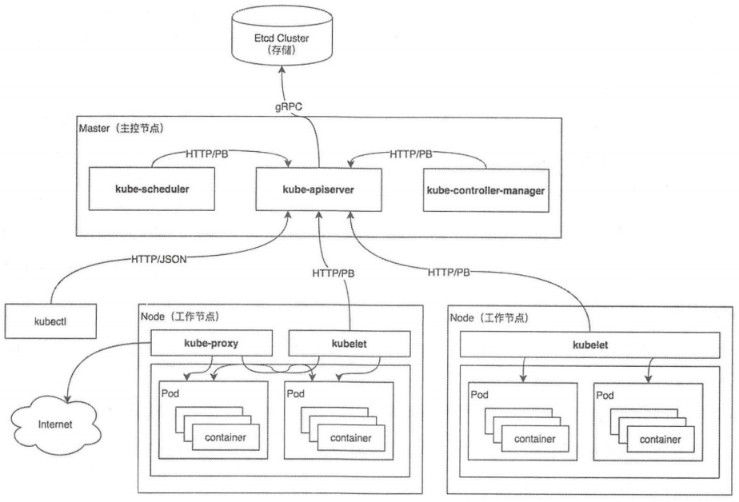

# kubernetes架构

整个k8s架构包括两个组件：master（APIs、scheduler、replication controller）和agent（kubelet、proxy）

逐一讲解每一个的作用：

1.kubelet：管理容器、镜像、已经使用的存储

2.kube-proxy：每一个节点都运行这个网络代理，这是为service提供负载均衡的，代理service的clusterip。本质通过iptables跳转

3.apiserver: 提供api访问接口服务

4.scheduler：是调度服务，支持插件的调度策略非常方便

5.controller manager:管理RC个数生命周期等，还有节点管理等服务。
