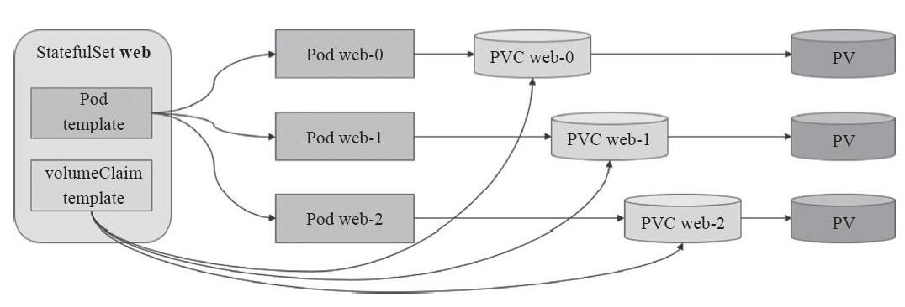

# statefulset controller 源码分析

## Statefulset 的基本功能

statefulset 旨在与有状态的应用及分布式系统一起使用，statefulset 中的每个 pod 拥有一个唯一的身份标识，并且所有 pod 名都是按照 {0..N-1} 的顺序进行编号。本文会主要分析 statefulset controller 的设计与实现，在分析源码前先介绍一下 statefulset 的基本使用。

### 创建

对于一个拥有 N 个副本的 statefulset，pod 是按照 {0..N-1}的序号顺序创建的，并且会等待前一个 pod 变为 Running & Ready 后才会启动下一个 pod。

```
$ kubectl create -f sts.yaml

$ kubectl get pod -o wide -w
NAME    READY   STATUS              RESTARTS   AGE   IP       NODE
web-0   0/1     ContainerCreating   0          20s   <none>   minikube
web-0   1/1     Running             0          3m1s   10.1.0.8   minikube

web-1   0/1     Pending             0          0s     <none>     <none>
web-1   0/1     ContainerCreating   0          2s     <none>     minikube
web-1   1/1     Running             0          4s     10.1.0.9   minikube
```

### 扩容

statefulset 扩容时 pod 也是顺序创建的，编号与前面的 pod 相接。

```
$ kubectl scale sts web --replicas=4
statefulset.apps/web scaled

$ kubectl get pod -o wide -w
......
web-2   0/1     Pending             0          0s     <none>     <none>
web-2   0/1     ContainerCreating   0          1s     <none>     minikube
web-2   1/1     Running             0          4s     10.1.0.10   minikube

web-3   0/1     Pending             0          0s     <none>      <none>
web-3   0/1     ContainerCreating   0          1s     <none>      minikube
web-3   1/1     Running             0          4s     10.1.0.11   minikube
```

### 缩容

缩容时控制器会按照与 pod 序号索引相反的顺序每次删除一个 pod，在删除下一个 pod 前会等待上一个被完全删除。

```
$ kubectl scale sts web --replicas=2

$ kubectl get pod -o wide -w
......
web-3   1/1     Terminating         0          8m25s   10.1.0.11   minikube
web-3   0/1     Terminating         0          8m27s   <none>      minikube

web-2   1/1     Terminating         0          8m31s   10.1.0.10   minikube
web-2   0/1     Terminating         0          8m33s   10.1.0.10   minikube
```

### 更新

更新策略由 statefulset 中的 spec.updateStrategy.type 字段决定，可以指定为 OnDelete 或者 RollingUpdate , 默认的更新策略为 RollingUpdate。当使用RollingUpdate 更新策略更新所有 pod 时采用与序号索引相反的顺序进行更新，即最先删除序号最大的 pod 并根据更新策略中的 partition 参数来进行分段更新，控制器会更新所有序号大于或等于 partition 的 pod，等该区间内的 pod 更新完成后需要再次设定 partition 的值以此来更新剩余的 pod，最终 partition 被设置为 0 时代表更新完成了所有的 pod。在更新过程中，如果一个序号小于 partition 的 pod 被删除或者终止，controller 依然会使用更新前的配置重新创建。

```
// 使用 RollingUpdate 策略更新
$ kubectl patch statefulset web --type='json' -p='[{"op": "replace", "path": "/spec/template/spec/containers/0/image", "value":"nginx:1.16"}]'

statefulset.apps/web patched

$ kubectl rollout status sts/web
Waiting for 1 pods to be ready...
Waiting for partitioned roll out to finish: 1 out of 2 new pods have been updated...
Waiting for 1 pods to be ready...
partitioned roll out complete: 2 new pods have been updated...
```

如果 statefulset 的 .spec.updateStrategy.type 字段被设置为 OnDelete，在更新 statefulset 时，statefulset controller 将不会自动更新其 pod。你必须手动删除 pod，此时 statefulset controller 在重新创建 pod 时，使用修改过的 .spec.template 的内容创建新 pod。

```
// 使用 OnDelete 方式更新
$ kubectl patch statefulset nginx --type='json' -p='[{"op": "replace", "path": "/spec/template/spec/containers/0/image", "value":"nginx:1.9"}]'

// 删除 web-1
$ kubectl delete pod web-1

// 查看 web-0 与 web-1 的镜像版本，此时发现 web-1 已经变为最新版本 nginx:1.9 了
$ kubectl get pod -l app=nginx -o jsonpath='{range .items[*]}{.metadata.name}{"\t"}{.spec.containers[0].image}{"\n"}{end}'
web-0    nginx:1.16
web-1    nginx:1.9
```

使用滚动更新策略时你必须以某种策略不段更新 partition 值来进行升级，类似于金丝雀部署方式，升级对于 pod 名称来说是逆序。使用非滚动更新方式式，需要手动删除对应的 pod，升级可以是无序的。

### 回滚

statefulset 和 deployment 一样也支持回滚操作，statefulset 也保存了历史版本，和 deployment 一样利用.spec.revisionHistoryLimit 字段设置保存多少个历史版本，但 statefulset 的回滚并不是自动进行的，回滚操作也仅仅是进行了一次发布更新，和发布更新的策略一样，更新 statefulset 后需要按照对应的策略手动删除 pod 或者修改 partition 字段以达到回滚 pod 的目的。

```
// 查看 sts 的历史版本
$ kubectl rollout history statefulset web
statefulset.apps/web
REVISION
0
0
5
6

$ kubectl get controllerrevision
NAME             CONTROLLER             REVISION   AGE
web-6c4c79564f   statefulset.apps/web   6          11m
web-c47b9997f    statefulset.apps/web   5          4h13m

// 回滚至最近的一个版本
$ kubectl rollout undo statefulset web --to-revision=5
```

因为 statefulset 的使用对象是有状态服务，大部分有状态副本集都会用到持久存储，statefulset 下的每个 pod 正常情况下都会关联一个 pv 对象，对 statefulset 对象回滚非常容易，但其使用的 pv 中保存的数据无法回滚，所以在生产环境中进行回滚时需要谨慎操作，statefulset、pod、pvc 和 pv 关系图如下所示：



### 删除

statefulset 同时支持级联和非级联删除。使用非级联方式删除 statefulset 时，statefulset 的 pod 不会被删除。使用级联删除时，statefulset 和它关联的 pod 都会被删除。对于级联与非级联删除，在删除时需要指定删除选项(orphan、background 或者 foreground)进行区分。

```
// 1、非级联删除
$ kubectl delete statefulset web --cascade=false

// 删除 sts 后 pod 依然处于运行中
$ kubectl get pod
NAME    READY   STATUS    RESTARTS   AGE
web-0   1/1     Running   0          4m38s
web-1   1/1     Running   0          17m

// 重新创建 sts 后，会再次关联所有的 pod
$ kubectl create  -f  sts.yaml

$ kubectl get sts
NAME   READY   AGE
web    2/2     28s
```

在级联删除 statefulset 时，会将所有的 pod 同时删掉，statefulset 控制器会首先进行一个类似缩容的操作，pod 按照和他们序号索引相反的顺序每次终止一个。在终止一个 pod 前，statefulset 控制器会等待 pod 后继者被完全终止。

```
// 2、级联删除
$ kubectl delete statefulset web

$ kubectl get pod -o wide -w
......
web-0   1/1     Terminating   0          17m   10.1.0.18   minikube   <none>           <none>
web-1   1/1     Terminating   0          36m   10.1.0.15   minikube   <none>           <none>
web-1   0/1     Terminating   0          36m   10.1.0.15   minikube   <none>           <none>
web-0   0/1     Terminating   0          17m   10.1.0.18   minikube   <none>           <none>
```

### Pod 管理策略

statefulset 的默认管理策略是 OrderedReady，该策略遵循上文展示的顺序性保证。statefulset 还有另外一种管理策略 Parallel，Parallel 管理策略告诉 statefulset 控制器并行的终止所有 pod，在启动或终止另一个 pod 前，不必等待这些 pod 变成 Running & Ready 或者完全终止状态，但是 Parallel 仅仅支持在 OnDelete 策略下生效，下文会在源码中具体分析。

## StatefulSetController 源码分析

startStatefulSetController 是 statefulSetController 的启动方法，其中调用 NewStatefulSetController 进行初始化 controller 对象然后调用 Run 方法启动 controller。其中 ConcurrentStatefulSetSyncs 默认值为 5。

```
func startStatefulSetController(ctx ControllerContext) (http.Handler, bool, error) {
	if !ctx.AvailableResources[schema.GroupVersionResource{Group: "apps", Version: "v1", Resource: "statefulsets"}] {
		return nil, false, nil
	}
	go statefulset.NewStatefulSetController(
		ctx.InformerFactory.Core().V1().Pods(),
		ctx.InformerFactory.Apps().V1().StatefulSets(),
		ctx.InformerFactory.Core().V1().PersistentVolumeClaims(),
		ctx.InformerFactory.Apps().V1().ControllerRevisions(),
		ctx.ClientBuilder.ClientOrDie("statefulset-controller"),
	).Run(int(ctx.ComponentConfig.StatefulSetController.ConcurrentStatefulSetSyncs), ctx.Stop)
	return nil, true, nil
}
```

当 controller 启动后会通过 informer 同步 cache 并监听 pod 和 statefulset 对象的变更事件，informer 的处理流程此处不再详细讲解，最后会执行 sync 方法，sync 方法是每个 controller 的核心方法，下面直接看 statefulset controller 的 sync 方法。

### sync

sync 方法的主要逻辑为：

1、根据 ns/name 获取 sts 对象；
2、获取 sts 的 selector；
3、调用 ssc.adoptOrphanRevisions 检查是否有孤儿 controllerrevisions 对象，若有且能匹配 selector 的则添加 ownerReferences 进行关联，已关联但 label 不匹配的则进行释放；
4、调用 ssc.getPodsForStatefulSet 通过 selector 获取 sts 关联的 pod，若有孤儿 pod 的 label 与 sts 的能匹配则进行关联，若已关联的 pod label 有变化则解除与 sts 的关联关系；
5、最后调用 ssc.syncStatefulSet 执行真正的 sync 操作；

```
func (ssc *StatefulSetController) sync(key string) error {
	startTime := time.Now()
	defer func() {
		klog.V(4).Infof("Finished syncing statefulset %q (%v)", key, time.Since(startTime))
	}()

	namespace, name, err := cache.SplitMetaNamespaceKey(key)
	if err != nil {
		return err
	}
	set, err := ssc.setLister.StatefulSets(namespace).Get(name)
	if errors.IsNotFound(err) {
		klog.Infof("StatefulSet has been deleted %v", key)
		return nil
	}
	if err != nil {
		utilruntime.HandleError(fmt.Errorf("unable to retrieve StatefulSet %v from store: %v", key, err))
		return err
	}

	selector, err := metav1.LabelSelectorAsSelector(set.Spec.Selector)
	if err != nil {
		utilruntime.HandleError(fmt.Errorf("error converting StatefulSet %v selector: %v", key, err))
		// This is a non-transient error, so don't retry.
		return nil
	}

	if err := ssc.adoptOrphanRevisions(set); err != nil {
		return err
	}

	pods, err := ssc.getPodsForStatefulSet(set, selector)
	if err != nil {
		return err
	}

	return ssc.syncStatefulSet(set, pods)
}
```

### syncStatefulSet

在 syncStatefulSet 中仅仅是调用了 ssc.control.UpdateStatefulSet 方法进行处理。ssc.control.UpdateStatefulSet 会调用 defaultStatefulSetControl 的 UpdateStatefulSet 方法，defaultStatefulSetControl 是 statefulset controller 中另外一个对象，主要负责处理 statefulset 的更新。

```
func (ssc *StatefulSetController) syncStatefulSet(set *apps.StatefulSet, pods []*v1.Pod) error {
	klog.V(4).Infof("Syncing StatefulSet %v/%v with %d pods", set.Namespace, set.Name, len(pods))
	// TODO: investigate where we mutate the set during the update as it is not obvious.
	if err := ssc.control.UpdateStatefulSet(set.DeepCopy(), pods); err != nil {
		return err
	}
	klog.V(4).Infof("Successfully synced StatefulSet %s/%s successful", set.Namespace, set.Name)
	return nil
}
```

UpdateStatefulSet 方法的主要逻辑如下所示：

1、获取历史 revisions；
2、计算 currentRevision 和 updateRevision，若 sts 处于更新过程中则 currentRevision 和 updateRevision 值不同；
3、调用 ssc.updateStatefulSet 执行实际的 sync 操作；
4、调用 ssc.updateStatefulSetStatus 更新 status subResource；
5、根据 sts 的 spec.revisionHistoryLimit字段清理过期的 controllerrevision；
在基本操作的回滚阶段提到了过，sts 通过 controllerrevision 保存历史版本，类似于 deployment 的 replicaset，与 replicaset 不同的是 controllerrevision 仅用于回滚阶段，在 sts 的滚动升级过程中是通过 currentRevision 和 updateRevision来进行控制并不会用到 controllerrevision。

```
func (ssc *defaultStatefulSetControl) UpdateStatefulSet(set *apps.StatefulSet, pods []*v1.Pod) error {

	// list all revisions and sort them
	revisions, err := ssc.ListRevisions(set)
	if err != nil {
		return err
	}
	history.SortControllerRevisions(revisions)

	currentRevision, updateRevision, err := ssc.performUpdate(set, pods, revisions)
	if err != nil {
		return utilerrors.NewAggregate([]error{err, ssc.truncateHistory(set, pods, revisions, currentRevision, updateRevision)})
	}

	// maintain the set's revision history limit
	return ssc.truncateHistory(set, pods, revisions, currentRevision, updateRevision)
}
```

### updateStatefulSet

updateStatefulSet 是 sync 操作中的核心方法，对于 statefulset 的创建、扩缩容、更新、删除等操作都会在这个方法中完成，以下是其主要逻辑：

1、分别获取 currentRevision 和 updateRevision 对应的的 statefulset object；
2、构建 status 对象；
3、将 statefulset 的 pods 按 ord(ord 为 pod name 中的序号)的值分到 replicas 和 condemned 两个数组中，0 <= ord < Spec.Replicas 的放到 replicas 组，ord >= Spec.Replicas 的放到 condemned 组，replicas 组代表可用的 pod，condemned 组是需要删除的 pod；
4、找出 replicas 和 condemned 组中的 unhealthy pod，healthy pod 指 running & ready 并且不处于删除状态；
5、判断 sts 是否处于删除状态；
6、遍历 replicas 数组，确保 replicas 数组中的容器处于 running & ready状态，其中处于 failed 状态的容器删除重建，未创建的容器则直接创建，最后检查 pod 的信息是否与 statefulset 的匹配，若不匹配则更新 pod 的状态。在此过程中每一步操作都会检查 monotonic 的值，即 sts 是否设置了 Parallel 参数，若设置了则循环处理 replicas 中的所有 pod，否则每次处理一个 pod，剩余 pod 则在下一个 syncLoop 继续进行处理；
7、按 pod 名称逆序删除 condemned 数组中的 pod，删除前也要确保 pod 处于 running & ready状态，在此过程中也会检查 monotonic 的值，以此来判断是顺序删除还是在下一个 syncLoop 中继续进行处理；
8、判断 sts 的更新策略 .Spec.UpdateStrategy.Type，若为 OnDelete 则直接返回；
9、此时更新策略为 RollingUpdate，更新序号大于等于 .Spec.UpdateStrategy.RollingUpdate.Partition 的 pod，在 RollingUpdate 时，并不会关注 monotonic 的值，都是顺序进行处理且等待当前 pod 删除成功后才继续删除小于上一个 pod 序号的 pod，所以 Parallel 的策略在滚动更新时无法使用。
updateStatefulSet 这个方法中包含了 statefulset 的创建、删除、扩若容、更新等操作，在源码层面对于各个功能无法看出明显的界定，没有 deployment sync 方法中写的那么清晰，下面还是按 statefulset 的功能再分析一下具体的操作：

创建：在创建 sts 后，sts 对象已被保存至 etcd 中，此时 sync 操作仅仅是创建出需要的 pod，即执行到第 6 步就会结束；
扩缩容：对于扩若容操作仅仅是创建或者删除对应的 pod，在操作前也会判断所有 pod 是否处于 running & ready状态，然后进行对应的创建/删除操作，在上面的步骤中也会执行到第 6 步就结束了；
更新：可以看出在第六步之后的所有操作就是与更新相关的了，所以更新操作会执行完整个方法，在更新过程中通过 pod 的 currentRevision 和 updateRevision 来计算 currentReplicas、updatedReplicas 的值，最终完成所有 pod 的更新；
删除：删除操作就比较明显了，会止于第五步，但是在此之前检查 pod 状态以及分组的操作确实是多余的；

```
func (ssc *defaultStatefulSetControl) updateStatefulSet(
	set *apps.StatefulSet,
	currentRevision *apps.ControllerRevision,
	updateRevision *apps.ControllerRevision,
	collisionCount int32,
	pods []*v1.Pod) (*apps.StatefulSetStatus, error) {
	// get the current and update revisions of the set.
	currentSet, err := ApplyRevision(set, currentRevision)
	if err != nil {
		return nil, err
	}
	updateSet, err := ApplyRevision(set, updateRevision)
	if err != nil {
		return nil, err
	}

	// set the generation, and revisions in the returned status
	status := apps.StatefulSetStatus{}
	status.ObservedGeneration = set.Generation
	status.CurrentRevision = currentRevision.Name
	status.UpdateRevision = updateRevision.Name
	status.CollisionCount = new(int32)
	*status.CollisionCount = collisionCount

	replicaCount := int(*set.Spec.Replicas)
	// slice that will contain all Pods such that 0 <= getOrdinal(pod) < set.Spec.Replicas
	replicas := make([]*v1.Pod, replicaCount)
	// slice that will contain all Pods such that set.Spec.Replicas <= getOrdinal(pod)
	condemned := make([]*v1.Pod, 0, len(pods))
	unhealthy := 0
	firstUnhealthyOrdinal := math.MaxInt32
	var firstUnhealthyPod *v1.Pod

	// First we partition pods into two lists valid replicas and condemned Pods
	for i := range pods {
		status.Replicas++

		// count the number of running and ready replicas
		if isRunningAndReady(pods[i]) {
			status.ReadyReplicas++
		}

		// count the number of current and update replicas
		if isCreated(pods[i]) && !isTerminating(pods[i]) {
			if getPodRevision(pods[i]) == currentRevision.Name {
				status.CurrentReplicas++
			}
			if getPodRevision(pods[i]) == updateRevision.Name {
				status.UpdatedReplicas++
			}
		}

		if ord := getOrdinal(pods[i]); 0 <= ord && ord < replicaCount {
			// if the ordinal of the pod is within the range of the current number of replicas,
			// insert it at the indirection of its ordinal
			replicas[ord] = pods[i]

		} else if ord >= replicaCount {
			// if the ordinal is greater than the number of replicas add it to the condemned list
			condemned = append(condemned, pods[i])
		}
		// If the ordinal could not be parsed (ord < 0), ignore the Pod.
	}

	// for any empty indices in the sequence [0,set.Spec.Replicas) create a new Pod at the correct revision
	for ord := 0; ord < replicaCount; ord++ {
		if replicas[ord] == nil {
			replicas[ord] = newVersionedStatefulSetPod(
				currentSet,
				updateSet,
				currentRevision.Name,
				updateRevision.Name, ord)
		}
	}

	// sort the condemned Pods by their ordinals
	sort.Sort(ascendingOrdinal(condemned))

	// find the first unhealthy Pod
	for i := range replicas {
		if !isHealthy(replicas[i]) {
			unhealthy++
			if ord := getOrdinal(replicas[i]); ord < firstUnhealthyOrdinal {
				firstUnhealthyOrdinal = ord
				firstUnhealthyPod = replicas[i]
			}
		}
	}

	for i := range condemned {
		if !isHealthy(condemned[i]) {
			unhealthy++
			if ord := getOrdinal(condemned[i]); ord < firstUnhealthyOrdinal {
				firstUnhealthyOrdinal = ord
				firstUnhealthyPod = condemned[i]
			}
		}
	}

	if unhealthy > 0 {
		klog.V(4).Infof("StatefulSet %s/%s has %d unhealthy Pods starting with %s",
			set.Namespace,
			set.Name,
			unhealthy,
			firstUnhealthyPod.Name)
	}

	// If the StatefulSet is being deleted, don't do anything other than updating
	// status.
	if set.DeletionTimestamp != nil {
		return &status, nil
	}

	monotonic := !allowsBurst(set)

	// Examine each replica with respect to its ordinal
	for i := range replicas {
		// delete and recreate failed pods
		if isFailed(replicas[i]) {
			ssc.recorder.Eventf(set, v1.EventTypeWarning, "RecreatingFailedPod",
				"StatefulSet %s/%s is recreating failed Pod %s",
				set.Namespace,
				set.Name,
				replicas[i].Name)
			if err := ssc.podControl.DeleteStatefulPod(set, replicas[i]); err != nil {
				return &status, err
			}
			if getPodRevision(replicas[i]) == currentRevision.Name {
				status.CurrentReplicas--
			}
			if getPodRevision(replicas[i]) == updateRevision.Name {
				status.UpdatedReplicas--
			}
			status.Replicas--
			replicas[i] = newVersionedStatefulSetPod(
				currentSet,
				updateSet,
				currentRevision.Name,
				updateRevision.Name,
				i)
		}
		// If we find a Pod that has not been created we create the Pod
		if !isCreated(replicas[i]) {
			if err := ssc.podControl.CreateStatefulPod(set, replicas[i]); err != nil {
				return &status, err
			}
			status.Replicas++
			if getPodRevision(replicas[i]) == currentRevision.Name {
				status.CurrentReplicas++
			}
			if getPodRevision(replicas[i]) == updateRevision.Name {
				status.UpdatedReplicas++
			}

			// if the set does not allow bursting, return immediately
			if monotonic {
				return &status, nil
			}
			// pod created, no more work possible for this round
			continue
		}
		// If we find a Pod that is currently terminating, we must wait until graceful deletion
		// completes before we continue to make progress.
		if isTerminating(replicas[i]) && monotonic {
			klog.V(4).Infof(
				"StatefulSet %s/%s is waiting for Pod %s to Terminate",
				set.Namespace,
				set.Name,
				replicas[i].Name)
			return &status, nil
		}
		// If we have a Pod that has been created but is not running and ready we can not make progress.
		// We must ensure that all for each Pod, when we create it, all of its predecessors, with respect to its
		// ordinal, are Running and Ready.
		if !isRunningAndReady(replicas[i]) && monotonic {
			klog.V(4).Infof(
				"StatefulSet %s/%s is waiting for Pod %s to be Running and Ready",
				set.Namespace,
				set.Name,
				replicas[i].Name)
			return &status, nil
		}
		// Enforce the StatefulSet invariants
		if identityMatches(set, replicas[i]) && storageMatches(set, replicas[i]) {
			continue
		}
		// Make a deep copy so we don't mutate the shared cache
		replica := replicas[i].DeepCopy()
		if err := ssc.podControl.UpdateStatefulPod(updateSet, replica); err != nil {
			return &status, err
		}
	}

	// At this point, all of the current Replicas are Running and Ready, we can consider termination.
	// We will wait for all predecessors to be Running and Ready prior to attempting a deletion.
	// We will terminate Pods in a monotonically decreasing order over [len(pods),set.Spec.Replicas).
	// Note that we do not resurrect Pods in this interval. Also note that scaling will take precedence over
	// updates.
	for target := len(condemned) - 1; target >= 0; target-- {
		// wait for terminating pods to expire
		if isTerminating(condemned[target]) {
			klog.V(4).Infof(
				"StatefulSet %s/%s is waiting for Pod %s to Terminate prior to scale down",
				set.Namespace,
				set.Name,
				condemned[target].Name)
			// block if we are in monotonic mode
			if monotonic {
				return &status, nil
			}
			continue
		}
		// if we are in monotonic mode and the condemned target is not the first unhealthy Pod block
		if !isRunningAndReady(condemned[target]) && monotonic && condemned[target] != firstUnhealthyPod {
			klog.V(4).Infof(
				"StatefulSet %s/%s is waiting for Pod %s to be Running and Ready prior to scale down",
				set.Namespace,
				set.Name,
				firstUnhealthyPod.Name)
			return &status, nil
		}
		klog.V(2).Infof("StatefulSet %s/%s terminating Pod %s for scale down",
			set.Namespace,
			set.Name,
			condemned[target].Name)

		if err := ssc.podControl.DeleteStatefulPod(set, condemned[target]); err != nil {
			return &status, err
		}
		if getPodRevision(condemned[target]) == currentRevision.Name {
			status.CurrentReplicas--
		}
		if getPodRevision(condemned[target]) == updateRevision.Name {
			status.UpdatedReplicas--
		}
		if monotonic {
			return &status, nil
		}
	}

	// for the OnDelete strategy we short circuit. Pods will be updated when they are manually deleted.
	if set.Spec.UpdateStrategy.Type == apps.OnDeleteStatefulSetStrategyType {
		return &status, nil
	}

	// we compute the minimum ordinal of the target sequence for a destructive update based on the strategy.
	updateMin := 0
	if set.Spec.UpdateStrategy.RollingUpdate != nil {
		updateMin = int(*set.Spec.UpdateStrategy.RollingUpdate.Partition)
	}
	// we terminate the Pod with the largest ordinal that does not match the update revision.
	for target := len(replicas) - 1; target >= updateMin; target-- {

		// delete the Pod if it is not already terminating and does not match the update revision.
		if getPodRevision(replicas[target]) != updateRevision.Name && !isTerminating(replicas[target]) {
			klog.V(2).Infof("StatefulSet %s/%s terminating Pod %s for update",
				set.Namespace,
				set.Name,
				replicas[target].Name)
			err := ssc.podControl.DeleteStatefulPod(set, replicas[target])
			status.CurrentReplicas--
			return &status, err
		}

		// wait for unhealthy Pods on update
		if !isHealthy(replicas[target]) {
			klog.V(4).Infof(
				"StatefulSet %s/%s is waiting for Pod %s to update",
				set.Namespace,
				set.Name,
				replicas[target].Name)
			return &status, nil
		}

	}
	return &status, nil
}
```

## 总结

本文分析了 statefulset controller 的主要功能，statefulset 在设计上有很多功能与 deployment 是类似的，但其主要是用来部署有状态应用的，statefulset 中的 pod 名称存在顺序性和唯一性，同时每个 pod 都使用了 pv 和 pvc 来存储状态，在创建、删除、更新操作中都会按照 pod 的顺序进行。
